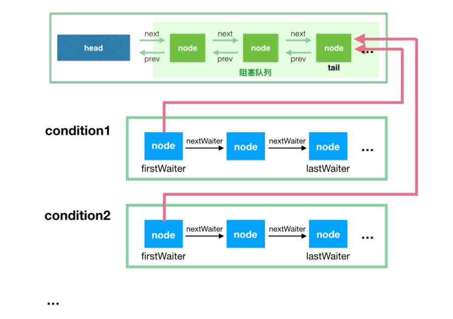

# Condition

首先明确一点：**AQS中的Condition是基于ReentrantLock的。Condition不管是调用await进入等待还是signal唤醒，都需要获取到锁才能进行操作**

## 摘要

~~~java
 public static void main(String[] args) {
        ReentrantLock reentrantLock = new ReentrantLock(true);
        
        Condition condition = reentrantLock.newCondition();
		...
    }

    public Condition newCondition() {
        return sync.newCondition();
    }
~~~

~~~JAVA

package java.util.concurrent.locks;

import java.util.Date;
import java.util.concurrent.TimeUnit;

public interface Condition {

    void await() throws InterruptedException;

    void awaitUninterruptibly();

    long awaitNanos(long nanosTimeout) throws InterruptedException;

    boolean await(long time, TimeUnit unit) throws InterruptedException;

    boolean awaitUntil(Date deadline) throws InterruptedException;

    void signal();
    
    void signalAll();
}

   public class ConditionObject implements Condition, java.io.Serializable {
        private static final long serialVersionUID = 1173984872572414699L;
        /** First node of condition queue. */
        // 条件队列的第一个节点
        private transient Node firstWaiter;
        /** Last node of condition queue. */
        // 条件队列的最后一个节点
        private transient Node lastWaiter;

        /**
         * Creates a new {@code ConditionObject} instance.
         */
        public ConditionObject() { }

        // Internal methods
		......
       
    }

~~~

注意：在Condition中，有一个**条件队列**如下图。

- 条件队列和阻塞队列的节点，都是 Node 的实例，因为条件队列的节点是需要转移到阻塞队列中去的；
- 我们知道一个 ReentrantLock 实例可以通过多次调用 newCondition() 来产生多个 Condition 实例，这里对应 condition1 和 condition2。注意，ConditionObject 只有两个属性 firstWaiter 和 lastWaiter；
- 每个 condition 有一个关联的**条件队列**，如线程 1 调用 `condition1.await()` 方法即可将当前线程 1 包装成 Node 后加入到条件队列中，然后阻塞在这里，不继续往下执行，条件队列是一个单向链表；
- 调用`condition1.signal()` 触发一次唤醒，此时唤醒的是队头，会将condition1 对应的**条件队列**的 firstWaiter（队头） 移到**阻塞队列的队尾**，等待获取锁，获取锁后 await 方法才能返回，继续往下执行。

## await

### 加入条件队列(wait queue)

~~~java
   		/**
         * Implements interruptible condition wait.
         * <ol>
         * <li>If current thread is interrupted, throw InterruptedException.
         * <li>Save lock state returned by {@link #getState}.
         * <li>Invoke {@link #release} with saved state as argument,
         *     throwing IllegalMonitorStateException if it fails.
         * <li>Block until signalled or interrupted.
         * <li>Reacquire by invoking specialized version of
         *     {@link #acquire} with saved state as argument.
         * <li>If interrupted while blocked in step 4, throw InterruptedException.
         * </ol>
         */
		// 如果当前线程被中断，会抛出异常(awaitUninterruptibly()此方法不怕中断)
		// 阻塞线程直到signal或interrupt
        public final void await() throws InterruptedException {
            // 先判断中断状态
            if (Thread.interrupted())
                throw new InterruptedException();
            // 将线程添加到等待队列中
            Node node = addConditionWaiter();
            // await的前提是持有当前锁，进行await时需要释放锁并返回state值。
            int savedState = fullyRelease(node);
            int interruptMode = 0;
            // 如果isOnSyncQueue(node)返回true，说明当前node已经到阻塞队列中了
            // 如果线程中断，会进行break( checkInterruptWhileWaiting(node) != 0)
            while (!isOnSyncQueue(node)) {
                LockSupport.park(this);
                if ((interruptMode = checkInterruptWhileWaiting(node)) != 0)
                    break;
            }
            // 线程被唤醒后，进入阻塞队列，等待获取锁
            if (acquireQueued(node, savedState) && interruptMode != THROW_IE)
                interruptMode = REINTERRUPT;
            if (node.nextWaiter != null) // clean up if cancelled
                unlinkCancelledWaiters();
            if (interruptMode != 0)
                reportInterruptAfterWait(interruptMode);
        }

        /**
         * Adds a new waiter to wait queue.
         * @return its new wait node
         */
		// 将当前节点加入到条件队列中，置于队尾
        private Node addConditionWaiter() {
            if (!isHeldExclusively())
                throw new IllegalMonitorStateException();
            Node t = lastWaiter;
            // If lastWaiter is cancelled, clean out.
            // 将状态不为Node.CONDITION的节点清除掉
            if (t != null && t.waitStatus != Node.CONDITION) {
                //具体的清除方法
                unlinkCancelledWaiters();
                t = lastWaiter;
            }
			// 新生成的节点的statu为Node.CONDITION
            Node node = new Node(Node.CONDITION);
			// 如果队列为空，当前节点为首节点。否则放在队尾
            if (t == null)
                firstWaiter = node;
            else
                t.nextWaiter = node;
            lastWaiter = node;
            return node;
        }

		// 等待链表是单向链表
        private void unlinkCancelledWaiters() {
            Node t = firstWaiter;
            Node trail = null;
            while (t != null) {
                Node next = t.nextWaiter;
                if (t.waitStatus != Node.CONDITION) {
                    t.nextWaiter = null;
                    if (trail == null)
                        firstWaiter = next;
                    else
                        trail.nextWaiter = next;
                    if (next == null)
                        lastWaiter = trail;
                }
                else
                    trail = t;
                t = next;
            }
        }

~~~

### 释放锁

当前线程进入条件队列（wait queue）后，会进行释放锁的操作。**是完全释放**

~~~java
	/**
     * Invokes release with current state value; returns saved state.
     * Cancels node and throws exception on failure.
     * @param node the condition node for this wait
     * @return previous sync state
     */
	// 完全释放锁
    final long fullyRelease(Node node) {
        try {
            long savedState = getState();
            // 如果此方法执行失败，会将当前节点状态设置为Node.CANCELLED(取消)
            if (release(savedState))
                return savedState;
            throw new IllegalMonitorStateException();
        } catch (Throwable t) {
            node.waitStatus = Node.CANCELLED;
            throw t;
        }
    }

    /**
     * Releases in exclusive mode.  Implemented by unblocking one or
     * more threads if {@link #tryRelease} returns true.
     * This method can be used to implement method {@link Lock#unlock}.
     *
     * @param arg the release argument.  This value is conveyed to
     *        {@link #tryRelease} but is otherwise uninterpreted and
     *        can represent anything you like.
     * @return the value returned from {@link #tryRelease}
     */
	// 根据传入的参数，改别state值，并将当前阻塞队列头节点的后继节点唤醒
    public final boolean release(long arg) {
        if (tryRelease(arg)) {
            Node h = head;
            if (h != null && h.waitStatus != 0)
                unparkSuccessor(h);
            return true;
        }
        return false;
    }

~~~

> 考虑一下这里的 savedState。如果在 condition1.await() 之前，假设线程先执行了 2 次 lock() 操作，那么 state 为 2，我们理解为该线程持有 2 把锁，这里 await() 方法必须将 state 设置为 0，然后再进入挂起状态，这样其他线程才能持有锁。当它被唤醒的时候，它需要重新持有 2 把锁，才能继续下去。
>
> 如果一个线程在不持有 lock 的基础上，就去调用 condition1.await() 方法，它能进入条件队列，但是在上面的这个方法中，由于它不持有锁，release(savedState) 这个方法肯定要返回 false，进入到异常分支，然后进入 finally 块设置 `node.waitStatus = Node.CANCELLED`，这个已经入队的节点之后会被后继的节点清除。

### 等待进入阻塞队列

~~~java
    ...
    // 此时已经释放锁了
    int interruptMode = 0;
	// 自旋判断节点是否在阻塞队列中
    while (!isOnSyncQueue(node)) {
        //如果不在阻塞队列中，将线程挂起
        LockSupport.park(this);
        // 线程被唤醒后，执行下列代码判断是否被中断过
        if ((interruptMode = checkInterruptWhileWaiting(node)) != 0)
            break;
    }

 /**
     * Returns true if a node, always one that was initially placed on
     * a condition queue, is now waiting to reacquire on sync queue.
     * @param node the node
     * @return true if is reacquiring
     */
	// 判断节点是否在阻塞队列中，如果节点在阻塞队列，返回true
	// 此方法若返回false，则将线程挂起
    final boolean isOnSyncQueue(Node node) {
        // node初始化时，waitStatus为Node.CONDITION。如果此时waitStatus还为Node.CONDITION，说明其还在条件队列中
        // 如果node的前驱节点为null，说明也没有在阻塞队列中。（条件队列是单向链表）
        if (node.waitStatus == Node.CONDITION || node.prev == null)
            return false;
        if (node.next != null) // If has successor, it must be on queue
            return true;
        /*
         * node.prev can be non-null, but not yet on queue because
         * the CAS to place it on queue can fail. So we have to
         * traverse from tail to make sure it actually made it.  It
         * will always be near the tail in calls to this method, and
         * unless the CAS failed (which is unlikely), it will be
         * there, so we hardly ever traverse much.
         */
        

        // 可以通过判断 node.prev() != null 来推断出 node 在阻塞队列吗？答案是：不能。
        // 这个可以看上篇 AQS 的入队方法，首先设置的是 node.prev 指向 tail，
        // 然后是 CAS 操作将自己设置为新的 tail，可是这次的 CAS 是可能失败的。
        // 此方法从阻塞队列的队尾开始从后往前遍历找，如果找到相等的，说明在阻塞队列，否则就是不在阻塞队列
        return findNodeFromTail(node);
    }

    /**
     * Returns true if node is on sync queue by searching backwards from tail.
     * Called only when needed by isOnSyncQueue.
     * @return true if present
     */

    private boolean findNodeFromTail(Node node) {
        // We check for node first, since it's likely to be at or near tail.
        // tail is known to be non-null, so we could re-order to "save"
        // one null check, but we leave it this way to help the VM.
        for (Node p = tail;;) {
            if (p == node)
                return true;
            if (p == null)
                return false;
            p = p.prev;
        }
    }

~~~

## signal

唤醒操作通常由另一个线程来进行操作。

~~~java
    /**
    * Moves the longest-waiting thread, if one exists, from the
    * wait queue for this condition to the wait queue for the
    * owning lock.
    *
    * @throws IllegalMonitorStateException if {@link #isHeldExclusively}
    *         returns {@code false}
    */
	// 唤醒线程就是将线程对应的node从条件队列转到阻塞队列中
    public final void signal() {
        // 只有持有独占锁的线程才能调用signal方法
        if (!isHeldExclusively())
            throw new IllegalMonitorStateException();
        Node first = firstWaiter;
        if (first != null)
            doSignal(first);
    }

    /**
     * Removes and transfers nodes until hit non-cancelled one or
     * null. Split out from signal in part to encourage compilers
     * to inline the case of no waiters.
     * @param first (non-null) the first node on condition queue
     */
	// 从条件队列从头向尾遍历，找到第一个需要转移的node
    private void doSignal(Node first) {
        do {
            if ( (firstWaiter = first.nextWaiter) == null)
                lastWaiter = null;
            first.nextWaiter = null;
        } while (!transferForSignal(first) &&
                 (first = firstWaiter) != null);
    }

    /**
     * Transfers a node from a condition queue onto sync queue.
     * Returns true if successful.
     * @param node the node
     * @return true if successfully transferred (else the node was
     * cancelled before signal)
     */
    final boolean transferForSignal(Node node) {
        /*
         * If cannot change waitStatus, the node has been cancelled.
         */
        if (!node.compareAndSetWaitStatus(Node.CONDITION, 0))
            return false;

        /*
         * Splice onto queue and try to set waitStatus of predecessor to
         * indicate that thread is (probably) waiting. If cancelled or
         * attempt to set waitStatus fails, wake up to resync (in which
         * case the waitStatus can be transiently and harmlessly wrong).
         */
        Node p = enq(node);
        int ws = p.waitStatus;
        if (ws > 0 || !p.compareAndSetWaitStatus(ws, Node.SIGNAL))
            LockSupport.unpark(node.thread);
        return true;
    }

~~~

