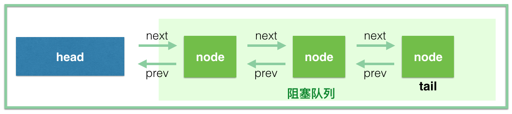

# AQS

 AbstractQueuedSynchronizer（抽象同步队列器），因为它是 Java 并发包的基础工具类，是实现 ReentrantLock、CountDownLatch、Semaphore、FutureTask 等类的基础。

## 结构

~~~java
// 头结点，你直接把它当做 当前持有锁的线程 可能是最好理解的
private transient volatile Node head;

// 阻塞的尾节点，每个新的节点进来，都插入到最后，也就形成了一个链表
private transient volatile Node tail;

// 这个是最重要的，代表当前锁的状态，0代表没有被占用，大于 0 代表有线程持有当前锁
// 这个值可以大于 1，是因为锁可以重入，每次重入都加上 1
private volatile int state;

// 代表当前持有独占锁的线程，举个最重要的使用例子，因为锁可以重入
// reentrantLock.lock()可以嵌套调用多次，所以每次用这个来判断当前线程是否已经拥有了锁
// if (currentThread == getExclusiveOwnerThread()) {state++}
private transient Thread exclusiveOwnerThread; //继承自AbstractOwnableSynchronizer
~~~

**注意：阻塞队列不包含head**

等待队列中的每个线程都被包装为一个Node实例，结构是链表

~~~java
 static final class Node {
        /** Marker to indicate a node is waiting in shared mode */
     	//标识当前节点在共享模式下
        static final Node SHARED = new Node();
        /** Marker to indicate a node is waiting in exclusive mode */
     	//标识当前节点在独占模式下
        static final Node EXCLUSIVE = null;

        /** waitStatus value to indicate thread has cancelled. */
     	//代表此线程取消了争抢这个锁
        static final int CANCELLED =  1;
        /** waitStatus value to indicate successor's thread needs unparking. */
     	//代表当前node的后继节点对应的线程需要被唤醒
        static final int SIGNAL    = -1;
        /** waitStatus value to indicate thread is waiting on condition. */
     	//代表当前线程在等待condition
        static final int CONDITION = -2;
        /**
         * waitStatus value to indicate the next acquireShared should
         * unconditionally propagate.
         */
        static final int PROPAGATE = -3;

        /**
         * Status field, taking on only the values:
         *   SIGNAL:     The successor of this node is (or will soon be)
         *               blocked (via park), so the current node must
         *               unpark its successor when it releases or
         *               cancels. To avoid races, acquire methods must
         *               first indicate they need a signal,
         *               then retry the atomic acquire, and then,
         *               on failure, block.
         *   CANCELLED:  This node is cancelled due to timeout or interrupt.
         *               Nodes never leave this state. In particular,
         *               a thread with cancelled node never again blocks.
         *   CONDITION:  This node is currently on a condition queue.
         *               It will not be used as a sync queue node
         *               until transferred, at which time the status
         *               will be set to 0. (Use of this value here has
         *               nothing to do with the other uses of the
         *               field, but simplifies mechanics.)
         *   PROPAGATE:  A releaseShared should be propagated to other
         *               nodes. This is set (for head node only) in
         *               doReleaseShared to ensure propagation
         *               continues, even if other operations have
         *               since intervened.
         *   0:          None of the above
         *
         * The values are arranged numerically to simplify use.
         * Non-negative values mean that a node doesn't need to
         * signal. So, most code doesn't need to check for particular
         * values, just for sign.
         *
         * The field is initialized to 0 for normal sync nodes, and
         * CONDITION for condition nodes.  It is modified using CAS
         * (or when possible, unconditional volatile writes).
         */
     	//如果这个值 大于0 代表此线程取消了等待，
        volatile int waitStatus;

     	//前驱节点
        volatile Node prev;

     	//后继节点
        volatile Node next;

       	//线程
        volatile Thread thread;

       	//下个等待节点
        Node nextWaiter;

    }
~~~

# ReentrantLock源码分析

## 构造函数

~~~java
//非公平锁
public ReentrantLock() {
	sync = new NonfairSync();
}

public ReentrantLock(boolean fair) {
	sync = fair ? new FairSync() : new NonfairSync();
}
//ReentrantLock 在内部用了内部类 Sync 来管理锁，所以真正的获取锁和释放锁是由 Sync 的实现类来控制的。
abstract static class Sync extends AbstractQueuedSynchronizer {
    
}
~~~

## 线程抢锁（公平锁）

~~~java
    //lock方法
    public void lock() {
        sync.acquire(1);
    } 
	
	
    public final void acquire(int arg) {
        //此时arg=1
        //如果过tryAcquire方法返回为true，则此方法直接结束，否则调用acquireQueued将线程压入到队列之中
        if (!tryAcquire(arg) && acquireQueued(addWaiter(Node.EXCLUSIVE), arg))
            selfInterrupt();
    }

static final class FairSync extends Sync {
        private static final long serialVersionUID = -3000897897090466540L;
        /**
         * Fair version of tryAcquire.  Don't grant access unless
         * recursive call or no waiters or is first.
         */
    	//返回boolean值，代表是否获取到锁
    	//有两种情况返回true（1.没有线程在等待锁。2.重入锁，线程本身就持有锁）
        @ReservedStackAccess
        protected final boolean tryAcquire(int acquires) {
            final Thread current = Thread.currentThread();
            int c = getState();
            //state为0，说明此时此刻，没有线程持有锁
            if (c == 0) {
                // 虽然此时此刻锁是可以用的，但是这是公平锁。
            	// 需要判断队列中是否有其他线程已经在等待
                if (!hasQueuedPredecessors() &&
                    // 如果没有线程在等待，就CAS获取锁（即通过CAS改变）
                    // 不成功的话，说明就在刚刚几乎同一时刻有个线程抢先了 
                    compareAndSetState(0, acquires)) {
               		// 抢占成功，对锁进行标识。
                    setExclusiveOwnerThread(current);
                    return true;
                }
            }
            //说明锁重入了，需要对state进行 +1 操作
            else if (current == getExclusiveOwnerThread()) {
                int nextc = c + acquires;
                if (nextc < 0)
                    throw new Error("Maximum lock count exceeded");
                setState(nextc);
                return true;
            }
            //说明没有获取到锁，将会执行 acquireQueued(addWaiter(Node.EXCLUSIVE), arg)) 
            return false;
        }
    
    
     /**
     * Creates and enqueues node for current thread and given mode.
     *
     * @param mode Node.EXCLUSIVE for exclusive, Node.SHARED for shared
     * @return the new node
     */
    // 在执行 acquireQueued 之前，先会调用 addWaiter(Node.EXCLUSIVE), arg) 方法
    // 此方法会将当前线程包装为Node，同时进入到队列中
    // 参数mode此时是Node.EXCLUSIVE，代表独占模式
    private Node addWaiter(Node mode) {
		//新建Node，在构造方法中通过Thread.currentThread()将当前线程封装。具体细节可看Node的构造方法
        Node node = new Node(mode);
		
        //采用自旋方式入队
        for (;;) {
            // 获取当前AQS的尾节点
            Node oldTail = tail;
            // 如果当前尾节点不为null
            if (oldTail != null) {
                // 将队列尾节点设置为新节点的prev
                node.setPrevRelaxed(oldTail);
                // 将当前线程排到队尾，有线程竞争就重复排
                if (compareAndSetTail(oldTail, node)) {
                    oldTail.next = node;
                   	//将当前node返回
                    return node;
                }
            } else {
                //初始化队列，初始化完成后，进入上面的if代码中
                initializeSyncQueue();
            }
        }
    }
    
    // 可能存在线程竞争，使用CAS进行初始化
    // 初始化队列时，可看出并没有设置队列的 head 。 
    private final void initializeSyncQueue() {
        Node h;
        if (HEAD.compareAndSet(this, null, (h = new Node())))
            tail = h;
    }
    
    
     /**
     * Acquires in exclusive uninterruptible mode for thread already in
     * queue. Used by condition wait methods as well as acquire.
     * 以独占模式获取在队列中的线程
     * @param node the node 已经进入阻塞队列的node
     * @param arg the acquire argument
     * @return {@code true} if interrupted while waiting 
     */
    // if (!tryAcquire(arg) 
    //        && acquireQueued(addWaiter(Node.EXCLUSIVE), arg)) 
    //     selfInterrupt();
    // 如果此方法返回为true，意味着上面的代码将会执行 selfInterrupt() 方法
    // 真正的线程挂起，以及唤醒线程获取锁
    final boolean acquireQueued(final Node node, int arg) {
        boolean interrupted = false;
        try {
            for (;;) {
                // p是当前节点的前驱节点，并且p节点不可能为null。具体见predecessor()方法
                final Node p = node.predecessor();
                // 如果当前节点是阻塞队列的第一个节点，会去尝试获取锁
                // 阻塞队列不包含head节点，head一般指的是占有锁的线程，head后面的才称为阻塞队列。
                if (p == head && tryAcquire(arg)) {
                    setHead(node);
                    p.next = null; // help GC
                    return interrupted;
                }
                // 当前节点不是对头，或者抢占失败
                // 看方法名可知，判断是否需要将当前线程挂起
                if (shouldParkAfterFailedAcquire(p, node))
                    // 如果parkAndCheckInterrupt()为true，则将interrupted变为true
                    interrupted |= parkAndCheckInterrupt();
            }
        } catch (Throwable t) {
            cancelAcquire(node);
            if (interrupted)
                selfInterrupt();
            throw t;
        }
    }
    
 	/**
     * Checks and updates status for a node that failed to acquire.
     * Returns true if thread should block. This is the main signal
     * control in all acquire loops.  Requires that pred == node.prev.
     *
     * @param pred node's predecessor holding status
     * @param node the node
     * @return {@code true} if thread should block
     */
    // 当前线程没有抢到锁，是否需要挂起当前线程？
    private static boolean shouldParkAfterFailedAcquire(Node pred, Node node) {
        int ws = pred.waitStatus;
        // 前驱节点 waitStatus 为 1，说明前驱节点状态正常，当前线程需要挂起。返回true即可
        if (ws == Node.SIGNAL)
            /*
             * This node has already set status asking a release
             * to signal it, so it can safely park.
             */
            return true;
        // 前驱节点 waitStatus大于0 ，之前说过，大于0 说明前驱节点取消了排队。
        // 这里需要知道这点：进入阻塞队列排队的线程会被挂起，而唤醒的操作是由前驱节点完成的。
        // 所以下面这块代码说的是将当前节点的prev指向waitStatus<=0的节点，
        // 简单说，就是为了找个好爹，因为你还得依赖它来唤醒呢，如果前驱节点取消了排队，
        // 找前驱节点的前驱节点做爹，往前遍历总能找到一个好爹的
        if (ws > 0) {
            /*
             * Predecessor was cancelled. Skip over predecessors and
             * indicate retry.
             */
            do {
                node.prev = pred = pred.prev;
            } while (pred.waitStatus > 0);
            pred.next = node;
        } else {
            /*
             * waitStatus must be 0 or PROPAGATE.  Indicate that we
             * need a signal, but don't park yet.  Caller will need to
             * retry to make sure it cannot acquire before parking.
             */
            // 进入此处意味着，前驱节点的waitStatus不等于-1和1，那也就是只可能是0，-2，-3
            // 每个新入队的Node的waitStatus都是0， 正常情况下，前驱节点是之前的 tail，那么它的 waitStatus 应该是 0
            // 用CAS将前驱节点的waitStatus设置为Node.SIGNAL(也就是-1)
            pred.compareAndSetWaitStatus(ws, Node.SIGNAL);
        }
        // 返回false之后，会在acquireQueued()方法的for循环中再次进入此方法，不过会进入第一个分支
        return false;
    }
	
     /**
     * Convenience method to park and then check if interrupted.
     *
     * @return {@code true} if interrupted
     */
    // 挂起线程，等待被唤醒
    private final boolean parkAndCheckInterrupt() {
        LockSupport.park(this);
        // Thread.interrupted() 默认返回false
        return Thread.interrupted();
    }
    
    
    
    
    
    
}
~~~

## 线程解锁（公平锁）

