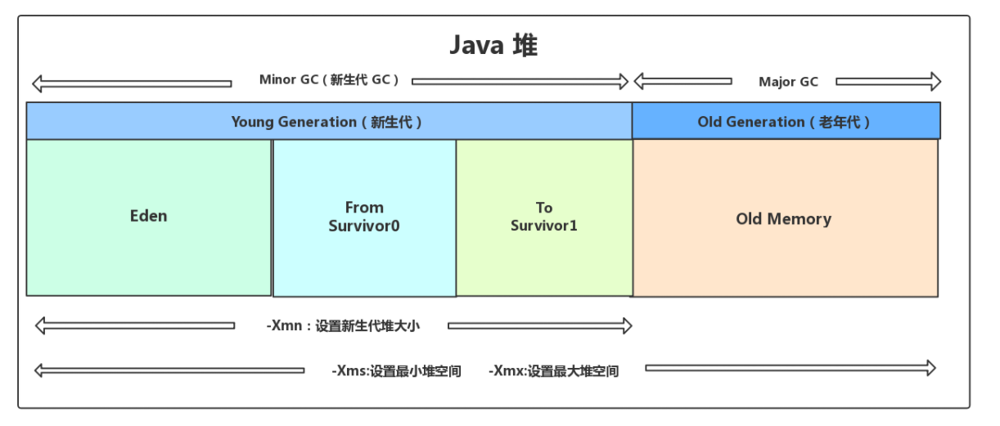

# GC

Java 堆是垃圾收集器管理的主要区域，因此也被称作**GC 堆（Garbage Collected Heap）**.从垃圾回收的角度，由于现在收集器基本都采用**分代垃圾收集算法**，所以 Java 堆还可以细分为：新生代和老年代：再细致一点有：Eden 空间、From Survivor、To Survivor 空间等。**进一步划分的目的是更好地回收内存，或者更快地分配内存。**

堆空间大致结构如下

 Eden 区、From Survivor0("From") 区、To Survivor1("To") 区都属于新生代，Old Memory 区属于老年代。

## 如何判断对象死亡？

目前比较常用的方法即为可达性分析法

即通过一系列的称为 **“GC Roots”** 的对象作为起点，从这些节点开始向下搜索，节点所走过的路径称为引用链，当一个对象到 GC Roots 没有任何引用链相连的话，则证明此对象是不可用的。可作为 GC Roots 的对象包括下面几种:

- 虚拟机栈(栈帧中的本地变量表)中引用的对象
- 本地方法栈(Native 方法)中引用的对象
- 方法区中类静态属性引用的对象
- 方法区中常量引用的对象
- 所有被同步锁持有的对象

其他方法如引用计数法因为有着较大的缺点（相互循环引用）使用较少。

判断一个对象真正死亡至少需要两次标记（了解即可）

> 1. 如果对象进行可达性分析之后没发现与GC Roots相连的引用链，那它将会第一次标记并且进行一次筛选。判断的条件是决定这个对象是否有必要执行finalize()方法。如果对象有必要执行finalize()方法，则被放入F-Queue队列中。
> 2. GC对F-Queue队列中的对象进行二次标记。如果对象在finalize()方法中重新与引用链上的任何一个对象建立了关联，那么二次标记时则会将它移出“即将回收”集合。如果此时对象还没成功逃脱，那么只能被回收了。

## GC的叫法

针对 HotSpot VM 的实现，它里面的 GC 其实准确分类只有两大种：

部分收集 (Partial GC)：

- 新生代收集（Minor GC / Young GC）：只对新生代进行垃圾收集；
- 老年代收集（Major GC / Old GC）：只对老年代进行垃圾收集。需要注意的是 Major GC 在有的语境中也用于指代整堆收集；
- 混合收集（Mixed GC）：对整个新生代和部分老年代进行垃圾收集，主要针对G1垃圾收集器。

整堆收集 (Full GC)：收集整个 Java 堆和方法区。

## 新生代的GC过程

大部分情况，对象都会首先在 Eden 区域分配，在一次新生代垃圾回收后，如果对象还存活，则会进入 s0 或者 s1，并且对象的年龄还会加 1(Eden 区->Survivor 区后对象的初始年龄变为 1)，当它的年龄增加到一定程度（默认为大于 15 岁），就会被晋升到老年代中。对象晋升到老年代的年龄阈值，可以通过参数 `-XX:MaxTenuringThreshold` 来设置。

经历第一次GC后，Eden 区和"From"区已经被清空。这个时候，"From"和"To"会交换他们的角色，也就是新的"To"就是上次 GC 前的“From”，新的"From"就是上次 GC 前的"To"。不管怎样，都会保证名为 To 的 Survivor 区域是空的。Minor GC 会一直重复这样的过程，在这个过程中，有可能当次Minor GC后，Survivor 的"From"区域空间不够用，有一些还达不到进入老年代条件的实例放不下，则放不下的部分会提前进入老年代。

## 老年代的GC过程(CMS)

以最常用的CMS回收器为例，其在老年代垃圾回收主要经历四个阶段（具体可见）

- 初始标记：此阶段会让系统的工作线程停止，进入“stop the world”。初始标记，是标记出所有**GC Roots直接引用**的对象。
- 并发标记：此阶段会让系统线程可以随意创建各种新对象，继续运行。此阶段运行期间可能会创造新的存活对象，也可能让部分存活对象失去引用变为垃圾对象。在这个过程中，垃圾回收线程会尽可能的对已有的对象进行GC Roots追踪，即**对老年代所有对象进行GC Roots追踪**，很耗时间，他需要跟踪所有对象是否从根源上被GC Roots引用了，但是这个最耗时的阶段是并发的，所以这个阶段不会对系统运行造成影响。
- 重新标记：第二阶段结束后，会有很多存活对象和垃圾对象，是之前没标记出来的。此时，第三阶段要继续让系统停止起来，进入“stop the world“阶段。然后重新标记下第二阶段里新创建的对象，还有一些对象可能失去引用。这个重新标记阶段，速度是很快的（是对第二阶段被系统程序运行改别变动过的少数对象进行标记）。
- 并发清理：让系统随意运行，并让垃圾回收线程清理掉之前标记为垃圾的对象。这个阶段也比较耗时，因为需要进行对象的清理，但是其可以跟系统程序并发执行，不会影响系统程序的执行。

需要注意的是使用CMS过程中，一定要避免Concurrent mode failure

CMS主要有以下缺点，但是HotSpot为其提供了解决方式

1. **对 CPU 资源敏感，消耗CPU资源**

   > CMS默认启动的垃圾回收线程数量是 (CPU核数+3)/4，这个值默认即可，无需设置

2. **无法处理浮动垃圾（Concurrent Mode Failure问题）**

   > 浮动垃圾：即在并发清理阶段，CMS回收之前标记好的垃圾对象。但此时还会有一些对象进入老年代，同时也有垃圾对象的产生。这些垃圾对象称之为浮动垃圾。
   >
   > 如果在CMS垃圾回收期间，系统放入老年代的对象大于了可用内存空间，此时就会**发生Concurrent Mode Failure**，即并发垃圾回收失败。此时系统会自动用**Serial Old垃圾回收器替代CMS**，直接强行把系统程序”stop the world“，重新进行长时间的GC Roots追踪，标记出来全部垃圾对象，不允许新的对象产生。然后一次性将全部垃圾对象回收掉之后，再恢复系统。
   >
   > 所以需要保证在CMS垃圾回收期间，还有一定的内存空间让一些对象可以进入老年代。CMS触发垃圾回收的时机之一：**当老年代内存占用达到一定比例了，就自动执行GC（"-XX:CMSInitiatingOccupancyFaction"，此参数可用来设置老年代占用多少比例的时候触发CMS垃圾回收。默认值为92%）**。这样可以在老年代留有一定的余量，避免出现Concurrent Mode Failure

3. **它使用的回收算法-“标记-清除”算法会导致收集结束时会有大量空间碎片产生**

   > CMS采用标记-清理算法，每次都是标记出垃圾对象后，进行回收，这样可能会导致大量的内存碎片产生。**太多的内存碎片会导致后续对象进入老年代找不到可用的连续内存空间，进而触发Full GC**。
   >
   > JVM提供了两个参数，来处理内存碎片的问题
   >
   > - "-XX:+UseCMSCompactAtFullCollection"，此参数是指在Full GC之后，要再次进行"stop the world"，停止工作线程，然后进行碎片整理，避免内存碎片。此参数默认开启
   > - "-XX:+UseCMSFullGCsBeforeCompaction"，这个参数是执行多少次Full GC之后再执行一次内存碎片整理的工作，默认是0，即每次Full GC之后都会整理内存碎片

## 新生代什么时候进入老年代

一般以下情况对象会进入老年代

- 新手代对象年龄大了，超过配置（"-XX:MaxTenuringThreshold"）

- 大对象直接进入老年代

- 新生代垃圾回收后，存活对象大小大于 Survivor区，无法进入survivor区，那么会将这些对象放入老年代中

- 动态对象年龄判断，即让一些满足动态对象年龄对象直接进入老年代

  >Hotspot 遍历所有对象时，按照年龄从小到大对其所占用的大小进行累积，当累积的某个年龄大小超过了 survivor 区的 50% 时（默认值是 50%，可以通过 `-XX:TargetSurvivorRatio=percent` 来设置），取这个年龄和 MaxTenuringThreshold 中更小的一个值，作为新的晋升年龄阈值”。

## 什么情况下会发生Full GC

一般有以下几种情况

1. 发生Young GC前进行检查——空间分配担保。这是为了确保确保在 Young GC 之前老年代本身还有容纳新生代所有对象的剩余空间。
   如果“老年代**可用的连续内存空间**”< “新生代历次Young GC后升入老年代的对象的平价大小或者新生代对象总大小”，说明本次Young GC后可能升入老年代的对象大小可能超过了老年代当前可用内存空间，此时需要先触发一次Full GC给老年代腾出更多的空间，然后再执行Young GC。
2. 执行Young GC之后有一批对象需要放入老年代，此时老年代就没有足够的内存空间存放这些对象了，此时就必须触发一次Full GC。
3. 老年代内存使用率超过92%（参数-XX:CMSInitiatingOccupancyFaction可调整，默认值为92%）

上面的情况落入到生产环境中，一般便是下面这些场景

- 系统承载高并发请求，或处理数据量大导致Young GC很频繁，而且每次Young GC过后存活对象太多，内存分配不合理，Survivor区域过小，导致对象频繁进入老年代，频繁触发Full GC。

- 系统一次性加载过多数据进内存，搞出来很多大对象，导致频繁有大对象进入老年代，必然频繁触发Full GC。

- 系统发生了内存泄漏，莫名其妙创建大量的对象，始终无法回收，一直占用在老年代里，必然频繁触发Full GC。

  

## JVM的优化是指什么

个人认为核心就是——**避免Full GC**。如果系统频繁的出现Full GC（单线程stop-the-world），就会严重的影响系统（主要指web）的性能。

从上面原因可看出，出现Full GC的原因就是老年代中对象太多，没有空间容纳更多对象。这虽然可通过增大堆内存来解决，但是治标不治本。

优化Full GC的前提是优化Young GC，优化Young GC的前提是合理的分配内存空间，不能让新生代对象频繁的进入到老年代中，而尽量让那些大对象，生命周期长的对象尽早的进入老年代空间，不要停留在新生代影响Young GC。

合理分配内存空间的前提是，需要对系统运行期间的内存使用模型进行评估（监控系统或者原始的jstat命令），不同的情况需要进行不同的分析。

### 一些常用的指令

#### jstat

jstat -gc PID 查看一个进程号为PID的进程的内存和使用情况，使用后会有以下信息

1. SOC：From Survivor区的大小
2. S1C：To Survivor区的大小
3. S0U：From Survivor当前使用的内存大小
4. S1U：To Survivor区的大小
5. EC：Eden区的大小
6. EU：Eden当前使用内存大小
7. OC：老年代大小
8. OU：老年代当前使用内存大小
9. MC：方法区（永久的，元数据区）大小
10. MU：方法区（永久的，元数据区）当前使用内存大小
11. YGC：系统运行迄今Young GC次数
12. YGCT：Young GC总耗时
13. FGC：系统运行迄今Full GC次数
14. FGCT：Full GC总耗时
15. GCT：所有GC总耗时

一般结合 jstat -gc PID 1000  100（每1秒统计一次，共统计100次）
通过此命令，可以精确的看到 一段时间内新生代对象增长的速率，Young GC的触发频率，Young GC的耗时，每次Young GC后有多少对象是存活下来的，每次Young GC过后有多少对象进入了老年代，老年代对象增长的速率，Full GC的触发频率，Full GC的耗时。

通过上面这些信息，便可以大致估算出**新生代对象增长的速率**， **YoungGC的触发频率和每次耗时**，**每次YoungGC后有多少对象是存活并进入老年代**以及**Full GC的触发时机和耗时**。有了这些数据，便可以对内存情况进行评估，合理的设置jvm

#### jmap

jmap -histo PID，会打印出如下信息

![4787  22Sé1  *Bytes  734516  4 g 7100  c Lass name  java. lang . String  java. lang. Class  3 ava . . SacksSccketZmpL  ava . . ccncuz-rent . ConcurrentHashMap%Tccie  java. lang . Object ](data:image/png;base64,iVBORw0KGgoAAAANSUhEUgAAApoAAAD/CAIAAADeyOFoAAAAAXNSR0IArs4c6QAAAARnQU1BAACxjwv8YQUAAAAJcEhZcwAADsMAAA7DAcdvqGQAACx/SURBVHhe7dw/b+JKvwfw4b4KkJLCUto0VAFpG6S8gMTKSoFqlTIdogtJAbhDqe42V4q2spH2iOQFrESzEqaiSRvJRZDwu+DOeP54bGxCAptkwvejc54DY+yxx+P5zR/nKSwWCwIAAAAm+x/xXwAAADAWwjkAAIDxEM4BAACMh3AOAABgPIRzAAAA4yGcAwAAGA/hHAAAwHgI5wAAAMZDOAcAADAewjkAAIDxEM4BAACMh3CumXnOIAwHtjMRCfCV+F3HJ77z3Qv594lTKBTsgfhmOr9LCgX2jzcTKQCwUxDONbOAWMXgiVh7IkEKve/2VlrJKKLAhwjp3bVmwfTQKvKEo6vFs1vmn18jHDifMGRWrsliQeae+AoAuwbhPMba+z36P3YtHc6L9d/DejoRzBKwztosKB9XRAIAwFeyeLtxj+7fcd0zfiTS83n6PErpjePP5NSb05HQKf3Q6dH/ZVujrzTBfY52+ljiZGLyWhbjDk9InWfetUe0o7Hr7UQlsZQFKxNBlFIkzmju0T1OXY9lxZy5agfGl+k0d8/tyaNFe0k8a0HL5azXO+M3aCfImyipknxm5RaXmEoXZSuKSOzOCjO67zqthN+p5P0FfWr5Pz2P/aObe4v0A6X9nnREmqAfqrM4VYd6XpzK9FOantpryaqKqtVSVSZRefZ6UanSp0ArXia/GAFglU1G55Ur2rrdNIImP9SY3PJVSTqWVe0X/Swf6b368NklN6RFf+uT6n4QfSgP/36CxUt6bqyVoe3suBc1RldHYkvlml3b3EtNyuZdO+P/ii4t0iLte54aZyEMz8WkL2U1VQPYCvbFhHzxfDj3SOPB4tvmJ8M7tag/cQq3Ip1usR4aU54+8y6fVOaL+UE/Xhue3MmzXSyapP2fSN4F7CbKyM06Xr/rquin9VJJlVgzKHWjsj+6oBW451/xgXzlmkbxU/cH/UbvO60MvThkXsux/vuU/IQUbsl8webV6T/WAxH3faWx/P38gNgDkUh5f7RDPYpEyv9FH1KR3iJEVOB8qyoqqakKr8qE3o5xpz09oD+f2w+lfvTBfRyxol9RjACw0saT7Z2xjHyWxeYzX1D2Llj7t2f1+Aej5Vx75ZhUC0L10Z2rFj9XkfwpiR0K1bZI5MrurYg9Ras8DXjTFnq3ZBzHJNZn4p2D8O/w/kZlXijV7+8fRqI5PKqRikgvVKbus4hVu46O/9QNOroak360Ll6sN3tt2UULB/12p7V6teV9Sj6677S6CPXfZHguPufaI/3oFTn6T6ku0rjaASnJTY3D+FBRBRbp1UcyvxbpK2VWVJp70BdXzspEJDK9FquxReuQfxBWFSMArIS188jMs2kgvWlXaTT9r0FD60Yvtx/RIZykBnz5woEdDVA4feL9LRLT/lQc9dnIUornAHaB3y0U9httOhCv37dpZFUvt9ModGCJTyl0gE4a0SjTv6uTaGj+gs9Z8s5+PNReJDMunsv01MD9KE5fNEmpK5Jfz3f4JBynT7znyy9GAFjl34XzacDf/qWRspIccH5CbCacxtFosj1arlOT7a+n/SlUBlks9GcF8bZ88ETsb6LJCgeXjZcnY4u1k2lV6yXQDkEh+lo8b5FKdrTwu9t5Od9EbLLd752yyfZonjw52R533SZOlahRuBig+xlDc3UTQ++76Pm9T8nXTkhVC67hgBRWx9oZmXaI6ok4ep9kRuycfZ3vZDsD4lkw7dRknr6zRjuwohgB4AW8B/wm8rUgttisxpRybTjuiffG0efT//0pXnGh8ZK/FufN+c+0l8I+ULRqHq2wigRq6f01+ZrPimtPvi0lfi/FxaK/W6ftIl6vY4dS7wSx8YrcUZVV7htDqXOWJ5B8HexzvIH4jviquf7ugqx743g6JHWzxJ1dKiuthBNDyXcp+bkXv78Wv9qmvbwm/jlb8Nz137vRZ/HKW2oX7X23np4uj7PCioqq1VLxrhxNlwXCioK/FjcWRR3dnZxiBIDVCvRf8djsuJln/7KGxyOHXG0wNIdPig6Rgx8/ya9R7Xr9yVs6+C41DrXFdQCAzwrhHCAH7eHtD+1n/F8OAIABEM4B0sKBHb+GfebO8TYWAHx6COcAAADGwx+qAQAAGA/hHAAAwHgI5wAAAMZDOAcAADAewjkAAIDxEM4BAACMh3AOAABgPIRzAAAA4yGcAwAAGA/hHAAAwHgI5wAAAMZDOAcAADAewjkAAIDxEM4BAACMh3AOAABgPIRzAAAA4yGcAwAAGA/hHAAAwHgI5wAAAMZDOAcAADAewjkAAIDxEM4BAACMh3AOAABgPIRzAAAA4yGcAwAAGA/hHAAAwHgI5wAAAMZDOAcAADDeJuE89L4XUpxJtGXiiO/Kdy9kG/ylDbY3YxvCgS0SlK7PNuQeCrknbD/33F2QewJy/+DcASBSWCwW4iMAAACYCZPtAAAAxkM4BwAAMB7COQAAgPEQzgEAAIyHcA4AAGA8hHMAAADjIZwDAAAYD+EcAADAeAjnAAAAxkM4BwAAMB7COQAAgPEQzgEAAIyHcA4AAGA8hHMAAADjIZwDAAAYD+EcAADAeAjnAAAAxkM4BwAAMB7COQAAgPEQzgEAAIyHcA4AAGA8hHMAAADjIZwDAAAYD+EcAADAeAjnAAAAxkM4BwAAMB7COQAAgPEQzgEAAIyHcA4AAGA8hHMAAADjIZwDAAAYb9NwHg7sAtX1xXdQZh4tGnsQiq8x32FFRtneTCRxojAprTxVojMRKcJEHua7t5zH1+B32fUtl2F+reNlmy5YKu9QcTEu75VTwvxQjNklH3rf+WU4eHoBvoDNwvnEKT21FotxT3wHJfSaQ9tbKhgW4/vW8yIyrO+JZIoGiagwI9cVkSpKmJpbt1qzS49za82jDYtmUPqK3Skas/sH88WzWxYJUm6to/GJle3cS++Reyi9GBetYD8uYdZjkJvmJ8NL2Q8Qh+K2VPL0mFndvn+tWP/NLmLcEd/fW9Tf5eyuY2sl6Xff0MOgdz+jGwewOzYL50dXceABTTi4HJ78rFviq0RjfNBKRnFh4rAgkS7M0PtjzUVisX5rjVSjPwvKzXqRfz66cElg8jAxW/F8ODwXl5iQW+tofMoq2xWH2qsPf8tiJJULjwQyHtBdFnJT8bxVfgqij8lDbankc0/vK/OdffosCC3Svhfpb5Z79wF2xL9cO+dzlV9x4PiCmXf5YP9cbqBno+DkIjMQ+X9IK6NBDwJi6alTGVTIUY38UQUbkIParkWDfyAcPRArKx6Eg/70IN01Y2ajYfIGvQqbAIglR5bxEoD2BCUm/9WSjRjIxksAy+syr5WZO8+x68kp+mQuaqhNzy3a/eX5hjNLlWnlWs5IRcep3rSr/GjacURx0fORealN8tqTZRj9zB548mJySrjr8yNvWmgAHw2vwm1dNM1+q8Z8mlkwJSPVUmrNRxg8kkA17vqK7GPe4K9ycdAXvy/0yTdE80353VLQvEp1tnicKD21skbP0fhyg9kpNgEgLc1418Ziy2J+0Bdx6+hq7p2SzjiaNqhcseWGU/dZnvNxvId1u+G0c1buPMebRtDkW8bkVlZUGjjVULsZlCrtU2/+0nxD5Yr+Mqq+VBz79+q0UMadnjoBdZyouOgJVAsyr5YleresN0BPNbXIQg/17JL6UKxtPdvDX1rHSK2kHPRL9fuev7g6EhsBDPUvw/nRFXtcNmjvzBQE/9039qNWqtK+r5dU2A6D6X29MfVEM6KthdNd2o16WTRhzUCt1OaaeZdqoX3RClQ7BW/BXgrrH8yXG3QRJ2jPKTXJxEZ+fUuF0q3bC1RnjQYbkchCWqt30+ehOhz0252Wml62tD0a/4nEN8rJnemMZSnRsXXAw2n4d1j2ZVHwPsc6ePsQaT2V4oi+Gu3NLERelaOXi7/s/RRFtGeVZefY/zN1ZYeb9hI+7O0BgK3C6Hzr6CBG8nt0mKKCRPGbfXrmykn4Yu1ErdRWah3SixvEmlyptazD6L/cLCByypc1oMeqLWMN63ptISzznQIdl8ejwGWsxSejOJ7TsR0bIP67ldrEujKtRSKZYQv8DdZ78+/qxP0h60D8yiSzWXxakftailb6jcMXVa7H6u2E92cdrNf/APjcsHb+jvbqrcPhSM6CBk/xSm3lhztVa+Fx2C7Wj4n6vb6+TnsG2lpueokd1iUG2WKiNRw4co6ajdfj1ZCJU30UC71snZXN0/K+V+h1/8Hfqs2CaacmA7XvVNriY0QM0Aej9pldk/UnDKY91b2jZ3sjPkp8oX2918VX5p6J1sa49mbskpF7+mX+ySj5dsJU9nTpvtt/X71yXB7+lbnPvMvUDASAoUQf/G3SPfdTV/wJVoRvZZNjO2junkVFQuiwWyRF4j+vogN3kRbRpijjhcP838fHTxf7V7E0ZyuLJbfW6WUSkXUv71BL6XpJ6kdTd2QpizM3cRffatxJ3ETtxE7d6M8d9bvPtybrlXZiZ67LRuf6AXkt0utV1rA7o7j03GVVZJesslsuSbZLsq5m5J4u+VQxxuf28s1dPLvJY8mjqXT2S/3kGW0Co+d6p8nCBDBSgf4rajUAfBC/awc/vsrfWU0cO7gw6E/vwoF9Zw3xKhyYDmvnAB8uDB7LmX8jZyL/T7ts0uJP7h8oApgF4RzgY4g/pGYy/kbONHyBnMn8G4FPR/7xelT4+P+fga8Ak+0AAADGw+gcAADAeAjnAAAAxkM4BwAAMB7COQAAgPEQzgEAAIyHcA4AAGA8hHMAAADjIZwDAAAYD+EcAADAeAjnAAAAxkM4BwAAMB7COQAAgPEQzgEAAIyHcA4AAGA8hHMAAADjIZwDAAAYD+EcAADAeAjnAAAAxkM4BwAAMB7COQAAgPEQzgEAAIyHcA4AAGA8hHMAAADjIZwDAAAYb9Nw7ncLwncvFGmwmu+IIrO9mUgiJPS+LydS/MepxMjMs6Mddq3k4yrHJS9fbbUHy6USFXLO75msTVnHodT9KjgTkWQadQmOL1I+h4l4PnJKHgCybRTOw4HdP5gvuGZQ6n6uZuEzYjG4bz3zIhvW90RyOLgcnvCSbAX7qnmlDS778dwri4RY6DWHNj/OzpX8qSsKkBr3Dq2iSGfxSVbIuf1wmeoDRYXs9sQ3RTva77o8lKzbz+5y0Ud9rFLQFDtdHYnUN6N5fUToKtZ/s/Mfd8T396b6o1Hk9ruy2h9dsdPKLnkAyLVROC+eD4fnsgE8unBJgO70SjQGBy0tikvh6KHcEiVZuXq2RqJxpw3u8o8js9HwsCU2HV3ND0YZw/cvqnKtlclkND2wxOcoPskKWaw3y4FeJjPv8sH+ea5+/IJE3U7yu6yPtXkUV1bk9WXRWL5PnwWh9VSq3ogtAPA221s7pwGGqHFShE+aYciuzEbByUVFfFll+hSIT+uaJkLXzvD/TO1vmYEw9G6nVtwTiiYzbuPBt+a+sR+NENed3fVHRHakNkMH5SJjJrmeIiecGfUEqUS2KKCWbMSgVl812HT+PzN3nmPXy15l0Jd+ot1XF6b/i8byK/UsVK5pTI+/ZtNG86llkcRAv+vY8TnHayKF747z/ZMtKwBs1bbCue/Qvvb1OqFqh82CKRmpllJrDYu1k2lfNH+0JBv30adV9mr2Y18EgIlTqr+8x1fkjx7tWjqy8jhXCpqptYyfmTE4CiQCHSO+HAjZTQxUkNhkkpwOykXGGTPetbHYspgf9EUuR1dz75R0xtGiQOVqMe6xlQIZBY/jPazbrJctXiErd57jTUOuMozJrYyp+lC7GZQq7VNvvnK+IQwexafXsFpqWSS5wBR1DoQWaccPw+ROrYksmqT9n0gG+JK2Ec5Z17hvqWZF4WtgiPFSGEzv642pJxZ3rdt4rFA8/2k/lKIAUZ16y+u7y4r1W3vIh5WVqeutscfXMxlNT2pLQYNGHV68cYcpeLq/r4vibf/XyHvVoPJjjfWiWXB/02gcinjXekqv0G/HXtCPTpfS+2rF81bvRnTjwkG/3YnnCSxtj8aGcSsnd6YzlqsMlkUCPokU/h2Wffn48z7Hv7BHRnIepVBpi8RI5ZhUxYZC9dGdqzbnqEYqIp09JsttFMAXsnE4nzgF1jHPWeIFTfGbfXrm/pSLu7UTos2Qi/eSqOE3Yh2v0ezs1eXgblgjVm17S7mmCAOSM9NO0fIckz8ibGtD8HHvTGvuU9jI+yVHtR7pjeURKsfJFfrtiOa6xAkvFr7eV6tceKTxi16Xf1cn7g95IROn9BTvsdnbbStyX0vRevEltqJ1+NrlIfFaqPDsJroMfOTAJQbuvG/H6S+ZAnxBG4Vztvh3a83FolfodZMLWnwFLmcktIv26q3D4Ui2YsET0RZ3FdaYWq+Kzawpt9aI/19MOHqyEjPtbJYobq/9blV7Sy4HraLxKqzvVPJW4nU0oE5HctxPuxRZN3EztFfRqckbSs8qMRIVA/TBqH0WLzSEwbSnuoATZ+m1Mr4AsV4wW5l7JtpPncqeU9YuGblXrlPBlf5m9ekFtPMmrzf0mvqClO+kltIlv7vhogOAUUTP9S3m7pk4iEDHPWJThPfrO2oZDqixGuycill3RhtO6X+FtVTCcWHGx0kX+454dntaAQr6oG2p4sWTwPombfTZ80UatTRj3NP20e7Llqr3uKPfdz33U76SotcWvlU/28Qpnbkuq07JP+djG/RLyBp2y2vJyV1WOVbfVHbimKld9LPNzp1KjLDV2S7VebVJv1NetK84Ye1ZoLTHITlLkShhgK+nQP8VtR0APggdRwY/vsqK1cSxg4ud+9M7gI+2vT9UA4A3CoPH8vYn7T+I/6ddTv7JKgC8A4RzgI+h/d15KWia/tI1XyBn+gfzLf5/7ADAmjDZDgAAYDyMzgEAAIyHcA4AAGA8hHMAAADjIZwDAAAYD+EcAADAeAjnAAAAxkM4BwAAMB7COQAAgPEQzgEAAIyHcA4AAGA8hHMAAADjIZwDAAAYD+EcAADAeAjnAAAAxkM4BwAAMB7COQAAgPEQzgEAAIyHcA4AAGA8hHMAAADjIZwDAAAYD+EcAADAeAjnAAAAxkM4BwAAMB7COQAAgPE2Duczzy5wji+SYLXQ+14ofPdC8ZWQiSOKULC9mdgifhxxJiKJ8rsiUdCP9vX5ennZg8Slq5JJpUfUjloJiwqcV3uzdolEGaHOv59wQG9U+i68m4/NfQVZ4T/jucE72yyc0zi0H7QWEZ9Uu2jcXhYOLocnbk98E069OS9FatwpW3si3e+WgiZPnlu3+hN76j7zdGrcO7SKIn03nLmqvIbn6tJZ16d/wLfM7YfLRAPHwnbfEoU2rIsS9p2oAo87/GtS9i6RiVMlrnsmvm2IhoqszsdnFA6c14YNrevpON23R53i+XDulcWXtX107lkdvngIJOg99deqXLPa+YZzg69ns3B+dLVYXFXE5wuXBLs0RnyTmXf5YP88t8RX7uhKi0n+6NGSm8OAuBdH/HOx3iwHsjGqXGvRZTKaHiQPuKOK9d8quieKi0X6Jg3byZDMVK5UBU7L24XynQoZX9fEt43RUKFVgC+F9lRkB2uxeLamNyL9fXxs7rn26sPojMad3jj6cCWecYCNbG/tfHLXIMkxIp9DxpA9RiPE0L6tr2q5aWw+qckfFGsHwUjGpDCwalmPvf9nan/7msEg13+NUjSsyZ9jDL3bqZrkILNRcHKRE7Zz5O/id6vEz+sEvEI0f6skL0Rff1FPkEpkaytqFUCM/7Rh6FqjPb5Y4Klz0J/TxPBRjS9ZjqV6u7EvNqz5aJdVq8DCmNY90nJJTU5oJWN7Ayd1OfFWdQL6obqOrZ3YO+SeuI/JU6retKtiQ+bqjyb6PTt59lvHF6fHakV0p+iHeI3JlLkceGdbCOeiNt9a8+vNm7ivLJpm/5k12oulYnPxvBbI1rP0ZGWVLx3N27WVx/xy6JBaaQX7qflM3uqVgqbedgdTMlKt4Vpzm3m7sGn28VaGU3RQLi4iY7a/xsdt1PygL5rvo6u5d0o648Vv2iOkhTDusTUX2bE4jvdIrstkq1zTTNuNJ7FWNiZ9uQuflpCerb54M4MV+9zrxas8azzvxfOf1q0oQ61nEEUvtU5H7+JTSYUo2p6U5Fmx+1tv8/QEvtoiT8D/pR2KtO956vvkPvMu499rNysagqvxN/XCBAz9/bNLbgg7lk+q/PT88vBvSO/U3CONfbXuw054rToMu0ZUkM35PX1FE5alm2zaLqeNe8kyHHfiNfJES6r4PX3dfQdlF8ti7p6Rni+/0CgYv6BAN8WNLKc3u1zeLjw9tqU6r99o5tnVs9FuMQ/h7JMI7VLyxJJHy6FfNd1dFFcy68hLlXBN7Mgix/T10hLu8JJMPwI6cY3LDw5tfJS83f9N7slij2hHWK5XuvTWZ7fHb7T6IJ/u+O4I4176NDa4L/BVbG+ynQ4dTuKZYVjGX1qJRK3G8uBmFpB4pp1KjLyLFtEWg4UwIDs3054UPE3Fp4Ri/feY/BHjseI3+/TM/SmX1WsnGSWZkreLNqSOYjwbKG+deEFP0GMVqVzQgdovel3+XZ24P2QVmjjamJLGCZH8Rul4mfkCwevt1X96L5f8SmUatMakmh6bspd4pGZQylwF+Ge5JwPtIpo72br49VjhES8qQdpG4dzvaqs4M++yThJ1DmvnrxT+DaxEbK7QKKLQyJ1+pEk4erJ2bKY9WesmTlX1eNhyYzyh6ner8RuCe/XW4VD1NYOn5ZJc8oZdtmUWTDs1Gah9p5KY7y2et3o3fW8wap/FXb0wmPaO49BeTb/zxRcgUqsSOeiFL8fL2FRGRPZ3BImfZTzvNF8903D0IIqx8sMO/mrxaHI3POAd2UrtsHGp7m/qdkcq13PrVs/ad7L/UPM9cqe3g1RWFKwqLnoyL6+A5Js2mvqfto5I8190GsBwokf5Vto4YGl+j48qlmfGdls8O5cuGTXjp9FHZsslqSbldoxW69LTlfHUZ7q4xqook3PXCdomKnOXiLov+XOzr5Ka/tWmcE9dj+WlnwDfmhwUssUF4cx1WfnoB+QXkigrWYbsZyo7eUztaIx2KK2E06PSjOc9Xbz6LokphGQx6pvUhUcnyc9EHZZfUTKX+FDvk3uy1lH60eLnN7sMOXZiKpEWYPSZZR3tTj+wufSoGggqi6VDpa4FdkqB/ivqAQB8EL9rBz+2NKcNX044cEbfrlA9YLXtrZ0DwBuFwePS4igAwGsgnAN8DO3vlUtBcwt/yA5fkt9Vf+6/3tsPsKsw2Q4AAGA8jM4BAACMh3AOAABgPIRzAAAA4yGcAwAAGA/hHAAAwHgI5wAAAMZDOAcAADAewjkAAIDxEM4BAACMh3AOAABgPIRzAAAA4yGcAwAAGA/hHAAAwHgI5wAAAMZDOAcAADAewjkAAIDxEM4BAACMh3AOAABgPIRzAAAA4yGcAwAAGA/hHAAAwHgI5wAAAMZDOAcAADAewjkAAIDxthPO/W6hUHB88Q18h5ZHwfZm4rsw82yWLjgTkRwJve88Ob1XVLbRhkEokhiehZDctCsya50qLq14VdlKXW0ncVOyaq+6X/rvGVn4371dLPcsstiX6jzAO5uwp/PdmsRw4Gy1zvPG6o3BdBvhfOJUieueiW87j96PvvW8mHtlkaDrjBfS1ZFIo8LB5fBkHiW3gn11L9mt7R/w9Ln9cJmoN2cu30ANz4sicXdk1jqWyEt4bt3qoaUXl/uz2zuwRDINzPtBa7EYd8R3jdhEzQ/6yc4Bu79MM7jcRqsRDuzP1iHzu/kNCm0u0/0bUrmOCiqzzu+wVcWYQ/VHWZs+85yv11PPvCjZdWYPmvz8xofi6Grh98RnDX3K0sfcNPCzbn2p3m7ss8Pw1obfPnlMNehav5tbrP/ObI7Wsnk4950KGV/XxDdg92NY3xNf1hOOHsotEZIrV8/WSNQGdmtlqC7Wm+Vgm91Ao2XXOv/P1P1RiT7SomsFv3hbSj9f8VQq/Dsklur9VK4W8SZdOBhZz2JT8fyn9UcOxCd3QVPe36Or1tPda9vrZcXzoUkdMtpcXmeWGWyKBgPZfaf9Tqu/35iKLV/dXv2nd9rzo0HOXn24GPc64+0+FPQpG3dOyYN6YEPvtk0HRT/fmovfld36xVyNK2i/du71iBh60eaFfXWfXxsR3mjTcO53q8TPbhB532e5I7/TbqpRZ41a1W2fPgXiU4xWvqml14n/GiVxqJ2b4VxV63SPwVLHm/Wcatq8SJ7giSRK+zHgtyQMkulk+uY+Fh8uSMmbyJ8dTj1BKpFN8quOv6hI2qgutY6TKdpdLBaIQ4m9orFR9aatamo8fMldfXgbdQn0gJ7XjVcuEiNUmcZ+TH8m102S16itp3ynh2J78eLlPxNFrRZHxIXQn8kd5aZ4dCVLW2akna12s6Ij295AbkxmkV2MeWbe6GAexzAW1eKJN622rJE7p9UiZ8DHxPn3Pf/aRdb0pi+Nm7Wz0mtF7s1iWew32nXZdK1sBgVV66jUBWqb7K5jJ6plkFVVyq0mGfGvs1Fw4saj+KwnLioQWtrxrU/exLJsCtJDOPu2FTSTp8rpJ5w4VF4WcXp0JiI1z2bhPJrb1CeNYZXo+RRo1zuumsXaybQv7qLv7Dfuo08Sv6OleFDIsH6fpM/P74D8Wlc5LjfEiJw209V29ClhNhoe1tYbWubF6bfH7xQ6XBA3MGO2v6ZWB+YHffGEH13NvVO2XvO7XmQVYNwjp66cQiDH8R7JhYZMfHf1mY4hTsW3qJaOO/HyRCrA0I0ZU5mvRmu1GtzQaxw2HuWG1AhVtPjRCd80gibfMCa36vGh95o+HTydrYA0blgqLV51UVFRa6ctrpHGWrlj0+LdNbZq8OwSGm9uregk5jXC8tGGYlT8xEW5kMYD//FifjK849FiRTHmmQV5Y3EaNUtPLXEglru4v7m5UzQ+iUtgW6wHPtDPv+/51y5Kjw5F5PJTi5fWzLuMz0qrqPk3i2fR8+R5JefG2pUobDH6w2u1VMk3g5IWs/1f4nyoFmnrzeZ9vZpVVehDVONf/V9D65tadKMynrhoqE0a+/Gtbz2VVOeg8oNWTkHrMXCVi5NheiWOxnJZgBQ9lCyuxLNA06tRBWYbcmpdno3CeUirnxhulhr/tauprtNRFHEwL5dpr946FAM+qnj+037gPdbq1NP6jAx76tgDebtcabjKhUd2Zx5+Va07uhoTuenQdQ9FshL+HZaPTaiQe4FqKUr1uJkqnrd6N33elIeDfrvTUj08S9uj8Z9I/LToyRM/7p6ygMH6KKzJ6xNtlpUGRV8Op6iO6sZZFpGPz+RueDKPu3es2Vlj5oZhsVbseFTRdynTeMPPhxQrR/S//ujmPloi5WiwacdnRcruLf8xKVrl6fKU0Kb8uwd7HjeklatnO/ircsnMPfRuyVhcAqUv271g6dol9t6PKNjKEfsvfZru4+lGVlHvH0bxxWferJV6PmvpInrfi4xUyVcSXfTKsXjaqeqjqxUROfVUlUjlXqkdDkczf0TiZ4fJeeKonlZRK9dj8keGVNG7pTIa56hJT6zE0Q6ErTrf7FBz+ykqrslIfxZoupy6X13rMmwUzqNeG0fPoKfVHnhRGMjhSIQ9b9zwG7EyQg79gVaTkoKnXVlio1bXOtb9564tclBLVcjgaa2Zdso60N/qos0BbRQY2mJG/+XoTVQTblsUv4XHJN7rYV23aAbCv6sT+aIAG4ppo7e3v0oDubQ3T7m4A7EtexbJWGX71LQAHNl+CNDePKWe3XgygeIjRi45cF+h8sMe7ldJoo1d8cQtPeBiCc93EtOrifOKFOu3Vn+9U8r1ylq3+atw+fhqxIbX83WwVTrVgwsHl43sWV9WsSx+z9hCSzy74nerU/lKtt/VllgmTvXRrm0/qBiNtQLkW6ptoV3yNWfaaaehRtQAiHafm7KdOrqwAnlP2PLbxZoHfIVZMO2o8/Sd5IhEDNAHo/ZZfNPDYNpTzROtD3KyTuLrNUszdf+pAa6TGpFoawp035cX7VbKyL34zZ5WtBRV1ffqLTLSfslGmS/0wI5q5br+Rx+JE45Hq5mLL+vKmjtdS24x8lXn+Cmm9uo/4/lqhv4m+kpzD0bavtFE8eq4ydbvqlrby7JTX1fd91egVZHoN3Ft6t2gxFllo6eq6nnoNfWFSD2gvgatY35ytW7VEzdt6KvgelMQv71UoJ3pjEAb3dDLB/GNdiO0ORV6qLshH2/I+X9hcidn115f60TQ34Tqy6S6Ejxd+9Os3RC/5SjEJaBtSpaVNpw6dePFkmRvNFmS2i7aX2Htjqxapy8EpscNlN9bSkwvA5/Gq3paCSdvlpbL1kp+3Encdy2LU9dj56ifGN+avJZE1XLZmesH5JeZPts4lzN3nDpmPECJj7M86Be/T42ZqESJZeee3EvbmjyaPCV5p9iR1cWqvfT7uHzhTM+PPkcnpteTSOZxmOz6EOEnpg7FvspCi/fKKkaO76gfn0vkEj/yiRNTe63OPXGZWusRpyfue961r2jQlm69uO/yUNk3SzugPFTiQtQx+dHiMiQ9L9ok9kqesMg6VQ5x7v8nC1Zclzpsukoknjj2Xnr0VVC5SPrrEVR8++KTzHmC9ENp10jTo+dXHDaz1uUp0H/FDwHgg/hdO/iReDkWAD5cOHBG365WPJh+1yHXa76r8c/9y8l2AFjLP1qDB4B/q/JpYjmFcA7wMfjqaaQUND9RowAAlN9V/6dvb3lF4P1hsh0AAMB4GJ0DAAAYD+EcAADAeAjnAAAAxkM4BwAAMB7COQAAgPEQzgEAAIyHcA4AAGA8hHMAAADjIZwDAAAYD+EcAADAeAjnAAAAxkM4BwAAMB7COQAAgPEQzgEAAIyHcA4AAGA8hHMAAADjIZwDAAAYD+EcAADAeAjnAAAAxkM4BwAAMB7COQAAgPEQzgEAAIyHcA4AAGA8hHMAAADjbRjOfacQswehSN5xM88WRVJwJiKNCwdyS9cXSRG/K5KZ7166HCeymLVN4lDJ4+yUqNCc1PWrksyqjaq62t5MJFFyl0QixdNzanXofY92WrrF5lCXkC7Dj8NP6fOcD4BJNh6dn7nzhTA8L4rEneY7+0FLFMncutWCxMQpPYkt84N+Mk6cus98y2Lxu66XIwvbt5YoZLVJHGrc41930MSpEtc9E98iLBj0D3hRze2Hy0R4Zn2sviUKeVjfE8m0eOUuraCZ6C2x9Ge3LBJ0tFtQCprRTovF1ZFIfTOa10d0hYv13+z8xx3x/b1pvV55+eyUXjofepfTHa+3mHnOB5Q5wD+Eyfatq1wtriric7HeLAey6QkD4v4QW4rnrfJTwD+vMvMuadhOBnjm6GpxLTPZRb5TIePrmvgmsGAg+5SJkmcxoEn7WHEUl/y7p5bcpXLVDO7kULt4Pszrnvpd1i3YPIorK/L6smgs3x/aondF+16ltTs09C4v30cA2Dyc/9coyR52usvMp4h3eDaY8v9MLdn0FL9ZwV/ZZs0C61iPx/eN/agUk7O74d/Alj0AUPxulfiqz5Qp9G7jkiezUXBykfH7WUAOLPE5Mg1eDCr+iLS2Ek7EcomQfHzU8gqlnqDEmotaOBBT0/p6zabz/5m58xy7XvYqgxpq03OLdl8dnv1fNJarqEwjNI3od1pLEa/iyVzi1Q0muSCVKMlkg6Ntsr2Bw4/Gymq/0a7LpgvT+/AlbBjO6UhUaQX7eCoSognbn3HTv1evPckWZD+wtOFd5VoUItV6KqmGMniakr9xy4biZdg0+zh/cMwjQSloamO4WTAlo6UIwUzXmSPRsUMFKrRsMklOB+XilmfMeNfGYou2LnN0NfdOSWcczdbQR2/cY2s0sltzHO+RWOJ5i6zceY43DbnKMCa3MqayobZcYGoGpUr71JuvnG8IA2LXEl2iYu2EyNmUdjVeFlHXIpYGIsk1Jj6DJenLWPQBVMtbrIGqt3k6e9ye3Z6n1glXdw0BzLDFyfbKhaceyMhRFOt3dU6YjgBoU5Jo1CaOXKalrYk1yokElR8uEWPEMHi8b9SnYln92erv9lQHF9J4elONgmmp8V+7mn5zkHcxaRiIwzbd5b7emIrmm27aoGM0C+5vGo1DEe9aT8kV+m3ZC/rRFVKl+r1IZD2AVu+mz3MMB/12J54nsLQ9Gv+JxDfKyZ3pqI6UZZGAd4XCv8OymizhfY6N0D6KNnC/tYe/Vt0umvu9qA8MPeH7h1FUJfy7B3setz+sYmxxiQTgs9nm2jkbSgIj38lKdmX8P1P7m4zuexbJGxey8R9Hhyynp54c3+/VbBnnd5k2qJ27Z73x8osFDB3MjckfEQaK3+zTM/en6FppA8E9S3/TjUb9srViTBk5qvVIbyzvbOVYX6HfFv1tysXC18eirNPcYOHNv6vHr2LQnqI2DN3w7bYVua+lmCjUTEWLDEeJcgtHD0QujpTjVZL19HxxskJ2lQD44jYK53QAGk82TpzqY3ICbUfXzsVrz2JcPhHLdVTl2BafKH3VlhZUPMT0nUoc9dkbc2KoQdHB0IvRZoex5dt42O13q1NVwnv11mEcP4InFTkqFweB3CUcPdkXL4/eaECdjuJxvzrU9tD+XKcmAzWtD2KKmBMD9MGofRY/brQj0lOvYtAn8UZ8lPgCxHpzEitzz0R7S1PZc8raJSP3yg97uK9WBGj3tzSMX27QZ1xCrzlc/foILRBSyby0Su2wcanNgSXaK22dha2vY94LvgDRn30rbRzQU+ttAu/Xd9LJX9zSaEYbOuhrfsni0vZKDzXiTdofs6Vz0TbtCFUC2p9KLp7deJ43XfHiwj+NF00Tu+glvzRjrN+vefwHcluq3uNO4g5quZ+6Hjtx/Zz51mQ90U7pzHXZU6kfkF97bpUT5LXk5C4LkBW4yk4cM7VLooQzc6e0kpe/54ftjVc8Dsy4p990Sr/vlLZVn6hIntX2byLAxyrQf0WdBoAP4nft4MdX+furiWMHF//yT+9853twgRl1gKRtrp0DwJuEweOrF4w/Lf9P++VXEDYxC6aHWHUCSEM4B/gY2p9El4Km6X8rFf+leP9g/g9eINf+7nw/aO30/4cSQDZMtgMAABgPo3MAAADjIZwDAAAYD+EcAADAeAjnAAAAxkM4BwAAMB7COQAAgPEQzgEAAIyHcA4AAGA4Qv4fzQV8icfjLjcAAAAASUVORK5CYII=)

 

打印结果，会按照各种对象占用内存空间的大小降序排列，将占用内存最多的对象放在最上面。一般用来看内存分布情况

使用jmap生成堆内存快照：**jmap -dump:live,format=b,file=dump.hprof PID**，此指令会在当前目录下生成一个dump.hrpof文件，可通过eclipse memory analyer进行分析。如果是内存泄漏问题，通过此方式一般都能解决。

