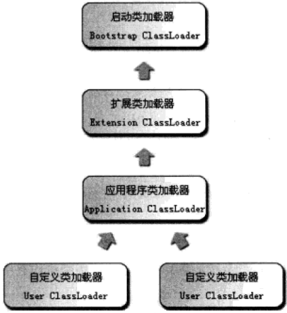
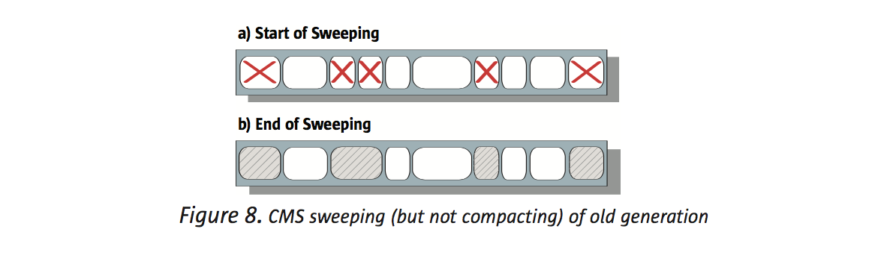
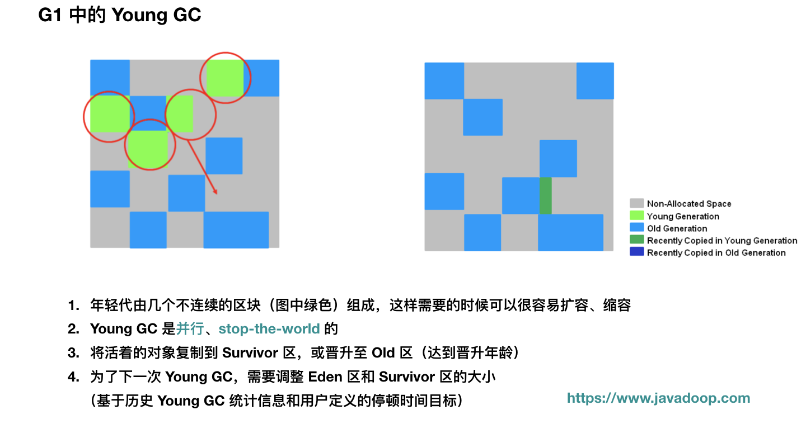

# 类加载

## 加载流程

**加载 -> 验证 -> 准备 -> 解析 -> 初始化 -> 使用 -> 卸载**

### 加载Loading

有两种时机会触发类加载：

- 预加载。虚拟机启动时加载，加载的是JAVA_HOME/lib下的rt.jar中的class文件（如java.lang.\*，java.util.\*等）
- 运行时加载，代码中用到class文件时

加载阶段主要做了一下：

- 获取class文件的二进制流
- 将类信息等class文件中的内容放入Metaspace中（1.8之前是方法区）
- 在内存中生成class文件对应的Class类对象

### 验证

根据规范，验证class文件是否符合标准

### 准备

为类变量分配内存空间，并设置其初始值的阶段

- 分配的内存仅仅为类变量（static修饰的变量），不是实例变量，实例变量会在对象实例化时随对象分配
- 此阶段赋初始值的变量是不被final修饰的变量static变量。比如"public static int value = 123;"，value在准备阶段过后是0而不是123，给value赋值为123的动作将在初始化阶段才进行；比如"public static final int value = 123;"就不一样了，在准备阶段，虚拟机就会给value赋值为123。

### 解析

符号引用替换为直接引用

### 初始化

此阶段会执行类的初始化代码，如静态代码块，静态变量赋值等。并且虚拟机会保证类的初始化在多线程环境中正确的加锁，同步

Java虚拟机规范严格规定以下必须立即对类进行初始化，这几种场景也称为对一个类进行**主动引用**：

- 使用new关键字实例化对象、读取或者设置一个类的静态字段（被final修饰的静态字段除外）、调用一个类的静态方法的时候
- 使用java.lang.reflect包中的方法对类进行反射调用的时候
- 初始化一个类，发现其父类还没有初始化过的时候
- 虚拟机启动的时候，虚拟机会先初始化用户指定的包含main()方法的那个类

除上述场景外，所有引用类的方式都不会触发类的初始化，称为被动引用

- 子类引用父类静态字段，不会导致子类初始化。至于子类是否被加载、验证了，前者可以通过"-XX:+TraceClassLoading"来查看
- 通过数组定义引用类，不会触发此类的初始化
- 引用静态常量时，常量在编译阶段会存入类的常量池中，本质上并没有直接引用到定义常量的类

### 使用

### 卸载

## 类加载器与双亲委派机制

### 类加载器

虚拟机设计团队把类加载阶段张的"通过一个类的全限定名来获取此类的二进制字节流"这个动作放到Java虚拟机外部去实现，以便让应用程序自己决定如何去获取所需要的类。实现这个动作的代码模块称为"类加载器"。

这几个层级的类加载器并不是继承关系，而是层次上的定义；他也并不是强制性的约束模型，而是Java设计者推荐的一种类加载器实现方式。

1. 启动类加载器Bootstrap ClassLoader。是嵌在JVM内核虚拟机的一部分，由C+语言实现。负责加载 **JAVA_HOME/lib** 下的类库。因为Bootstrap ClassLoader是JVM的一部分，是用C/C++写的，不属于Java，自然在Java堆中也没有自己的空间，所以就返回null了。所以，**如果ClassLoader得到的是null，那么表示的ClassLoader就是Bootstrap ClassLoader**。
2. 扩展类加载器Extension ClassLoader。负责加载 **JAVA_HOME/lib/ext** 目录中的类，或者被java.ext.dirs系统变量指定所指定的路径中所有类库
3. 应用程序类加载器Application ClassLoader。**只能加载项目bin目录下的.class文件**。

### 双亲委派

双亲委派模型是在JDK1.2期间被引入的，其工作过程可以分为两步：

1、**如果一个类加载器收到了类加载的请求，它首先不会自己去尝试加载这个类，而是把这个请求委派给父类加载器去完成，每一个层次的类加载器都是如此。**

2、**只有当父加载器反馈自己无法完成这这个加载请求（它的搜索范围中没有找到所需的类）时，子加载器才会尝试自己去加载**

所以，其实所有的加载请求最终都应该传送到顶层的启动类加载器中。双亲委派模型对于Java程序的稳定运作很重要，因为Java类随着它的加载器一起具备了一种带有优先级的层次关系。例如java.lang.Object，存放于rt.jar中，无论哪一个类加载器要去加载这个类，最终都是由Bootstrap ClassLoader去加载，因此Object类在程序的各种类加载器环境中都是一个类。相反，如果没有双亲委派模型，由各个类自己去加载的话，如果用户自己编写了一个java.lang.Object，并放在CLASSPATH下，那系统中将会出现多个不同的Object类，Java体系中最基础的行为也将无法保证，应用程序也将会变得一片混乱。

# 垃圾回收器

> Serial和Serial Old垃圾回收器：分别用来回收新生代和老年代的垃圾对象。工作原理就是单线程运行，垃圾回收时会停止系统的工作线程，直接进入stop the world状态
>
> ParNew和CMS垃圾回收器：分别用于新手代和老年代。都是多线程并发的机制，支持多个线程同时进行垃圾回收，性能更强。
>
> G1垃圾回收器：统一收集新生代和老年代

## ParNew

ParNew主打多线程垃圾回收机制，和Serial相比，区别就在于单线程和多线程的区别，垃圾回收算法是一样的。

在进行垃圾回收时，会开启多个垃圾回收线程并行执行，此时系统工作线程会停止。、

通过设置 -XX:+UseParNewGC 可开启

默认线程数是CPU核心数（可通过 -XX:ParallelGCThreads 参数去设置）

多线程垃圾回收可能更适用于客户端程序（很少用）

## CMS

> CMS，使用了标记清理算法，并且采取了垃圾回收线程和系统工作线程尽量同时执行的模式来进行处理。

### CMS执行垃圾回收的过程

#### 初始标记

此阶段会让系统的工作线程停止，进入“stop the world”。初始标记，是标记出所有**GC Roots直接引用**的对象。

**注意：类的实例变量不是GC Roots**

#### 并发标记

此阶段会让系统线程可以随意创建各种新对象，继续运行。

此阶段运行期间可能会创造新的存活对象，也可能让部分存活对象失去引用变为垃圾对象。在这个过程中，垃圾回收线程会尽可能的对已有的对象进行GC Roots追踪

此阶段就是**对老年代所有对象进行GC Roots追踪**，很耗时间，他需要跟踪所有对象是否从根源上被GC Roots引用了，但是这个最耗时的阶段，所以这个阶段不会对系统运行造成影响。

#### 重新标记

第二阶段结束后，会有很多存活对象和垃圾对象，是之前没标记出来的

此时，第三阶段要继续让系统停止起来，进入“stop the world“阶段。然后重新标记下第二阶段里新创建的对象，还有一些对象可能失去引用。

这个重新标记阶段，速度是很快的（是对第二阶段被系统程序运行改别变动过的少数对象进行标记）。

#### 并发清理

让系统随意运行，并让垃圾回收线程清理掉之前标记为垃圾的对象。

这个阶段也比较耗时，因为需要进行对象的清理，但是其可以跟系统程序并发执行，不会影响系统程序的执行。

### CMS可能的问题

#### 消耗CPU资源

CMS默认启动的垃圾回收线程数量是 (CPU核数+3)/4。在并发标记和并发清理两个最耗时的阶段，垃圾回收线程和系统工作线程同时工作，会导致有限的CPU资源被垃圾回收线程占用了一部分

#### Concurrent Mode Failure问题

在并发清理阶段，CMS回收之前标记好的垃圾对象。但此时还会有一些对象进入老年代，同时也有垃圾对象的产生，称之为**浮动垃圾**

如果在CMS垃圾回收期间，系统放入老年代的对象大于了可用内存空间，此时就会发生Concurrent Mode Failure，即并发垃圾回收失败。此时系统会自动用Serial Old垃圾回收器替代CMS，直接强行把系统程序”stop the world“，重新进行长时间的GC Roots追踪，标记出来全部垃圾对象，不允许新的对象产生。然后一次性将全部垃圾对象回收掉之后，再恢复系统。

所以需要保证在CMS垃圾回收期间，还有一定的内存空间让一些对象可以进入老年代。CMS触发垃圾回收的时机之一：当老年代内存占用达到一定比例了，就自动执行GC

"-XX:CMSInitiatingOccupancyFaction"，此参数可用来设置老年代占用多少比例的时候触发CMS垃圾回收。默认值为92%

#### 内存碎片问题

CMS采用标记-清理算法，每次都是标记出垃圾对象后，进行回收，这样可能会导致大量的内存碎片产生。**太多的内存碎片会导致后续对象进入老年代找不到可用的连续内存空间，进而触发Full GC**

"-XX:+UseCMSCompactAtFullCollection"，此参数是指在Full GC之后，要再次进行"stop the world"，停止工作线程，然后进行碎片整理，避免内存碎片。此参数默认开启

"-XX:+UseCMSFullGCsBeforeCompaction"，这个参数是执行多少次Full GC之后再执行一次内存碎片整理的工作，默认是0，即每次Full GC之后都会整理内存碎片

## G1垃圾回收器

G1垃圾回收器可以同时回收新生代和老年代对象，不需要两个垃圾回收器配合运作，G1就可以完成新生代和老年代的垃圾回收。他在触发垃圾回收的时候，可以根据设定的预期停顿时间，来**选择最少回收时间和最多回收对象的Region进行垃圾回收**。

G1的新生代和老年代是动态变化的。

特点

- 将Java堆内存拆分为多个大小相同的Region。Region即可以属于老年代，也可以属于新生代（新生代和老年代各自的内存区域是不停变动的），是由G1控制
- 可设置一个垃圾回收的预期停顿时间

可以给G1指定在一个时间内，垃圾回收导致的系统停顿时间不能超过多久，G1会全权负责，保证达到这个目标。如果G1要做的这一点，他就必须追踪每个Region里的**回收价值**。G1需要搞清楚每个Region中的对象有多少是垃圾，如果对这个Region进行回收，需要耗费多长时间，才能成功回收。

所以简单来说，G1可以做到让你来设定垃圾回收对系统的影响，他自己通过把内存拆分为大量小Region，以及追踪每个Region中可以回收的对象大小和预估时间，最后在垃圾回收的时候，尽量把垃圾回收对系统造成的影响控制在你指定的时间范围内，同时在有限的时间内尽量回收尽可能多的垃圾对象。

### 相关设置

"-XX:+UseG1GC"来指定使用G1垃圾回收器

JVM默认有2048个Region，并且Region的大小必须是2的倍数，比如1MB，2MB，4MB等。手动指定可以通过参数来设置 "-XX:G1HeapRegionSize"

新生代初始占比默认为5%，约100个Region，可通过参数"-XX:G1NewSizePercent"来设置

新生代最大占比为60%，可通过参数"-XX:G1NewMaxSizePercent"来设置

"-XX:MaxGCPauseMills"，设置目标GC停顿时间，默认为200ms

G1提供了专门的Region存放大对象，而不是让对象进入老年代中。在G1中，大对象的判断规则是是否超过一个Region的50%的大小。如果放不下，会横跨多个Region去存放。当进行垃圾回收的时候，也会顺带这将其回收

### G1的新生代垃圾回收

G1新生代有survivor和eden区，触发机制都是类似的。当新生代达到设定的占据堆内存的最大大小60%时，就会使用复制算法进行清理。但不同之处在于，G1会根据设置的目标GC停顿时间，有选择的在指定时间内，回收尽可能多的对象。

#### 对象进入老年代

- 对象在新生代躲过了很多次垃圾回收，达到一定的年龄（"-XX:MaxTenuringThreshold"参数可设置）
- 动态年龄判断规则(此时就会判断一下，比如年龄为1岁，2岁，3岁，4岁的对象的大小总和超过了Survivor的50%，此时4岁以上的对象全部会进入老年代，这就是动态年龄判定规则)

### 新生代+老年代混合垃圾回收

"-XX:InitiatingHeapOccupancyPercent"，默认值为45%。其含义是，如果老年代占据堆内存的45%的Region，那么就会尝试触发一个新生代+老年代一起回收的混合回收阶段。

### G1垃圾回收过程

#### 初始标记

此阶段进入stop the world，但是仅标记GC Roots直接引用（各个线程栈内存中的局部变量代表的GC Roots，方法区中类静态变量代表的GC Roots等）的对象，速度较快。

#### 并发标记

此阶段运行系统正常运行，同时进行GC Roots追踪，从GC Roots开始追踪所有存活的对象。这个并发标记比较耗时，因为要追踪全部的存活对象。但是这个阶段可以跟系统程序并发运行，对系统影响不大。并且JVM会对并发标记阶段对对象做出的一些修改记录起来，比如那个对象被新建了，那个对象失去了引用。

#### 最终标记阶段

此阶段进入“stop the world”，会根据并发标记阶段记录的那些对象修改，最终标记一下有那些对象存活，那些对象是垃圾对象。

#### 混合回收阶段

计算老年代中每个Region中的存活对象数量，存活对象占比，以及执行垃圾回收的预期性能和效率。接着会停止系统程序，此时会根据设置的最大停顿时间，去选择部分Region进行回收

**注意：当老年代对堆内存占比达到45%时，触发的是混合回收。此时不仅回收老年代，还会回收新生代以及大对象。回收选择的Region也是有G1进行自动的选择（满足最大停顿时间）**

### G1垃圾回收器的一些参数

"-XX:G1MixedGCCountTarget"：在一次混合回收中，最后一个阶段执行几次混合回收，默认值为8。这意味着最后一个阶段回收过程中，先停止系统运行，混合回收一些Region，再恢复系统运行，再接着进行系统运行，继续进行回收，反复8次。这样可以尽可能的让系统不会停顿时间过长，可以在多次回收的间隙，也可运行。

"-XX:G1HeapWastePercent"：默认值为5%。在混合回收过程中，一旦空闲出来的Region达到堆内存的5%，此时就会立即停止混合回收。在回收过程中，对Region的回收时基于复制算法进行的，是要把回收的Region里的对象放入其他Region，然后将Region中的垃圾对象全部清理掉。

"-XX:G1MixedGCLiveThresholdPercent"，默认值是85%，意思是存活对象低于85%的Region才可以进行回收。

### 其他

进行Mixed回收的时候，无论是老年代还是新生代都是基于复制算法进行回收，都要把各个Region的存活对象拷贝到别的Region中去。如果拷贝时发现没有空闲的Region可以承载自己的存活对象了，就会触发一次失败。一旦失败，立刻就会停止系统程序，切换为单线程进行标记，清理和压缩整理，以空出来一批Region。

# Young GC与Full GC

进入老年代的对象

- 新手代对象年龄大了，超过配置（"-XX:MaxTenuringThreshold"）
- 动态年龄判断规则
- 新生代垃圾回收后，存活对象太多，无法放入Surviovr中

## Full GC的触发时机

- 发生Young GC前进行检查，如果老年代可用的连续内存空间” < “新生代历次Young GC后升入老年代的对象总和的平均大小”，说明本次Young GC后可能升入老年代的对象大小，可能超过了老年代当前可用内存空间
- 执行Young GC后，要放入老年代区域的对象大小 > 老年代剩余空间
- 老年代内存使用率超过92%（参数-XX:CMSInitiatingOccupancyFaction可调整，默认值为92%）

# GC日志与分析

打印GC日志参数

- -XX:+PrintGCDetils：打印详细的gc日志
- -XX:+PrintGCTimeStamps：这个参数可以打印出来每次GC发生的时间
- -Xloggc:gc.log：这个参数可以设置将gc日志写入一个磁盘文件

# jstat、jmap、jhat

## jstat

jstat -gc -PID。使用后有一下信息

1. SOC：From Survivor区的大小
2. S1C：To Survivor区的大小
3. S0U：From Survivor当前使用的内存大小
4. S1U：To Survivor区的大小
5. EC：Eden区的大小
6. EU：Eden当前使用内存大小
7. OC：老年代大小
8. OU：老年代当前使用内存大小
9. MC：方法区（永久的，元数据区）大小
10. MU：方法区（永久的，元数据区）当前使用内存大小
11. YGC：系统运行迄今Young GC次数
12. YGCT：Young GC总耗时
13. FGC：系统运行迄今Full GC次数
14. FGCT：Full GC总耗时
15. GCT：所有GC总耗时

> jstat -gccapacity PID：堆内存分析
>
> jstat -gcnew PID：年轻代GC分析，这里的TT和MTT可以看到对象在年轻代存活的年龄和存活的最大年龄
>
> jstat -gcnewcapacity PID：年轻代内存分析
>
> jstat -gcold PID：老年代GC分析
>
> jstat -gcoldcapacity PID：老年代内存分析
>
> jstat -gcmetacapacity PID：元数据区内存分析
>
> jstat -gc PID 1000 -10  每一秒统计一次，共统计十次

## jmap

jmap -histo PID  可以看当前jvm中对象内存占用情况

jmap -dump:live,format=b,file=dump.hprof PID  当前目录下生成dump.hrpof文件。可通过相关工具打开

# 案例
> 预估性优化：尽量让每次Young GC后的存活对象小于Survivor区域的50%，都留存在年轻代里。尽量别让对象进入老年代。尽量减少Full GC的频率，避免频繁Full GC对JVM性能的影响。

频繁Full GC的几种常见原因

- 系统承载高并发请求，或者处理数据量过大，导致Young GC很频繁，而且每次Young GC过后存活对象太多，内存分配不合理，Survivor区域过小，导致对象频繁进入老年代，频繁触发Full GC。
- 系统一次性加载过多数据进内存，搞出来很多大对象，导致频繁有大对象进入老年代，必然频繁触发Full GC
- 系统发生了内存泄漏，莫名其妙创建大量的对象，始终无法回收，一直占用在老年代里，必然频繁触发Full GC
- Metaspace（永久代）因为加载类过多触发Full GC
- 误调用System.gc()触发Full GC

### 频繁Full GC导致内存碎片问题

两个参数“-XX:+UseCMSCompactAtFullCollection -XX:CMSFullGCsBeforeCompaction=5”是设置的5次Full GC之后才会进行一次压缩操作，解决内存碎片的问题，空出来大片的连续可用内存空间。这意味着5次Full GC的过程中，可能会产生大量内存碎片。太多的内存碎片会增加Full GC的频率。

所以可适当调整上述两个参数。

### JVM的默认模板参数

-Xms4096M -Xmx4096M -Xmn3072M -Xss1M  -XX:PermSize=256M -XX:MaxPermSize=256M -XX:+UseParNewGC -XX:+UseConcMarkSweepGC -XX:CMSInitiatingOccupancyFaction=92 -XX:+UseCMSCompactAtFullCollection -XX:CMSFullGCsBeforeCompaction=0 -XX:+CMSParallelInitialMarkEnabled -XX:+CMSScavengeBeforeRemark

XX:+CMSScavengeBeforeRemark：在CMS进行重新标记阶段前进行一次Young GC（好处是，可提前回收一些年轻代中的对象，在CMS的重新标记阶段就可以少标记一些对象，提高了其效率）

可根据业务情况，自行定制。

### 大对象导致Full GC

导出大批量文件，加上慢sql。导致有大对象一直停留在老年代

### 日志注解导致Full GC

导出和会员相关的文件时，远程调用member服务获取会员信息，会异步的使用线程池写日志。大量的导出导致线程池的阻塞队列不停的增长，导致内存不够使用，频繁GC

### 远程调用超时时间太长导致的OOM

### Jetty的堆外内存溢出

# OOM(Out Of Memory)

-XX:+HeapDumpOnOutOfMemoryError    此参数可以在OOM时，自动dump当前内存快照

-XX:HeapDumpPath=/usr/local/app/oom	此参数是指将快照放在那个目录下

## 那些区域可能OOM？

1. Metaspace可能发生OOM，因为其会存放类信息
2. 各个线程的栈内存（默认为1MB），也可能会发生OOM
3. 堆内存空间

### Metaspace

-XX:MetaspaceSize=512m 

-XX:MaxMetaspaceSize=512m

如果Metaspace区域满了，就需要对其进行回收，但回收条件很苛刻（该类的类加载需要被回收，该类的所有对象实例需要被回收等）。若无法对其进行有效回收，就OOM

正常情况下，有两种情况会发生Metaspace的OOM

1. Metaspace的容量设置的较小
2. 代码中存在一些cglib之类的技术生成的动态类。一旦代码有些小问题，就可能导致生成类过多，Metaspace不够用

### 栈内存

每个线程的虚拟机栈的大小是固定的，如果其中大量调用方法，栈中会不停的压入栈帧，导致栈内存溢出

### 堆内存

对象太多，两种情况

1. 系统请求量太大，短时间内存在大量对象，导致溢出
2. 内存泄漏，存在大量未使用对象无法清除，导致溢出

# [HotSpot JVM内存管理(译文)](https://www.javadoop.com/post/jvm-memory-management)

本节内容基本都是复制粘贴

## 垃圾收集概念

GC需要做三件事情：

- 分配内存
- 确保还在使用的对象的内存还在，不能把有用的空间当垃圾回收
- 释放不再使用的对象所占用的空间

将**GC ROOTS**引用的对象称为活的，不再被引用的对象称为死的，即垃圾。GC的工作就是找到死的对象，回收其所占用空间

GC ROOTS主要有

- 当前各线程执行方法中的局部变量（包括形参）引用的对象
- 已被加载的类的static域引用的对象
- 方法区被常量引用的对象
- JNI(Java Native Interface)引用

> [了解更多](https://www.zhihu.com/question/53613423/answer/135743258)

GC管理的内存称之为**堆(heap)**。垃圾收集启动时机取决于各个垃圾回收器，通常，垃圾回收发生于整个堆或堆的部分已经被使用光了，或者使用的空间百分比达到阈值。

### 垃圾收集器的理想特征

- 安全和全面：活的对象一定不能被清理掉，死的对象一定不能在几个回收周期结束后还在内存中
- 高效：不能将程序挂起太长时间，需要在时间，空间，频次上做出权衡(如果堆内存很小，每次垃圾收集就会很快，但是频次会增加。如果堆内存很大，很久才会被填满，但是每一次回收需要的时间很长)
- 尽量少的内存碎片：每次将垃圾对象释放以后，这些空间可能分布在各个地方，最糟糕的情况就是，内存中到处都是碎片，在给一个大对象分配空间的时候没有内存可用，实际上内存是够的。消除碎片的方式就是**压缩**。
- 可扩展性：在多核多线程应用中，内存分配和垃圾回收都不应该成为可扩展性的瓶颈。

### 设计上的权衡

往下看之前，我们需要先分清楚这里的两个概念：并发和并行

- **并行**：多个垃圾回收线程同时工作，而不是只有一个垃圾回收线程在工作
- **并发**：垃圾回收线程和应用程序线程同时工作，应用程序不需要挂起

在设计或选择垃圾回收算法的时候，我们需要作出以下几个权衡：

- **串行 vs 并行**

	串行收集的情况，即使是多核 CPU，也只有一个核心参与收集。使用并行收集器的话，垃圾收集的工作将分配给多个线程在不同的 CPU 上同时进行。并行可以让收集工作更快，缺点是带来的复杂性和内存碎片问题。

- **并发 vs Stop-the-world**

	当 stop-the-world 垃圾收集器工作的时候，应用将完全被挂起。与之相对的，并发收集器在大部分工作中都是并发进行的，也许会有少量的 stop-the-world。

	stop-the-world 垃圾收集器比并发收集器简单很多，因为应用挂起后**堆空间不再发生变化**，它的缺点是在某些场景下挂起的时间我们是不能接受的（如 web 应用）。

	相应的，并发收集器能够降低挂起时间，但是也更加复杂，因为在收集的过程中，也会有新的垃圾产生，同时，需要有额外的空间用于在垃圾收集过程中应用程序的继续使用。

- **压缩 vs 不压缩 vs 复制**

	当垃圾收集器标记出内存中哪些是活的，哪些是垃圾对象后，收集器可以进行压缩，将所有活的对象移到一起，这样新的内存分配就可以在剩余的空间中进行了。经过压缩后，分配新对象的内存空间是非常简单快速的。

	相对的，不压缩的收集器只会就地释放空间，不会移动存活对象。优点就是快速完成垃圾收集，缺点就是潜在的碎片问题。通常，这种情况下，分配对象空间会比较慢比较复杂，比如为新的一个大对象找到合适的空间。

	还有一个选择就是复制收集器，将活的对象复制到另一块空间中，优点就是原空间被清空了，这样后续分配对象空间非常迅速，缺点就是需要进行复制操作和占用额外的空间。

### 性能指标

以下几个是评估垃圾收集器性能的一些指标：

- 吞吐量：应用程序的执行时间占总时间的百分比，当然是越高越好
- 垃圾收集开销：垃圾收集时间占总时间的百分比（1 - 吞吐量）
- 停顿时间：垃圾收集过程中导致的应用程序挂起时间
- 频次：相对于应用程序来说，垃圾收集的频次
- 空间：垃圾收集占用的内存
- 及时性：一个对象从成为垃圾到该对象空间再次可用的时间

在交互式程序中，通常希望是低延时的，而对于非交互式程序，总运行时间比较重要。实时应用程序既要求每次停顿时间足够短，也要求总的花费在收集的时间足够短。在小型个人计算机和嵌入式系统中，则希望占用更小的空间。

### 分代收集介绍

当我们使用分代垃圾收集器时，内存将被分为不同的**代(generation)**，最常见的就是分为**年轻代**和**老年代**。

在不同的分代中，可以根据不同的特点使用不同的算法。分代垃圾收集基于 **weak generational hypothesis** 假设（通常国人会翻译成 **弱分代**假设）：

- 大部分对象都是短命的，它们在年轻的时候就会死去
- 极少老年对象对年轻对象的引用

年轻代中的收集是非常频繁的、高效的、快速的，因为年轻代空间中，通常都是小对象，同时有非常多的不再被引用的对象。

那些**经历过多次年轻代垃圾收集还存活的对象**会晋升到老年代中，老年代的空间更大，而且占用空间增长比较慢。这样，老年代的垃圾收集是不频繁的，但是进行一次垃圾收集需要的时间更长。

对于新生代，需要选择速度比较快的垃圾回收算法，因为新生代的垃圾回收是频繁的。

对于老年代，需要考虑的是空间，因为老年代占用了大部分堆内存，而且针对该部分的垃圾回收算法，需要考虑到这个区域的**垃圾密度比较低**。

## J2SE 5.0 HotSpot JVM 中的垃圾收集器

J2SE 5.0 HotSpot 虚拟机包含四种垃圾收集器，都是采用分代算法。包括**串行收集器**、**并行收集器**、**并行压缩收集器** 和 **CMS 垃圾收集器**。

### HotSpot 分代

在 HotSpot 虚拟机中，内存被组织成三个分代：年轻代、老年代、永久代。

大部分对象初始化的时候都是在年轻代中的。

老年代存放经过了几次年轻代垃圾收集依然还活着的对象，还有部分大对象因为比较大所以分配的时候直接在老年代分配。

> 如 -XX:PretenureSizeThreshold=1024，这样大于 1k 的对象就会直接分配在老年代

永久代，通常也叫 **方法区**，用于存储已加载类的元数据，以及存储运行时常量池等。

### 垃圾回收类型

当年轻代被填满后，会进行一次年轻代垃圾收集（也叫做 **minor GC**）。

> 下面这两段我也没有完全弄明白，弄明白会更新。至少读者要明白一点，"minor gc 收集年轻代，full gc 收集老年代" 这句话是错的。

当老年代或永久代被填满了，会触发 **full GC**（也叫做 **major GC**），full GC 会收集所有区域，先进行年轻代的收集，使用年轻代专用的垃圾回收算法，然后使用老年代的垃圾回收算法**回收老年代和永久代**。如果算法带有压缩，每个代分别独立地进行压缩。

如果先进行年轻代垃圾收集，会使得老年代不能容纳要晋升上来的对象，这种情况下，不会先进行 young gc，所有的收集器都会（除了 CMS）**直接采用老年代收集算法对整个堆进行收集**（CMS 收集器比较特殊，因为它不能收集年轻代的垃圾）。

> 基于统计，计算出每次年轻代晋升到老年代的平均大小，if (老年代剩余空间 < 平均大小) 触发 full gc。

### 快速分配

如果垃圾收集完成后，存在大片连续的内存可用于分配给新对象，这种情况下分配空间是非常简单快速的，只要一个简单的指针碰撞就可以了（**bump-the-pointer**），每次分配对象空间只要检测一下是否有足够的空间，如果有，指针往前移动 N 位就分配好空间了，然后就可以初始化这个对象了。

对于多线程应用，对象分配必须要保证线程安全性，如果使用全局锁，那么分配空间将成为瓶颈并降低程序性能。HotSpot 使用了称之为 **Thread-Local Allocation Buffers (TLABs)** 的技术，该技术能改善多线程空间分配的吞吐量。首先，给予每个线程一部分内存作为缓存区，每个线程都在自己的缓存区中进行指针碰撞，这样就不用获取全局锁了。只有当一个线程使用完了它的 TLAB，它才需要使用同步来获取一个新的缓冲区。HotSpot 使用了多项技术来降低 TLAB 对于内存的浪费。比如，TLAB 的平均大小被限制在 Eden 区大小的 1% 之内。TLABs 和使用指针碰撞的线性分配结合，使得内存分配非常简单高效，只需要大概 10 条机器指令就可以完成。

### 串行收集器

使用串行收集器，年轻代和老年代都使用单线程进行收集（使用一个 CPU），收集过程中会 stop-the-world。所以当在垃圾收集的时候，应用程序是完全停止的。

现在基本不用

### 并行收集器

### 并行压缩收集器

### CMS(Concurrent Mark-Sweep)收集器

对于许多程序来说，吞吐量不如响应时间来得重要。通常年轻代的垃圾收集不会停顿多长时间，但是，老年代垃圾回收，虽然不频繁，但是可能导致长时间的停顿，尤其当堆内存比较大的时候。为了解决这个问题，HotSpot 虚拟机提供了 CMS 收集器，也叫做 **低延时收集器**。

**在年轻代中使用 CMS 收集器**

在年轻代中，CMS 和 **并行收集器** 一样，即：**并行、stop-the-world、复制**。

**在老年代中使用 CMS 收集器**

在老年代的垃圾收集过程中，大部分收集任务是和应用程序**并发**执行的。

CMS 收集过程首先是一段小停顿 stop-the-world，叫做 **初始标记阶段（initial mark）**，用于确定 GC Roots。然后是 **并发标记阶段（concurrent mark）**，标记 GC Roots 可达的所有存活对象，由于这个阶段应用程序同时也在运行，所以并发标记阶段结束后，并不能标记出所有的存活对象。为了解决这个问题，需要再次停顿应用程序，称为 **再次标记阶段（remark）**，遍历在并发标记阶段应用程序修改的对象（标记出应用程序在这个期间的活对象），由于这次停顿比初始标记要长得多，**所以会使用多线程并行执行来增加效率**。

再次标记阶段结束后，能保证所有存活对象都被标记完成，所以接下来的 **并发清理阶段（concurrent sweep）** 将就地回收垃圾对象所占空间。下图示意了老年代中 **串行、标记 -> 清理 -> 压缩收集器**和 CMS 收集器的区别：

由于部分任务增加了收集器的工作，如遍历并发阶段应用程序修改的对象，所以增加了 CMS 收集器的负载。对于大部分试图降低停顿时间的收集器来说，这是一种权衡方案。

CMS 收集器是**唯一不进行压缩的收集器**，在它释放了垃圾对象占用的空间后，它不会移动存活对象到一边去。（可通过开启空间碎片整理功能XX:CMSFullGCsBeforeCompaction进行空间的压缩）

这将节省垃圾回收的时间，但是由于之后空闲空间不是连续的，所以也就不能使用简单的 **指针碰撞（bump-the-pointer）** 进行对象空间分配了。它需要维护一个 **空闲列表**，将所有的空闲区域连接起来，当分配空间时，需要寻找到一个可以容纳该对象的区域。显然，它比使用简单的指针碰撞成本要高。同时它也会加大年轻代垃圾收集的负载，因为年轻代中的对象如果要晋升到老年代中，需要老年代进行空间分配。

另外一个缺点就是，CMS 收集器相比其他收集器需要使用更大的堆内存。因为在并发标记阶段，程序还需要执行，所以需要留足够的空间给应用程序。另外，虽然收集器能保证在标记阶段识别出所有的存活对象，但是由于应用程序并发运行，所以刚刚标记的存活对象很可能立马成为垃圾，而且这部分由于已经被标记为**存活对象**，所以只能到下次老年代收集才会被清理，这部分垃圾称为 **浮动垃圾**。

最后，由于缺少压缩环节，堆将会出现碎片化问题。为了解决这个问题，CMS 收集器需要追踪统计最常用的对象大小，评估将来的分配需求，可能还需要分割或合并空闲区域。

不像其他垃圾收集器，CMS 收集器不能等到老年代满了才开始收集。否则的话，CMS 收集器将退化到使用更加耗时的 **stop-the-world、标记-清除-压缩** 算法。为了避免这个，CMS 收集器需要统计之前每次垃圾收集的时间和老年代空间被消耗的速度。另外，如果老年代空间被消耗了 **预设占用率（initiating occupancy）**，也将会触发一次垃圾收集，这个占用率通过 **–XX:CMSInitiatingOccupancyFraction=n** 进行设置，n 为老年代空间的占用百分比，默认值是 **68**。

> 这个数字到 Java8 的时候已经变为默认 92 了。如果老年代空间不足以容纳从新生代垃圾回收晋升上来的对象，那么就会发生 concurrent mode failure，此时会退化到发生 Full GC，清除老年代中的所有无效对象，这个过程是单线程的，比较耗时
>
> 另外，即使在晋升的时候判断出老年代有足够的空间，但是由于老年代的碎片化问题，其实最终没法容纳晋升上来的对象，那么此时也会发生 Full GC，这次的耗时将更加严重，因为需要对整个堆进行压缩，压缩后年轻代彻底就空了。

总结下来，和并行收集器相比，CMS 收集器**降低了老年代收集时的停顿时间**（有时是显著降低），**稍微增加了一些年轻代收集的时间**、**降低了吞吐量** 以及 **需要更多的堆内存**。

**增量模式**

CMS 收集器可以使用增量模式，在并发标记阶段，周期性地将自己的 CPU 时钟周期让出来给应用程序。这个功能适用于需要 CMS 的低延时，但是 CPU 核心只有 1 个或 2 个的情况。

> 增量模式在 Java8 已经不推荐使用。
>
> 目前我了解到的是，在所有的并发或并行收集器中，都提供了控制垃圾收集线程数量的参数设置。

**何时使用 CMS 收集器**

适用于应用程序要求低停顿，同时能接受在垃圾收集阶段和垃圾收集线程一起共享 CPU 资源的场景，典型的就是 web 应用了。

> 在 web 应用中，低延时非常重要，所以 CMS 几乎就是唯一选择，直到后来 G1 的出现。

**使用 CMS 收集器**

显示指定：-XX:+UseConcMarkSweepGC

如果需要增量模式：–XX:+CMSIncrementalModeoption

> 当然，CMS 还有好些参数可以设置，这里就不展开了，想要了解更多 CMS 细节，建议读者可以参考《Java 性能权威指南》，非常不错的一本书。

## 小结

虽然是翻译的文章，也小结一下吧。

串行收集器：在年轻代和老年代都采用单线程，年轻代中使用 **stop-the-world、复制** 算法；老年代使用 **stop-the-world、标记 -> 清理 -> 压缩** 算法。

并行收集器：在年轻代中使用 **并行、stop-the-world、复制** 算法；老年代使用串行收集器的 **串行、stop-the-world、标记 -> 清理 -> 压缩** 算法。

并行压缩收集器：在年轻代中使用并行收集器的 **并行、stop-the-world、复制** 算法；老年代使用 **并行、stop-the-world、标记 -> 清理 -> 压缩** 算法。和并行收集器的区别是老年代使用了并行。

CMS 收集器：在年轻使用并行收集器的 **并行、stop-the-world、复制** 算法；老年代使用 **并发、标记 -> 清理** 算法，不压缩。本文介绍的唯一一个并发收集器，也是唯一一个不对老年代进行压缩的收集器。

另外，在 HotSpot 中，永久代使用的是和老年代一样的算法。到了 J2SE 8.0 的 HotSpot JVM 中，永久代被 MetaSpace 取代了，这个以后再介绍。

# [G1垃圾回收器](https://www.javadoop.com/post/g1)

G1 的主要关注点在于达到**可控的停顿时间**，在这个基础上尽可能提高吞吐量，这一点非常重要。

G1 被设计用来长期取代 CMS 收集器，和 CMS 相同的地方在于，它们都属于并发收集器，在大部分的收集阶段都不需要挂起应用程序。区别在于，G1 没有 CMS 的碎片化问题（或者说不那么严重），同时提供了更加可控的停顿时间。

如果你的应用使用了较大的堆（如 6GB 及以上）而且还要求有较低的垃圾收集停顿时间（如 0.5 秒），那么 G1 是你绝佳的选择，是时候放弃 CMS 了。

## G1(Garbage-First) 总览

首先是内存划分上，之前介绍的分代收集器将整个堆分为年轻代、老年代和永久代，每个代的空间是确定的。

而 G1 将整个堆划分为一个个大小相等的小块（每一块称为一个 region），每一块的内存是连续的。和分代算法一样，G1 中每个块也会充当 Eden、Survivor、Old 三种角色，但是它们不是固定的，这使得内存使用更加地灵活。

执行垃圾收集时，和 CMS 一样，G1 收集线程在标记阶段和应用程序线程**并发**执行，标记结束后，G1 也就知道哪些区块基本上是垃圾，存活对象极少，G1 会先从这些区块下手，因为从这些区块能很快释放得到很大的可用空间，**这也是为什么 G1 被取名为 Garbage-First 的原因**。

在 G1 中，目标停顿时间非常非常重要，用 -XX:MaxGCPauseMillis=200 指定期望的停顿时间。

G1 使用了**停顿预测模型**来满足用户指定的停顿时间目标，并基于目标来选择进行垃圾回收的区块数量。G1 采用增量回收的方式，每次回收一些区块，而不是整堆回收。

我们要知道 G1 不是一个实时收集器，它会尽力满足我们的停顿时间要求，但也不是绝对的，它基于之前垃圾收集的数据统计，估计出在用户指定的停顿时间内能收集多少个区块。

**注意：**G1 有和应用程序一起运行的并发阶段，也有 stop-the-world 的并行阶段。但是，**Full GC 的时候还是单线程运行的**，所以我们应该尽量避免发生 Full GC，后面我们也会介绍什么时候会触发 Full GC。

**G1 内存占用**

G1 比 ParallelOld 和 CMS 会需要更多的内存消耗，那是因为有部分内存消耗于簿记（accounting）上，如以下两个数据结构：

- **Remembered Sets**：每个区块都有一个 RSet，用于记录进入该区块的对象引用（如区块 A 中的对象引用了区块 B，区块 B 的 Rset 需要记录这个信息），它用于实现收集过程的并行化以及使得区块能进行独立收集。总体上 Remembered Sets 消耗的内存小于 5%。
- **Collection Sets**：将要被回收的区块集合。GC 时，在这些区块中的对象会被复制到其他区块中，总体上 Collection Sets 消耗的内存小于 1%。

## G1 工作流程

前面啰里啰嗦说了挺多的，唯一要记住的就是，G1 的设计目标就是尽力满足我们的目标停顿时间上的要求。

本节介绍 G1 的收集过程，G1 收集器主要包括了以下 4 种操作：

- 1、年轻代收集
- 2、并发收集，和应用线程同时执行
- 3、混合式垃圾收集
- *、必要时的 Full GC

接下来，我们进行一一介绍。

### 年轻代收集

首先，我们来看下 G1 的堆结构：

年轻代中的垃圾收集流程（Young GC）：

我们可以看到，年轻代收集概念上和之前介绍的其他分代收集器大差不差的，但是它的年轻代会动态调整。

### Old GC / 并发标记周期

接下来是 Old GC 的流程（含 Young GC 阶段），其实把 Old GC  理解为**并发周期**是比较合理的，不要单纯地认为是清理老年代的区块，因为这一步和年轻代收集也是相关的。下面我们介绍主要流程：

1. 初始标记：stop-the-world，它伴随着一次普通的 Young GC 发生，然后对 Survivor 区（root region）进行标记，因为该区可能存在对老年代的引用。

	> 因为 Young GC 是需要 stop-the-world 的，所以并发周期直接重用这个阶段，虽然会增加 CPU 开销，但是停顿时间只是增加了一小部分。

2. 扫描根引用区：因为先进行了一次 YGC，所以当前年轻代只有 Survivor 区有存活对象，它被称为根引用区。扫描 Survivor 到老年代的引用，该阶段必须在下一次 Young GC 发生前结束。

	> 这个阶段不能发生年轻代收集，如果中途 Eden 区真的满了，也要等待这个阶段结束才能进行 Young GC。

3. 并发标记：寻找整个堆的存活对象，该阶段可以被 Young GC 中断。

	> 这个阶段是并发执行的，中间可以发生多次 Young GC，Young GC 会中断标记过程

4. 重新标记：stop-the-world，完成最后的存活对象标记。使用了比 CMS 收集器更加高效的 snapshot-at-the-beginning (SATB) 算法。

	> Oracle 的资料显示，这个阶段会回收完全空闲的区块

5. 清理：清理阶段真正回收的内存很少。

到这里，G1 的一个并发周期就算结束了，其实就是主要完成了垃圾定位的工作，定位出了哪些分区是垃圾最多的。因为整堆一般比较大，所以这个周期应该会比较长，中间可能会被多次 stop-the-world 的 Young GC 打断。

### 混合垃圾回收周期

并发周期结束后是混合垃圾回收周期，不仅进行年轻代垃圾收集，而且回收之前标记出来的老年代的垃圾最多的部分区块。

混合垃圾回收周期会持续进行，直到几乎所有的被标记出来的分区（垃圾占比大的分区）都得到回收，然后恢复到常规的年轻代垃圾收集，最终再次启动并发周期。

### Full GC

到这里我们已经说了年轻代收集、并发周期、混合回收周期了，大家要熟悉这几个阶段的工作。

下面我们来介绍特殊情况，那就是会导致 **Full GC** 的情况，也是我们需要极力避免的：

1. concurrent mode failure：并发模式失败，CMS 收集器也有同样的概念。G1 并发标记期间，如果在标记结束前，老年代被填满，G1 会放弃标记。

	> 这个时候说明
	>
	> - 堆需要增加了，
	> - 或者需要调整并发周期，如增加并发标记的线程数量，让并发标记尽快结束
	> - 或者就是更早地进行并发周期，默认是整堆内存的 45% 被占用就开始进行并发周期。

2. 晋升失败：并发周期结束后，是混合垃圾回收周期，伴随着年轻代垃圾收集，进行清理老年代空间，如果这个时候清理的速度小于消耗的速度，导致老年代不够用，那么会发生晋升失败。

	> 说明混合垃圾回收需要更迅速完成垃圾收集，也就是说在混合回收阶段，每次年轻代的收集应该处理更多的老年代已标记区块。

3. 疏散失败：年轻代垃圾收集的时候，如果 Survivor 和 Old 区没有足够的空间容纳所有的存活对象。这种情况肯定是非常致命的，因为基本上已经没有多少空间可以用了，这个时候会触发 Full GC 也是很合理的。

	> 最简单的就是增加堆大小

4. 大对象分配失败，我们应该尽可能地不创建大对象，尤其是大于一个区块大小的那种对象。

### 简单小结

看完上面的 Young GC 和 Old GC 等，很多读者可能还是很懵的，这里说几句不严谨的白话文帮助读者进行理解：

首先，最好不要把上面的 Old GC 当做是一次 GC 来看，而应该当做**并发标记周期**来理解，虽然它确实会释放出一些内存。

并发标记结束后，G1 也就知道了哪些区块是最适合被回收的，那些完全空闲的区块会在这这个阶段被回收。如果这个阶段释放了足够的内存出来，其实也就可以认为结束了一次 GC。

我们假设并发标记结束了，那么下次 GC 的时候，还是会先回收年轻代，如果从年轻代中得到了足够的内存，那么结束；过了几次后，年轻代垃圾收集不能满足需要了，那么就需要利用之前并发标记的结果，选择一些活跃度最低的老年代区块进行回收。直到最后，老年代会进入下一个并发周期。

那么什么时候会启动并发标记周期呢？这个是通过参数控制的，下面马上要介绍这个参数了，此参数默认值是 45，也就是说当堆空间使用了 45% 后，G1 就会进入并发标记周期。

## G1 参数配置和最佳实践

G1 调优的目标是尽量避免出现 Full GC，其实就是给老年代足够的空间，或相对更多的空间。

有以下几点我们可以进行调整的方向：

- 增加堆大小，或调整老年代和年轻代的比例，这个很好理解
- 增加并发周期的线程数量，其实就是为了加快并发周期快点结束
- 让并发周期尽早开始，这个是通过设置堆使用占比来调整的（默认 45%）
- 在混合垃圾回收周期中回收更多的老年代区块

G1 的很重要的目标是达到可控的停顿时间，所以很多的行为都以这个目标为出发点开展的。

我们通过设置 -XX:MaxGCPauseMillis=N 来指定停顿时间（单位 ms，默认 200ms），如果没有达到这个目标，G1 会通过各种方式来补救：调整年轻代和老年代的比例，调整堆大小，调整晋升的年龄阈值，调整混合垃圾回收周期中处理的老年代的区块数量等等。

当然了，调整每个参数满足了一个条件的同时往往也会引入另一个问题，比如为了降低停顿时间，我们可以减小年轻代的大小，可是这样的话就会增加年轻代垃圾收集的频率。如果我们减少混合垃圾回收周期处理的老年代区块数量，虽然可以更容易满足停顿时间要求，可是这样就会增加 Full GC 的风险等等。

下面介绍最常用也是最基础的一些参数的设置，涉及到更高级的调优参数设置，请读者自行参阅其他资料。

**参数介绍**：

- **-XX:+UseG1GC**

	使用 G1 收集器

- **-XX:MaxGCPauseMillis=200**

	指定目标停顿时间，默认值 200 毫秒。

	> 在设置 -XX:MaxGCPauseMillis 值的时候，不要指定为平均时间，而应该指定为满足 90% 的停顿在这个时间之内。记住，停顿时间目标是我们的目标，不是每次都一定能满足的。

- **-XX:InitiatingHeapOccupancyPercent=45**

	整堆使用达到这个比例后，触发并发 GC 周期，默认 45%。

	> 如果要降低晋升失败的话，通常可以调整这个数值，使得并发周期提前进行

- **-XX:NewRatio=n**

	老年代/年轻代，默认值 2，即 1/3 的年轻代，2/3 的老年代

	> 不要设置年轻代为固定大小，否则：
	>
	> - G1 不再需要满足我们的停顿时间目标
	> - 不能再按需扩容或缩容年轻代大小

- **-XX:SurvivorRatio=n**

	Eden/Survivor，默认值 8，这个和其他分代收集器是一样的

- **-XX:MaxTenuringThreshold =n**

	从年轻代晋升到老年代的年龄阈值，也是和其他分代收集器一样的

- **-XX:ParallelGCThreads=n**

	并行收集时候的垃圾收集线程数

- **-XX:ConcGCThreads=n**

	并发标记阶段的垃圾收集线程数

	> 增加这个值可以让并发标记更快完成，如果没有指定这个值，JVM 会通过以下公式计算得到：
	>
	> ConcGCThreads=(ParallelGCThreads + 2) / 4^3

- **-XX:G1ReservePercent=n**

	堆内存的预留空间百分比，默认 10，用于降低晋升失败的风险，即默认地会将 10% 的堆内存预留下来。

- **-XX:G1HeapRegionSize=n**

	每一个 region 的大小，默认值为根据堆大小计算出来，取值 1MB~32MB，这个我们通常指定整堆大小就好了。

	## 小结

	我自己仔细检查了几遍，主要内容都囊括了，我也不知道读者看完本文会不会是一脸懵逼。

	如果有什么问题，可以在留言板上给我留言，**我是 GC 的门外汉**，如果有些问题我觉得自己能解答，我会尽力帮助大家。

	最后，在这里推荐一些资料给感兴趣的读者：

	Oracle 官方出品，本文的很多内容是翻译并解读这篇文章的：

	[Getting Started with the G1 Garbage Collector](http://www.oracle.com/technetwork/tutorials/tutorials-1876574.html)

	帮助大家理解 G1 的日志：

	[Understanding G1 GC Logs](https://blogs.oracle.com/poonam/understanding-g1-gc-logs)

	这里介绍 GC 的内容非常好：

	https://plumbr.io/handbook/garbage-collection-algorithms-implementations#g1

	《Java 性能权威指南》：非常好的一本书，建议读者有时间可以看看这本书中关于 GC 的介绍。