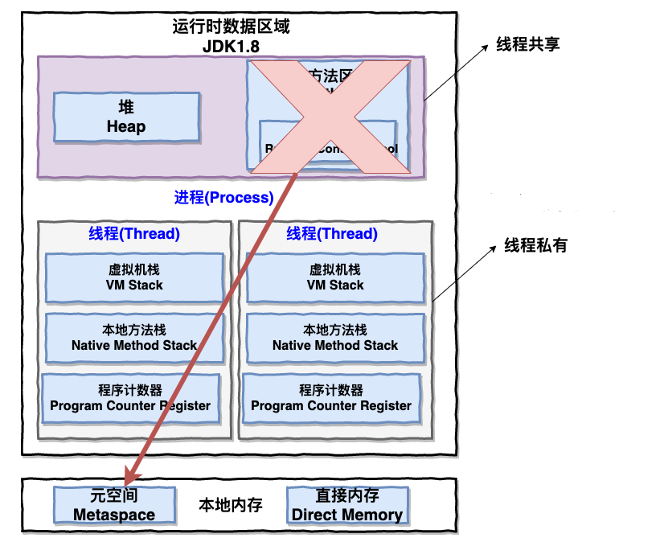
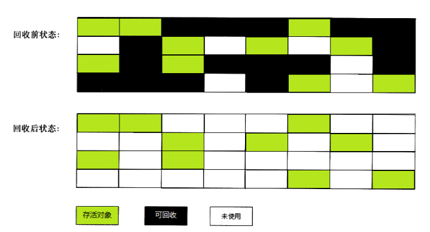
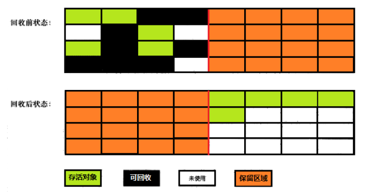
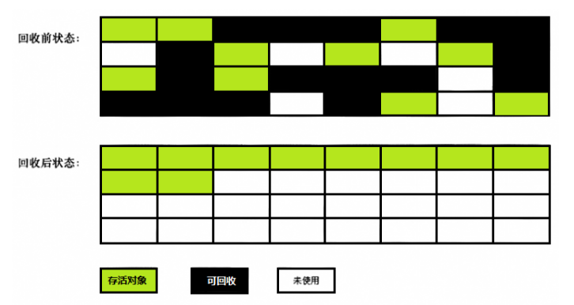

# 关于GC

GC即垃圾收集，了解垃圾回收之前，需要了解下jvm虚拟机运行时管理内存区域的划分

下图为

和jdk1.8和之前的版本相比，最大的区别就是取消了方法区，取而代之的是元空间Metaspace（占用本地内存）[详情可见——深入理解堆外内存 Metaspace](https://www.javadoop.com/post/metaspace)

在这些内存区域中，最重要的就是**Java 堆(Heap)**，现在的垃圾回收器基本都采用分代垃圾收集算法，所以 Java 堆还可以细分为：新生代和老年代：再细致一点有：Eden 空间、From Survivor、To Survivor 空间等。**进一步划分的目的是更好地回收内存，或者更快地分配内存。**

## 垃圾回收的一些概念

GC 需要做 3 件事情：

- 分配内存，为每个新建的对象分配空间

  > 即对象在JVM中的创建，一般需要以下几个步骤（具体可见《深入理解Java虚拟机》一书）   
  > 	类加载监察——>分配内存——>初始化零值——>设置对象头——>执行init方法   

- 确保还在使用的对象的内存一直还在，不能把有用的空间当垃圾回收了

  > 通过GC Roots来判断对象是否存活，GC 的工作就是找到死的对象，回收它们占用的空间
  >
  > 常见的GC Roots有
  >
  > - 当前各线程执行方法中的局部变量（包括形参）引用的对象
  > - 已被加载的类的 static 域引用的对象
  > - 方法区中常量引用的对象
  > - JNI 引用
  >
  > 日常代码中，最常见的GC Roots应该就是前三类了

- 释放不再使用的对象所占用的空间

  > 不同的垃圾回收器有着不同的垃圾回收算法

## 垃圾回收器的理想特点

1. 安全和全面：活的对象一定不能被清理掉，死的对象一定不能在几个回收周期结束后还在内存中。
2. 高效：不能将我们的应用程序挂起太长时间。我们需要在时间、空间、频次上作出权衡。比如，如果堆内存很小，每次垃圾收集就会很快，但是频次会增加。如果堆内存很大，很久才会被填满，但是每一次回收需要的时间很长。
3. 尽量少的内存碎片：每次将垃圾对象释放以后，这些空间可能分布在各个地方，最糟糕的情况就是，内存中到处都是碎片，在给一个大对象分配空间的时候没有内存可用，实际上内存是够的。消除碎片的方式就是**压缩**。
4. 可扩展性：在多核多线程应用中，应当充分利用CPU资源。

## 垃圾回收器的选择

对垃圾回收器来说，需要明确两个概念：**并发和并行**（和平常所说的并发不同）。

- **并行**：多个垃圾回收线程同时工作
- **并发**：垃圾回收线程能够和应用程序线程同时工作，应用程序不需挂起（即没有stop-the-world）

因此不同的垃圾回收算法，对上面两个概念有着不同的考量

- **并行 VS 串行**
  串行收集的垃圾回收器，只会有一个CPU核心在参与收集。而并行垃圾回收器会将垃圾回收的工作分配给多个线程在不同的CPU上同时进行。这可以显著提升回收效率，但同样会带来回收的复杂性问题以及内存碎片问题
- **并发 VS stop-the-world**
  当 stop-the-world 垃圾收集器工作的时候，应用将完全被挂起。与之相对的，并发收集器在大部分工作中都是并发进行的，也许会有少量的 stop-the-world。这种垃圾回收器工作起来会相对简单，因为此时应用挂起后，**堆内存不会有任何变化**，可以安心的进行回收。但是其带来的挂起时间目前对于web应用普遍是不能接受的（因此在web程序中要尽量避免stop-the-world）
- **压缩 VS 不压缩 VS 复制**
  当垃圾收集器标记出内存中哪些是活的，哪些是垃圾对象后，收集器可以进行压缩，将所有活的对象移到一起，这样新的内存分配就可以在剩余的空间中进行了。**经过压缩后，分配新对象的内存空间是非常简单快速的**。
  相对的，不压缩的收集器只会就地释放空间，不会移动存活对象。优点就是快速完成垃圾收集，缺点就是潜在的碎片问题。通常，这种情况下，分配对象空间会比较慢比较复杂，比如为新的一个大对象找到合适的空间。
  还有一个选择就是**复制收集器**，将活的对象复制到另一块空间中，优点就是原空间被清空了，这样后续分配对象空间非常迅速，缺点就是需要进行复制操作和占用额外的空间。
  一般 不压缩和复制两者结合在一起使用

### 分代收集

使用分代垃圾收集器时，内存将被分为不同的**代(generation)**，最常见的就是分为**年轻代**和**老年代**。在不同的分代中，可以根据不同的特点使用不同的算法

分代垃圾收集基于 **weak generational hypothesis** 假设：

- **大部分对象都是短命的，它们在年轻的时候就会死去**
- **极少老年对象对年轻对象的引用**

年轻代中的收集是非常频繁的、高效的、快速的，因为年轻代空间中，通常都是小对象，同时有非常多的不再被引用的对象。

那些**经历过多次年轻代垃圾收集还存活的对象**会晋升到老年代中，老年代的空间更大，而且占用空间增长比较慢。这样，老年代的垃圾收集是不频繁的，但是进行一次垃圾收集需要的时间更长。

对于新生代，需要选择速度比较快的垃圾回收算法，因为新生代的垃圾回收是频繁的。
对于老年代，需要考虑的是空间，因为老年代占用了大部分堆内存，而且针对该部分的垃圾回收算法，需要考虑到这个区域的**垃圾密度比较低**。

## 常见的垃圾回收算法

### 标记-清除算法

标记清除算法就是分为“标记”和“清除”两个阶段。标记出所有需要回收的对象，标记结束后统一回收。这个方法很简单，也存在不足，后续的算法都是根据这个基础来加以改进的。

其实它就是把已死亡的对象标记为空闲内存，然后记录在一个空闲列表中，当我们需要new一个对象时，内存管理模块会从空闲列表中寻找空闲的内存来分给新的对象。

不足的方面就是标记和清除的效率比较低下。且这种做法会让**内存中的碎片非常多**（没有进行压缩）。这个导致了如果我们需要使用到较大的内存块时，无法分配到足够的连续内存。比如下图

### 复制算法

为了解决效率问题，复制算法就出现了。它将可用内存按容量划分成两等分，每次只使用其中的一块。和survivor一样也是用from和to两个指针这样的玩法。fromPlace存满了，就把存活的对象copy到另一块toPlace上，然后交换指针的内容。这样就**解决了碎片**的问题。

这个算法的代价就是把内存缩水了，这样堆内存的使用效率就会变得十分低下了。

不过可以通过**合理的分配两块内存区域**来解决内存浪费问题

### 标记-整理算法

复制算法在对象存活率高的时候会有一定的效率问题，标记过程仍然与“标记-清除”算法一样，但后续步骤不是直接对可回收对象进行清理，而是让所有存活的对象都向一端移动，然后直接清理掉边界以外的内存。

## HotSpot中的垃圾回收器

### Serial 收集器

Serial（串行）收集器是最基本、历史最悠久的垃圾收集器了。大家看名字就知道这个收集器是一个单线程收集器了。它的 **“单线程”** 的意义不仅仅意味着它只会使用一条垃圾收集线程去完成垃圾收集工作，更重要的是它在进行垃圾收集工作的时候必须暂停其他所有的工作线程（ **"stop The World"** ），直到它收集结束。

**新生代采用标记-复制算法，老年代采用标记-整理算法。**

Serial的优点应该就是**简单而高效（与其他收集器的单线程相比）**。Serial 收集器由于没有线程交互的开销，自然可以获得很高的单线程收集效率。Serial 收集器对于运行在 Client 模式下的虚拟机来说是个不错的选择（虽然现在已经基本没有了）。

### ParNew收集器

**ParNew 收集器其实就是 Serial 收集器的多线程版本，除了使用多线程进行垃圾收集外，其余行为（控制参数、收集算法、回收策略等等）和 Serial 收集器完全一样。**

**新生代采用标记-复制算法，老年代采用标记-整理算法。**

它也是现在新生代中最常用的垃圾收集器

### Parallel Scavenge 收集器

Parallel Scavenge 收集器也是使用标记-复制算法的多线程收集器，它看上去几乎和 ParNew 都一样。 **Parallel Scavenge 收集器关注点是吞吐量（高效率的利用 CPU），所谓吞吐量就是 CPU 中用于运行用户代码的时间与 CPU 总消耗时间的比值**

### Serial Old收集器

**Serial 收集器的老年代版本**，它同样是一个单线程收集器。现在基本已不再使用，其一个用途是作为 CMS 收集器的后备方案。

### CMS 收集器

**CMS（Concurrent Mark Sweep）收集器是一种以获取最短回收停顿时间为目标的收集器。它非常符合在注重用户体验的应用上使用。**

**CMS（Concurrent Mark Sweep）收集器是 HotSpot 虚拟机第一款真正意义上的并发收集器，它第一次实现了让垃圾收集线程与用户线程（基本上）同时工作。**

其工作过程分为4个阶段

- **初始标记**：此阶段会让系统的工作线程停止，进入“stop the world”。初始标记，是标记出所有**GC Roots直接引用**（类实例变量不是GC Roots）的对象。
- **并发标记**：此阶段会让系统线程可以随意创建各种新对象，继续运行。此阶段运行期间可能会创造新的存活对象，也可能让部分存活对象失去引用变为垃圾对象。在这个过程中，垃圾回收线程会尽可能的对已有的对象进行GC Roots追踪。
  此阶段就是**对老年代所有对象进行GC Roots追踪**，很耗时间，他需要跟踪所有对象是否从根源上被GC Roots引用了，但是这个最耗时的阶段，所以这个阶段不会对系统运行造成影响。
- **重新标记**：第二阶段结束后，会有很多存活对象和垃圾对象，是之前没标记出来的。此时，第三阶段要继续让系统停止起来，进入“stop the world“阶段。然后重新标记下第二阶段里新创建的对象，还有一些对象可能失去引用。这个重新标记阶段，速度是很快的（是对第二阶段被系统程序运行改别变动过的少数对象进行标记）。
- **并发清理**：让系统随意运行，并让垃圾回收线程清理掉之前标记为垃圾的对象。这个阶段也比较耗时，因为需要进行对象的清理，但是其可以跟系统程序并发执行，不会影响系统程序的执行。

但是其也有几个缺点（有对应解决方式）

- **对 CPU 资源敏感；**
- **无法处理浮动垃圾；**
- **它使用的回收算法-“标记-清除”算法会导致收集结束时会有大量空间碎片产生。**

### G1收集器

G1 (Garbage-First) 是一款面向服务器的垃圾收集器,主要针对**配备多颗处理器及大容量内存**的机器. 以**极高概率满足 GC 停顿时间要求**的同时,还具备高吞吐量性能特征.

G1垃圾回收器可以同时回收新生代和老年代对象，不需要两个垃圾回收器配合运作，G1就可以完成新生代和老年代的垃圾回收。他在触发垃圾回收的时候，可以根据设定的**预期停顿时间**，来**选择最少回收时间和最多回收对象的Region进行垃圾回收**。

**G1 收集器在后台维护了一个优先列表，每次根据允许的收集时间，优先选择回收价值最大的 Region** 。这种使用 Region 划分内存空间以及有优先级的区域回收方式，保证了 G1 收集器在有限时间内可以尽可能高的收集效率（把内存化整为零）。

主要特点

- **并行与并发**：G1 能充分利用 CPU、多核环境下的硬件优势，使用多个 CPU（CPU 或者 CPU 核心）来缩短 Stop-The-World 停顿时间。部分其他收集器原本需要停顿 Java 线程执行的 GC 动作，G1 收集器仍然可以通过并发的方式让 java 程序继续执行。
- **分代收集**：虽然 G1 可以不需要其他收集器配合就能独立管理整个 GC 堆，但是还是保留了分代的概念（将Java堆内存拆分为多个大小相同的Region。Region即可以属于老年代，也可以属于新生代（新生代和老年代各自的内存区域是不停变动的），是由G1控制（**G1的新生代和老年代是动态变化的**））。
- **空间整合**：与 CMS 的“标记-清理”算法不同，G1 从整体来看是基于“标记-整理”算法实现的收集器；从局部上来看是基于“标记-复制”算法实现的。
- **可预测的停顿**：这是 G1 相对于 CMS 的另一个大优势，降低停顿时间是 G1 和 CMS 共同的关注点，但 G1 除了追求低停顿外，还能建立可预测的停顿时间模型，能让使用者明确指定在一个长度为 M 毫秒的时间片段内。

#### G1垃圾回收过程

##### 初始标记

此阶段进入stop the world，但是仅标记GC Roots直接引用（各个线程栈内存中的局部变量代表的GC Roots，方法区中类静态变量代表的GC Roots等）的对象，速度较快。

##### 并发标记

此阶段运行系统正常运行，同时进行GC Roots追踪，从GC Roots开始追踪所有存活的对象。这个并发标记比较耗时，因为要追踪全部的存活对象。但是这个阶段可以跟系统程序并发运行，对系统影响不大。并且JVM会对并发标记阶段对对象做出的一些修改记录起来，比如那个对象被新建了，那个对象失去了引用。

##### 最终标记阶段

此阶段进入“stop the world”，会根据并发标记阶段记录的那些对象修改，最终标记一下有那些对象存活，那些对象是垃圾对象。

##### 混合回收阶段

计算老年代中每个Region中的存活对象数量，存活对象占比，以及执行垃圾回收的预期性能和效率。接着会停止系统程序，此时会根据设置的最大停顿时间，去选择部分Region进行回收

#### 一些配置

在G1中，JVM默认有2048个Region，并且Region的大小必须是2的倍数，比如1MB，2MB，4MB等。手动指定可以通过参数来设置 "-XX:G1HeapRegionSize"

新生代初始占比默认为5%，约100个Region，可通过参数"-XX:G1NewSizePercent"来设置

新生代最大占比为60%，可通过参数"-XX:G1NewMaxSizePercent"来设置

"-XX:MaxGCPauseMills"，设置目标GC停顿时间，默认为200ms

G1提供了专门的Region存放大对象，而不是让对象进入老年代中。在G1中，大对象的判断规则是是否超过一个Region的50%的大小。如果放不下，会横跨多个Region去存放。当进行垃圾回收的时候，也会顺带这将其回收。

"-XX:G1MixedGCCountTarget"：在一次混合回收中，最后一个阶段执行几次混合回收，默认值为8。这意味着最后一个阶段回收过程中，先停止系统运行，混合回收一些Region，再恢复系统运行，再接着进行系统运行，继续进行回收，反复8次。这样可以尽可能的让系统不会停顿时间过长，可以在多次回收的间隙，也可运行。

"-XX:G1HeapWastePercent"：默认值为5%。在混合回收过程中，一旦空闲出来的Region达到堆内存的5%，此时就会立即停止混合回收。在回收过程中，对Region的回收时基于复制算法进行的，是要把回收的Region里的对象放入其他Region，然后将Region中的垃圾对象全部清理掉。

"-XX:G1MixedGCLiveThresholdPercent"，默认值是85%，意思是存活对象低于85%的Region才可以进行回收。

