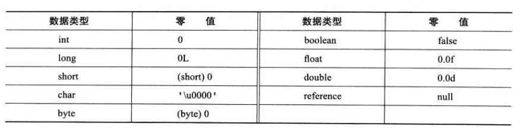
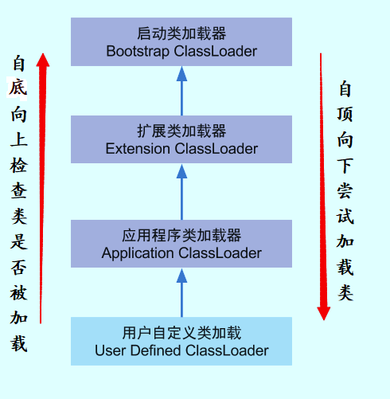

# 类加载流程

## 加载流程

~~~mermaid
graph LR
A[加载] --> B[验证] --> C[准备] --> D[解析] --> E[初始化] --> F[使用] --> G[使用]
~~~


### 加载

有两种时机会触发类加载：

- **预加载**。虚拟机启动时加载，加载的是JAVA_HOME/lib下的rt.jar中的class文件（如java.lang.\*，java.util.\*等）
- **运行时加载**，即代码中用到class文件时

加载阶段主要进行一下内容

- 获取class文件的二进制流
- 将类信息等class文件中的内容放入Metaspace中（1.8之前是方法区）
- 在内存中生成class文件对应的Class类对象

一个类（非数组类）的加载阶段——获取class文件二进制流，是我们可控的，可以通过自定义类加载器（重写类加载器的loadclass方法）去进行控制

### 验证

主要是根据java虚拟机规范，验证class文件是否符合标准

### 准备

**准备阶段是正式为类变量分配内存并设置类变量初始值的阶段**

1. 这时候进行内存分配的仅包括类变量（ Class Variables ，即静态变量，被 `static` 关键字修饰的变量，只与类相关，因此被称为类变量），而不包括实例变量。实例变量会在对象实例化时随着对象一块分配在 Java 堆中。

2. 这里所设置的初始值"通常情况"下是数据类型默认的零值（如 0、0L、null、false 等），比如我们定义了`public static int value=111` ，那么 value 变量在准备阶段的初始值就是 0 而不是 111（初始化阶段才会赋值）。特殊情况：比如给 value 变量加上了 final 关键字`public static final int value=111` ，那么准备阶段 value 的值就被赋值为 111。

   

注意：jdk8后，类变量则会随着 Class 对象一起存放在 Java 堆中

### 解析

符号引用替换为直接引用（即个人理解即C语音中的指针）。个人感觉不需要多了解

### 初始化

此阶段会执行类的初始化代码，如静态代码块，静态变量赋值等。并且虚拟机会保证类的初始化在多线程环境中正确的加锁，同步

Java虚拟机规范严格规定以下必须立即对类进行初始化，这几种场景也称为对一个类进行**主动引用**：

- 当遇到`new` 、 `getstatic`、`putstatic` 或 `invokestatic`这 4 条直接码指令时，比如new一个类，读取一个静态字段(未被 final 修饰)、或调用一个类的静态方法时。
  - 当 jvm 执行 `new` 指令时会初始化类。即当程序创建一个类的实例对象。
  - 当 jvm 执行 `getstatic` 指令时会初始化类。即程序访问类的静态变量(不是静态常量，常量会被加载到运行时常量池)。
  - 当 jvm 执行 `putstatic` 指令时会初始化类。即程序给类的静态变量赋值。
  - 当 jvm 执行 `invokestatic` 指令时会初始化类。即程序调用类的静态方法。
- 使用 `java.lang.reflect` 包的方法对类进行反射调用时如 `Class.forname("...")`, `newInstance()` 等等。如果类没初始化，需要触发其初始化。
- 初始化一个类，如果其父类还未初始化，则先触发该父类的初始化。
- 当虚拟机启动时，用户需要定义一个要执行的主类 (包含 `main` 方法的那个类)，虚拟机会先初始化这个类。
- `MethodHandle` 和 `VarHandle` 可以看作是轻量级的反射调用机制，而要想使用这 2 个调用， 就必须先使用 `findStaticVarHandle` 来初始化要调用的类。
- 当一个接口中定义了 JDK8 新加入的默认方法（被 default 关键字修饰的接口方法）时，如果有这个接口的实现类发生了初始化，那该接口要在其之前被初始化。

除上述场景外，所有引用类的方式都不会触发类的初始化，称为被动引用

- 子类引用父类静态字段，不会导致子类初始化。至于子类是否被加载、验证了，前者可以通过"-XX:+TraceClassLoading"来查看
- 通过数组定义引用类，不会触发此类的初始化
- 引用静态常量时，常量在编译阶段会存入类的常量池中，本质上并没有直接引用到定义常量的类

### 使用

正常的代码运行

### 卸载

卸载类即该类的 Class 对象被 GC。

卸载类需要满足 3 个要求:

1. 该类的所有的实例对象都已被 GC，也就是说堆不存在该类的实例对象。
2. 该类没有在其他任何地方被引用
3. 该类的类加载器的实例已被 GC

所以，在 JVM 生命周期内，由 jvm 自带的类加载器加载的类是不会被卸载的。但是由我们自定义的类加载器加载的类是可能被卸载的。

只要想通一点就好了，jdk 自带的 `BootstrapClassLoader`, `ExtClassLoader`, `AppClassLoader` 负责加载 jdk 提供的类，所以它们(类加载器的实例)肯定不会被回收。而我们自定义的类加载器的实例是可以被回收的，所以使用我们自定义加载器加载的类是可以被卸载掉的。

## 类加载器与双亲委派机制

### 类加载器

所有的类都由类加载器加载，加载的作用就是将 .class文件加载到内存。JVM 中内置了三个重要的 ClassLoader，除了 BootstrapClassLoader 其他类加载器均由 Java 实现且全部继承自`java.lang.ClassLoader`：

1. **BootstrapClassLoader(启动类加载器)** ：最顶层的加载类，由C++实现，负责加载 `%JAVA_HOME%/lib`目录下的jar包和类或者或被 `-Xbootclasspath`参数指定的路径中的所有类。
2. **ExtensionClassLoader(扩展类加载器)** ：主要负责加载目录 `%JRE_HOME%/lib/ext` 目录下的jar包和类，或被 `java.ext.dirs` 系统变量所指定的路径下的jar包。
3. **AppClassLoader(应用程序类加载器)** ：面向我们用户的加载器，负责加载当前应用classpath下的所有jar包和类。

可通过自定义类加载器（通过继承ClassLoader），以达到自己想要的加载效果

### 双亲委派机制

**双亲委派模型** ，即在类加载的时候，系统会首先判断当前类是否被加载过。已经被加载的类会直接返回，否则才会尝试加载。加载的时候，首先会把该请求委派该父类加载器的 `loadClass()` 处理，因此所有的请求最终都应该传送到顶层的启动类加载器 `BootstrapClassLoader` 中。当父类加载器无法处理时，才由自己来处理。当父类加载器为null时，会使用启动类加载器 `BootstrapClassLoader` 作为父类加载器。



每个类加载都有一个父类加载器，我们通过下面的程序来验证。

```java
public class ClassLoaderDemo {
    public static void main(String[] args) {
        System.out.println("ClassLodarDemo's ClassLoader is " + ClassLoaderDemo.class.getClassLoader());
        System.out.println("The Parent of ClassLodarDemo's ClassLoader is " + 	ClassLoaderDemo.class.getClassLoader().getParent());
        System.out.println("The GrandParent of ClassLodarDemo's ClassLoader is " + ClassLoaderDemo.class.getClassLoader().getParent().getParent());
    }
}Copy to clipboardErrorCopied
```

Output

```
ClassLodarDemo's ClassLoader is sun.misc.Launcher$AppClassLoader@18b4aac2
The Parent of ClassLodarDemo's ClassLoader is sun.misc.Launcher$ExtClassLoader@1b6d3586
The GrandParent of ClassLodarDemo's ClassLoader is null
```

`AppClassLoader`的父类加载器为`ExtClassLoader`， `ExtClassLoader`的父类加载器为null，**null并不代表`ExtClassLoader`没有父类加载器，而是 `BootstrapClassLoader`** 。

#### 双亲委派优点

双亲委派模型保证了Java程序的稳定运行，可以避免类的重复加载（JVM 区分不同类的方式不仅仅根据类名，相同的类文件被不同的类加载器加载产生的是两个不同的类），也保证了 Java 的核心 API 不被篡改。如果没有使用双亲委派模型，而是每个类加载器加载自己的话就会出现一些问题，比如我们编写一个称为 `java.lang.Object` 类的话，那么程序运行的时候，系统就会出现多个不同的 `Object` 类。

在自定义加载器的情况下。如果不想使用双亲委派模型，需要重写 `loadClass()` 方法。如果不想打破双亲委派模型，就重写 `ClassLoader` 类中的 `findClass()` 方法即可


#### 双亲委派机制实现代码

代码主要集中在 `java.lang.ClassLoader` 的 `loadClass()` 中

~~~java
private final ClassLoader parent; 
protected Class<?> loadClass(String name, boolean resolve)
        throws ClassNotFoundException
    {
        synchronized (getClassLoadingLock(name)) {
            // 首先，检查请求的类是否已经被加载过
            Class<?> c = findLoadedClass(name);
            if (c == null) {
                long t0 = System.nanoTime();
                try {
                    if (parent != null) {//父加载器不为空，调用父加载器loadClass()方法处理
                        c = parent.loadClass(name, false);
                    } else {//父加载器为空，使用启动类加载器 BootstrapClassLoader 加载
                        c = findBootstrapClassOrNull(name);
                    }
                } catch (ClassNotFoundException e) {
                   //抛出异常说明父类加载器无法完成加载请求
                }
                
                if (c == null) {
                    long t1 = System.nanoTime();
                    //自己尝试加载
                    c = findClass(name);

                    // this is the defining class loader; record the stats
                    sun.misc.PerfCounter.getParentDelegationTime().addTime(t1 - t0);
                    sun.misc.PerfCounter.getFindClassTime().addElapsedTimeFrom(t1);
                    sun.misc.PerfCounter.getFindClasses().increment();
                }
            }
            if (resolve) {
                resolveClass(c);
            }
            return c;
        }
    }
~~~

