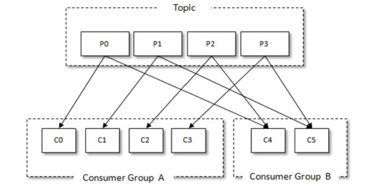

# Kafka

一个多分区、多副本且基于 Zookeeper 协调的分布式消息系统。

- 消息系统：Kafka 和传统的消息系统（也称作消息中间件）都具备系统解耦、冗余存储、流量削峰、缓冲、异步通信、扩展性、可恢复性等功能。与此同时，Kafka 还提供了大多数消息系统难以实现的消息顺序性保障及回溯消费的功能
- 存储系统：Kafka 把消息持久化到磁盘，相比于其他基于内存存储的系统而言，有效地降低了数据丢失的风险。也正是得益于Kafka 的消息持久化功能和多副本机制，我们可以把Kafka作为长期的数据存储系统来使用，只需要把对应的数据保留策略设置为“永久”或启用主题的日志压缩功能即可。
- 流式处理平台：Kafka 不仅为每个流行的流式处理框架提供了可靠的数据来源，还提供了一个完整的流式处理类库，比如窗口、连接、变换和聚合等各类操作。

## 基本概念

一般一个 Kafka 架构包含若干 Producer、若干 Broker、若干 Consumer，以及一个Zookeeper 集群。其中 Zookeeper 集群负责集群**元数据**的管理、控制器的选举等操作。Producer 负责将消息发送到 Broker，Broker 负责将收到的消息存储到磁盘中，而 Consumer 负责从 Broker 订阅并消费消息。

- Broker：服务代理节点。Broker可以简单的视为一个独立的 Kafka 服务节点或服务实例。
- Topic：主题。Kafka中消息以主题为单位进行归类，生产者负责将消息发送到指定的 Topic 中，消费者订阅主题进行消费
- Partition：分区。主题可细分为多个分区（主题是一个逻辑上的概念），它还可以细分为多个分区，一个 Partition 只属于单个 Topic。在同一个 Topic 下不同的 Partition 包含的信息是不同的。
- Offset：偏移量。Patition 在存储层面可视为一个可追加的 log 文件，消息被追加到分区日志文件中时，会分配一个特定的偏移量(offset)。offset 是消息在分区中的唯一标识，Kafka通过它来保证消息在分区内的顺序性，但是 offset 并不跨越分区。即 **Kafka保证分区有序**。

Kafka 为分区引入了多副本机制，通过增加副本数量可以提升容灾能力。同一分区的不同副本保存的是相通的信息（**在同一时刻，副本之间并非完全一样**），副本之间是一主多从的关系，leader 副本负责处理读写请求，follower 副本只负责与 leader 副本的信息同步，且处在不同的 Broker 节点中。当 leader 副本出现故障时，会从 followe 副本中重新选举新的 leader 副本对外提供服务。

分区中所有副本称为**AR（Assigned Replicas）**。所有与 leader 副本保持一定程度同步的副本（包括 leader 副本在内）组成 **ISR（In-Sync Replicas）**，ISR 时 AR 的一个子集。与 leader 副本同步滞后过多的副本（不包括 leader 副本）称之为 **OSR（Out-of-Sync Replicas）**。一般而言 AR = ISR + OSR。在正常情况下，所有的 follower 副本都应该与 leader 副本保持一定程度的同步，即 AR = ISR，OSR 集合为空

> 消息首先会发送到leader副本，然后follower副本才能从leader副本中拉取消息进行同步，同步期间内follower副本相对于leader副本而言会有一定程度的滞后。前面所说的“一定程度的同步”是指可忍受的滞后范围，这个范围可以通过参数进行配置
>
> leader副本负责维护和跟踪ISR集合中所有follower副本的滞后状态，当follower副本落后太多或失效时，leader副本会把它从ISR集合中剔除。如果OSR集合中有follower副本“追上”了leader副本，那么leader副本会把它从OSR集合转移至ISR集合。默认情况下，当leader副本发生故障时，只有在ISR集合中的副本才有资格被选举为新的leader，而在OSR集合中的副本则没有任何机会（不过这个原则也可以通过修改相应的参数配置来改变）

ISR 与 HW（High Watermark） 和 LEO（LogEndOffset） 也有紧密的关系。HW 标识了一个特定的消息偏移量 offset，消费者只能拉取到这个 offset 之前的消息。

如上图所示，这个日志文件中有 9 条消息，第一条消息的 offset（LogStartOffset）为0，最后一条消息的offset为8，offset为9的消息用虚线框表示，代表下一条待写入的消息。日志文件的HW为6，表示消费者只能拉取到offset在0至5之间的消息，而offset为6的消息对消费者而言是不可见的。LEO 标识了当前日志文件中下一条待写入消息的offset，图1-4中offset为9的位置即为当前日志文件的LEO，LEO的大小相当于当前日志分区中最后一条消息的offset值加1。分区ISR集合中的每个副本都会维护自身的LEO，而ISR集合中最小的LEO即为分区的HW，对消费者而言只能消费HW之前的消息。

## 生产者

消息对象 ProducerRecord 结构如下

- topic：代表信息要发往的主题
- partition：代表信息要发往的分区
- header：消息头，一般用来设定与应用相关的消息，可不设定
- key：消息的键，可用来计算分区号让消息发往特定分区
- value：消息体，一般不为空。
- timestamp：时间戳

消息在发向 broker 的过程中，一般会需要经过拦截器（Interceptor）、序列化器（Serializer）和分区器（Partitioner）

### 一些生产者参数

#### acks

用于指定必须有多少个副本收到消息，才能任务这条消息是成功写入的。其有三种类型的值

- acks=1。默认值就是1，其代表生产者发送消息后，只要分区的 leader 副本成功写入消息，即视为成功。如果消息写入 leader 副本并成功响应，且在其他 follower 副本拉取之前 leader 崩溃，那么消息就会丢失（新选举的 leader 副本并没有对应的消息）
- acks=0。发送消息后不需要等待服务端响应。此设置可以保证最大吞吐量
- acks=-1或all。生产者发送消息后，需要等待 ISR 中所有副本都成功写入消息才能视为成功。此设置可以达到最大的可靠性。但不意味消息一定可靠，因为 ISR 中可能只有 leader 副本，此时就退化为了 acks=1 的情况。如果想获取更高的消息可靠性需要配合 min.insync.replicas 等参数

#### max.request.size

限制生产者发送消息的最大值，默认为 1MB

#### retries和retry.backoff.ms

retries即重试次数，默认为0。即发生异常时不进行重试。retry.backoff.ms参数默认值为100，其用来设定两次重试之间的时间间隔，避免无效的重试。

Kafka 可以保证同一个分区中的消息是有序的。如果生产者按照一定的顺序发送消息，那么这些消息也会顺序地写入分区，进而消费者也可以按照同样的顺序消费它们。对于某些应用来说，顺序性非常重要，比如MySQL的binlog传输，如果出现错误就会造成非常严重的后果。如果将acks参数配置为非零值，并且max.in.flight.requests.per.connection参数配置为大于1的值，那么就会出现错序的现象：如果第一批次消息写入失败，而第二批次消息写入成功，那么生产者会重试发送第一批次的消息，此时如果第一批次的消息写入成功，那么这两个批次的消息就出现了错序。一般而言，在需要保证消息顺序的场合建议把参数max.in.flight.requests.per.connection配置为1，而不是把acks配置为0，不过这样也会影响整体的吞吐。

#### compress.type

指定消息的压缩方式，默认值为 null 。还可配置"gzip"等参数，对消息进行压缩可以减少网络传输量，降低网络I/O。其是一种时间换空间的的优化方式，如果对时延有要求，最好不进行压缩

#### linger.ms

指定生产者发送 ProducerBatch 之前等待更多消息加入 ProducerBatch 的时间，默认值为0。生产者会在 ProducerBatch 被填满或等待时间超过 linger.ms 值时发送出去。增大此参数会增加消息延迟但可增加吞吐量

## 消费者

消费者负责订阅主题，并从主题上拉取信息。在 Kafka 中还有消费组（Consumer Group）的概念，每个消费者都有一个对应的消费组，当消息发布到主题后，只会被投递给订阅它的每个消费组中的一个消费者。

消费组是一个逻辑上的概念，它将旗下的消费者归为一类，每一个消费者只隶属于一个消费组。每一个消费组都会有一个固定的名称，消费者在进行消费前需要指定其所属消费组的名称，这个可以通过消费者客户端参数group.id来配置，默认值为空字符串。

### 消费组

如下图，某主题有四个分区，两个消费组。

可以看出消费组A中每个消费者都分配了一个分区，消费组B中每个消费者分配到两个分区，两个消费者互不影响，**每一个分区只能被一个消费组中的一个消费者所消费**。

假设目前某消费组内只有一个消费者C0，其订阅了一个主题，该主题有7个分区。那么这七个分区皆被C0订阅

此时，如果又加入一个消费者C1，那么需要将消费者C0中的部分分区分配给C1进行消费。

如果再加入消费者，那么会在此对分区进行分配。

消费者和消费组的模型可以让整体的消费能力具备横向伸缩性，可以**通过增加消费者的个数来提高整体的消费能力**。但如果消费者的数量超过分区数，那么会有消费者无法分配到分区，而无法进行消费。

对于消息中间件，一般又两张消息投递模式：点对点（P2P，Point-to-Point）模式和发布/订阅（Pub/Sub）模式

- 点对点模式是基于队列的，消息生产者发送消息到队列，消息消费者从队列中接收消息
- 发布订阅模式定义了如何向一个内容节点发布和订阅消息，这个内容节点称为主题（Topic），主题可以认为是消息传递的中介，消息发布者将消息发布到某个主题，而消息订阅者从主题中订阅消息。主题使得消息的订阅者和发布者互相保持独立，不需要进行接触即可保证消息的传递，发布/订阅模式在消息的一对多广播时采用。

而 Kafka 同时支持这两种模式

- 如果所有的消费者都隶属于同一个消费组，那么所有的消息都会被均衡地投递给每一个消费者，即每条消息只会被一个消费者处理，这就相当于点对点模式的应用。
- 如果所有的消费者都隶属于不同的消费组，那么所有的消息都会被广播给所有的消费者，即每条消息会被所有的消费者处理，这就相当于发布/订阅模式的应用

### 关于offset

对于消息在分区中的位置，我们将offset称为“偏移量”；对于消费者消费到的位置，将 offset 称为“位移”，有时候也会更明确地称之为“消费位移”。committed offset，它表示已经提交过的消费位移。

在 Kafka 中默认的消费位移的提交方式是自动提交，这个由消费者客户端参数enable.auto.commit 配置，默认值为 true。当然这个默认的自动提交不是每消费一条消息就提交一次，而是定期提交，这个定期的周期时间由客户端参数auto.commit.interval.ms配置，默认值为5秒，此参数生效的前提是enable.auto.commit参数为true。

## 主题与分区

### 优先副本的选举

分区使用多副本机制来提升可靠性，但只有leader副本对外提供读写服务，而follower副本只负责在内部进行消息的同步。如果一个分区的leader副本不可用，那么就意味着整个分区变得不可用，此时就需要Kafka从剩余的follower副本中挑选一个新的leader副本来继续对外提供服务。但从某种程度上说，broker 节点中 leader 副本个数的多少决定了这个节点负载的高低。

**优先副本**（preferred replica）。所谓的优先副本是指在 AR 集合列表中的第一个副本。比如上面主题 topic-partitions 中分区 0的AR集合列表（Replicas）为[1，2，0]，那么分区0的优先副本即为1。理想情况下，优先副本就是该分区的leader副本，所以也可以称之为preferred leader。Kafka要确保所有主题的优先副本在Kafka集群中均匀分布，这样就保证了所有分区的leader均衡分布。如果leader分布过于集中，就会造成集群负载不均衡。

优先副本的选举是指通过一定的方式促使优先副本选举为leader副本，以此来促进集群的负载均衡，这一行为也可以称为“分区平衡”。但分区平衡并不意味着Kafka集群的负载均衡，因为还要考虑集群中的分区分配是否均衡。更进一步，每个分区的leader副本的负载也是各不相同的，有些leader副本的负载很高，比如需要承载TPS为30000的负荷，而有些leader副本只需承载个位数的负荷。也就是说，就算集群中的分区分配均衡、leader 分配均衡，也并不能确保整个集群的负载就是均衡的，还需要其他一些硬性的指标来做进一步的衡量。

> Kafka 中可以提供分区自动平衡的功能，与此对应的 broker 端参数是auto.leader.rebalance.enable，此参数的默认值为true，即默认情况下此功能是开启的。如果开启分区自动平衡的功能，则 Kafka 的控制器会启动一个定时任务，这个定时任务会轮询所有的 broker节点，计算每个broker节点的分区不平衡率（broker中的不平衡率=非优先副本的leader个数/分区总数）是否超过leader.imbalance.per.broker.percentage参数配置的比值，默认值为 10%，如果超过设定的比值则会自动执行优先副本的选举动作以求分区平衡。执行周期由参数leader.imbalance.check.interval.seconds控制，默认值为300秒，即5分钟。

## 可靠性

### 副本

副本（Replica）是分布式系统中常见的概念之一，指的是分布式系统对数据和服务提供的一种冗余方式。一般可分为数据副本和服务副本。

数据副本是指在不同的节点上持久化同一份数据，当某一个节点上存储的数据丢失时，可以从副本上读取该数据，这是解决分布式系统数据丢失问题最有效的手段。

服务副本，指多个节点提供同样的服务，每个节点都有能力接收来自外部的请求并进行相应的处理。

> - 副本是相对于分区而言的，即副本是特定分区的副本。
> - 一个分区中包含一个或多个副本，其中一个为leader副本，其余为follower副本，各个副本位于不同的broker节点中。只有leader副本对外提供服务，follower副本只负责数据同步。
> - 分区中的所有副本统称为 AR，而ISR 是指与leader 副本保持同步状态的副本集合，当然leader副本本身也是这个集合中的一员。
> - LEO标识每个分区中最后一条消息的下一个位置，分区的每个副本都有自己的LEO，ISR中最小的LEO即为HW，俗称高水位，消费者只能拉取到HW之前的消息。

#### 失效副本

在 ISR 集合之外，处于同步失效或功能失效的副本称之为失效副本，失效副本对应的分区也就称之为同步失效分区（under-replicated分区）。当 ISR 集合中的一个 follower 副本滞后 leader 副本的时间超过此参数（replica.lag.time.max.ms）指定的值时则判定为同步失败，需要将此 follower 副本剔除出 ISR 集合。该参数默认值为10000.

> 具体的实现原理也很容易理解，当follower副本将leader副本LEO（LogEndOffset）之前的日志全部同步时，则认为该 follower 副本已经追赶上leader 副本，此时更新该副本的lastCaughtUpTimeMs 标识。Kafka 的副本管理器会启动一个副本过期检测的定时任务，而这个定时任务会定时检查当前时间与副本的 lastCaughtUpTimeMs 差值是否大于参数replica.lag.time.max.ms 指定的值。千万不要错误地认为 follower 副本只要拉取 leader副本的数据就会更新lastCaughtUpTimeMs。试想一下，当 leader 副本中消息的流入速度大于follower 副本中拉取的速度时，就算 follower 副本一直不断地拉取 leader 副本的消息也不能与leader副本同步。如果还将此follower副本置于ISR集合中，那么当leader副本下线而选取此follower副本为新的leader副本时就会造成消息的严重丢失。

一般又两种情况会导致副本失效

1. follower 副本进程卡住，在一段时间内根本没有时间向 leader 副本发起同步请求，比如频繁 full GC
2. follower 副本进程同步过慢，在一段时间内都无法追上 leader 副本，比如 I/O 开销过大

#### ISR的伸缩

Kafka 在启动的时候会开启两个与 ISR 相关的定时任务，名称分别为“isr-expiration”和“isr-change-propagation”。isr-expiration任务会周期性地检测每个分区是否需要缩减其ISR集合。这个周期和replica.lag.time.max.ms参数有关，大小是这个参数值的一半，默认值为5000ms。当检测到ISR集合中有失效副本时，就会收缩ISR集合。

随着follower副本不断与leader副本进行消息同步，follower副本的LEO也会逐渐后移，并最终追赶上leader副本，此时该follower副本就有资格进入ISR集合。追赶上leader副本的判定准则是**此副本的LEO是否不小于leader副本的HW**，注意这里并不是和leader副本的LEO相比。

#### 不支持读写分离

Kafka中，生产者写入消息、消费者读取消息的操作都是与leader副本进行交互的，从而实现的是一种主写主读的生产消费模型。主写从读可以让**从节点去分担主节点的负载压力，预防主节点负载过重而从节点却空闲的情况发生**。但是主写从读也有2个很明显的缺点：

- 数据一致性问题。数据从主节点转到从节点必然会有一个延时的时间窗口，这个时间窗口会导致主从节点之间的数据不一致。某一时刻，在主节点和从节点中A数据的值都为X，之后将主节点中A的值修改为Y，那么在这个变更通知到从节点之前，应用读取从节点中的A数据的值并不为最新的Y，由此便产生了数据不一致的问题。
- 延时问题。类似Redis这种组件，数据从写入主节点到同步至从节点中的过程需要经历网络→主节点内存→网络→从节点内存这几个阶段，整个过程会耗费一定的时间。而在Kafka中，主从同步会比 Redis 更加耗时，它需要经历网络→主节点内存→主节点磁盘→网络→从节点内存→从节点磁盘这几个阶段。对延时敏感的应用而言，主写从读的功能并不太适用。

但现实情况中，很多应用即可以忍受一定程度的延时，也可以忍受一段时间内的数据不一致的情况。

主读从写可以分摊一定的负载却不能做到完全的负载均衡，比如对于数据写压力很大而读压力很小的情况，从节点只能分摊很少的负载压力，而绝大多数压力还是在主节点上。但在 Kafka 中却可以达到很大程度上的负载均衡，并且这种均衡是在主写主读的情况下达成的。

在Kafka集群中有3个分区，每个分区有3个副本，正好均匀地分布在3个broker上，灰色阴影的代表leader副本，非灰色阴影的代表follower副本，虚线表示follower副本从leader副本上拉取消息。当生产者写入消息的时候都写入leader副本，对于上图的情形，每个broker都有消息从生产者流入；当消费者读取消息的时候也是从leader副本中读取的，每个broker都有消息流出到消费者。

上图是理想的负载均衡，有以下几种情况（包含但不仅限于）会造成一定程度上的负载不均衡：

- broker端的分区分配不均。当创建主题的时候可能会出现某些broker分配到的分区数多而其他broker分配到的分区数少，那么自然而然地分配到的leader副本也就不均。
- 生产者写入消息不均。生产者可能只对某些broker中的leader副本进行大量的写入操作，而对其他broker中的leader副本不闻不问。
- 消费者消费消息不均。消费者可能只对某些broker中的leader副本进行大量的拉取操作，而对其他broker中的leader副本不闻不问。
- leader副本的切换不均。在实际应用中可能会由于broker宕机而造成主从副本的切换，或者分区副本的重分配等，这些动作都有可能造成各个broker中leader副本的分配不均。

对此，我们可以做一些防范措施。针对第一种情况，在主题创建的时候尽可能使分区分配得均衡，好在Kafka 中相应的分配算法也是在极力地追求这一目标，如果是开发人员自定义的分配，则需要注意这方面的内容。对于第二和第三种情况，主写从读也无法解决。对于第四种情况，Kafka 提供了优先副本的选举来达到 leader副本的均衡，与此同时，也可以配合相应的监控、告警和运维平台来实现均衡的优化。

在实际应用中，配合监控、告警、运维相结合的生态平台，在绝大多数情况下Kafka都能做到很大程度上的负载均衡。总的来说，Kafka 只支持主写主读有几个优点：可以简化代码的实现逻辑，减少出错的可能；将负载粒度细化均摊，与主写从读相比，不仅负载效能更好，而且对用户可控；没有延时的影响；在副本稳定的情况下，不会出现数据不一致的情况。

### 日志同步机制

一个分布式系统中，日志同步机制既要保证数据的一致性，也要保证数据的顺序性。有很多方式可以实现这些功能，但最高校的方式还是从集群中选出一个 leader 负责处理数据写入的顺序性。只要 leader 还处于存活状态，那么 follower 只需按照 leader 写入顺序同步即可。

通常情况下，只要 leader 不宕机就不需要考虑同步情况，但 leader 一旦宕机，就需要从 follower 中选择一个新的 leader。因此需要确保选举具有最新日志的消息的 follower 作为新的 leader。

日志同步机制的一个基本原则就是：**如果告知客户端已经成功提交了某条消息，那么即使 leader宕机，也要保证新选举出来的leader中能够包含这条消息。**这里有一个需要权衡（tradeoff）的地方，**如果leader在消息被提交前需要等待更多的follower确认，那么在它宕机之后就可以有更多的follower替代它，不过这也会造成性能的下降**。

一种常见的作法是**少数服从多数**，它可以用来负责提交决策和选举决策（Kafka未选择此方式）。在这种方式下，如果我们有2f+1个副本，那么在提交之前必须保证有f+1个副本同步完消息。同时为了保证能正确选举出新的leader，至少要保证有f+1个副本节点完成日志同步并从同步完成的副本中选举出新的leader节点。并且在不超过f个副本节点失败的情况下，新的leader需要保证不会丢失已经提交过的全部消息。这样在任意组合的 f+1 个副本中，理论上可以确保至少有一个副本能够包含已提交的全部消息，这个副本的日志拥有最全的消息，因此会有资格被选举为新的 leader来对外提供服务。

这种方式还有一个很大的优势就是**系统的延迟取决于最快的几个节点**，比如副本数为 3，那么延迟就取决于最快的那个 follower 而不是最慢的那个（除了leader，只需要另一个follower确认即可）。但它也有劣势，比如为了保证leader选举的正常进行，它所能容忍的失败follower数比较少，如果要容忍1个follower失败，那么至少要有3个副本，如果要容忍2个follower失败，必须要有5个副本。也就是说，**在生产环境下为了保证较高的容错率，必须要有大量的副本，而大量的副本又会在大数据量下导致性能的急剧下降**。这也就是“少数服从多数”的这种Quorum模型常被用作**共享集群配置**（比如ZooKeeper），而很少用于主流的数据存储中的原因。

在 Kafka 中动态维护了一个 ISR 集合，处于 ISR 集合中的节点保持与leader相同的高水位（HW），只有位列其中的副本（unclean.leader.election.enable配置为false）才有资格被选为新的 leader。写入消息时只有等到所有 ISR 集合中的副本都确认收到之后才能被认为已经提交。位于 ISR 中的任何副本节点都有资格成为leader。选择过程简单（AR列表中直接选），开销低，这也是 Kafka 选择此模型的重要因素。Kafka 中包含大量分区， leader 副本的均衡保障了整体负载的均衡，所以此因素也极大影响了 Kafka 的性能指标。

在采用 ISR 模型和（f+1）个副本数的配置下，一个Kafka分区能够容忍最大f个节点失败，相比于“少数服从多数”的方式所需的节点数大幅减少。实际上，为了能够容忍f个节点失败，“少数服从多数”的方式和ISR的方式都需要相同数量副本的确认信息才能提交消息。

> 为了容忍1个节点失败，“少数服从多数”需要3个副本和1个follower的确认信息，采用ISR的方式需要2个副本和1个follower的确认信息。在需要相同确认信息数的情况下，采用ISR的方式所需要的副本总数变少，复制带来的集群开销也就更低，“少数服从多数”的优势在于它可以绕开最慢副本的确认信息，降低提交的延迟，而对Kafka而言，这种能力可以交由客户端自己去选择。
>
> 另外，一般的同步策略依赖于稳定的存储系统来做数据恢复，也就是说，在数据恢复时日志文件不可丢失且不能有数据上的冲突。不过它们忽视了两个问题：首先，磁盘故障是会经常发生的，在持久化数据的过程中并不能完全保证数据的完整性；其次，即使不存在硬件级别的故障，我们也不希望在每次写入数据时执行同步刷盘（fsync）的动作来保证数据的完整性，这样会极大地影响性能。而 Kafka 不需要宕机节点必须从本地数据日志中进行恢复，Kafka 的同步方式允许宕机副本重新加入ISR集合，但在进入ISR之前必须保证自己能够重新同步完leader中的所有数据。

### 可靠性分析

就可靠性本身而言，它并不是一个可以用简单的“是”或“否”来衡量的一个指标，而一般是采用**几个9**来衡量的。任何东西不可能做到完全的可靠，即使能应付单机故障，也难以应付集群、数据中心等集体故障，即使躲得过天灾也未必躲得过人祸。那么如何在尽可能高的提高 Kafka 的可靠性？

就Kafka而言，越多的副本数越能够保证数据的可靠性，副本数可以在创建主题时配置，也可以在后期修改，不过副本数越多也会引起磁盘、网络带宽的浪费，同时会引起性能的下降。一般而言，**设置副本数为3即可满足绝大多数场景对可靠性的要求**，而对可靠性要求更高的场景下，可以适当增大这个数值，比如国内部分银行在使用 Kafka 时就会设置副本数为 5。

仅依靠副本数是不够的，一般还会将生产者客户端参数 acks 进行设置（设置为 -1）并对发送失败的消息进行适当的重试。当 acks=-1时，它要求 ISR 中的所有副本都收到相关的信息之后才能告知生产者已经成功提交。但是在这种场景下：leader 副本中信息流入速度很快，而 follower 副本中的同步速度很慢，那在某个临界点时所有的 follower 副本都会被剔除出 ISR 集合。此时 ISR 集合中只有一个 leader 副本，最终 acks = -1演变为了acks=1 的情况，此时就加大了信息丢失的风险。

> Kakfa 为此提供了min.insync.replicas参数（默认值为1）来作为辅助（配合acks=-1来使用），这个参数指定了ISR集合中最小的副本数，如果不满足条件就会抛出NotEnoughReplicasException或NotEnoughReplicasAfterAppendException。在正常的配置下，需要满足副本数 ＞ min.insync.replicas参数的值。一个典型的配置方案为：副本数配置为 3，min.insync.replicas 参数值配置为 2。注意min.insync.replicas参数在提升可靠性的时候会从侧面影响可用性。试想如果ISR中只有一个leader副本，那么最起码还可以使用，而此时如果配置min.insync.replicas＞1，则会使消息无法写入。

与可靠性和ISR集合有关的还有一个参数—**unclean.leader.election.enable**。这个参数的默认值为false，如果**设置为true就意味着当leader下线时候可以从非ISR集合中选举出新的 leader，这样有可能造成数据的丢失**。如果这个参数设置为false，那么也会影响可用性，非ISR集合中的副本虽然没能及时同步所有的消息，但最起码还是存活的可用副本。

在broker端还有两个参数**log.flush.interval.messages和log.flush.interval.ms，用来调整同步刷盘的策略**，默认是不做控制而交由操作系统本身来进行处理。同步刷盘是增强一个组件可靠性的有效方式。

在消费端也需要进行配置保持高可靠性。enable.auto.commit 参数的默认值为 true，即开启自动位移提交的功能，虽然这种方式非常简便，但它会带来重复消费和消息丢失的问题，对于高可靠性要求的应用来说显然不可取，所以需要将 enable.auto.commit 参数设置为 false 来执行手动位移提交。在执行手动位移提交的时候也要遵循一个原则：如果消息没有被成功消费，那么就不能提交所对应的消费位移。对于高可靠要求的应用来说，宁愿重复消费也不应该因为消费异常而导致消息丢失。

对于消费端，Kafka 还提供了一个可以兜底的功能，即回溯消费，通过这个功能可以让我们能够有机会对漏掉的消息相应地进行回补，进而可以进一步提高可靠性。

## 高级应用

