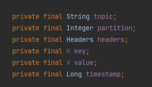

# Kafka

一个多分区、多副本且基于 Zookeeper 协调的分布式消息系统。

- 消息系统：Kafka 和传统的消息系统（也称作消息中间件）都具备系统解耦、冗余存储、流量削峰、缓冲、异步通信、扩展性、可恢复性等功能。与此同时，Kafka 还提供了大多数消息系统难以实现的消息顺序性保障及回溯消费的功能
- 存储系统：Kafka 把消息持久化到磁盘，相比于其他基于内存存储的系统而言，有效地降低了数据丢失的风险。也正是得益于Kafka 的消息持久化功能和多副本机制，我们可以把Kafka作为长期的数据存储系统来使用，只需要把对应的数据保留策略设置为“永久”或启用主题的日志压缩功能即可。
- 流式处理平台：Kafka 不仅为每个流行的流式处理框架提供了可靠的数据来源，还提供了一个完整的流式处理类库，比如窗口、连接、变换和聚合等各类操作。

## 基本概念

一般一个 Kafka 架构包含若干 Producer、若干 Broker、若干 Consumer，以及一个Zookeeper 集群。其中 Zookeeper 集群负责集群**元数据**的管理、控制器的选举等操作。Producer 负责将消息发送到 Broker，Broker 负责将收到的消息存储到磁盘中，而 Consumer 负责从 Broker 订阅并消费消息。

- Broker：服务代理节点。Broker可以简单的视为一个独立的 Kafka 服务节点或服务实例。
- Topic：主题。Kafka中消息以主题为单位进行归类，生产者负责将消息发送到指定的 Topic 中，消费者订阅主题进行消费
- Partition：分区。主题可细分为多个分区（主题是一个逻辑上的概念），它还可以细分为多个分区，一个 Partition 只属于单个 Topic。在同一个 Topic 下不同的 Partition 包含的信息是不同的。
- Offset：偏移量。Patition 在存储层面可视为一个可追加的 log 文件，消息被追加到分区日志文件中时，会分配一个特定的偏移量(offset)。offset 是消息在分区中的唯一标识，Kafka通过它来保证消息在分区内的顺序性，但是 offset 并不跨越分区。即 **Kafka保证分区有序**。

## 生产者

消息对象 ProducerRecord 结构如下

- topic：代表信息要发往的主题
- partition：代表信息要发往的分区
- header：消息头，一般用来设定与应用相关的消息，可不设定
- key：消息的键，可用来计算分区号让消息发往特定分区
- value：消息体，一般不为空。
- timestamp：时间戳

消息在发向 broker 的过程中，一般会需要经过拦截器（Interceptor）、序列化器（Serializer）和分区器（Partitioner）

### 一些生产者参数

#### acks

用于指定必须有多少个副本收到消息，才能任务这条消息是成功写入的。其有三种类型的值

- acks=1。默认值就是1，其代表生产者发送消息后，只要分区的 leader 副本成功写入消息，即视为成功。如果消息写入 leader 副本并成功响应，且在其他 follower 副本拉取之前 leader 崩溃，那么消息就会丢失（新选举的 leader 副本并没有对应的消息）
- acks=0。发送消息后不需要等待服务端响应。此设置可以保证最大吞吐量
- acks=-1或all。生产者发送消息后，需要等待 ISR 中所有副本都成功写入消息才能视为成功。此设置可以达到最大的可靠性。但不意味消息一定可靠，因为 ISR 中可能只有 leader 副本，此时就退化为了 acks=1 的情况。如果想获取更高的消息可靠性需要配合 min.insync.replicas 等参数

#### max.request.size

限制生产者发送消息的最大值，默认为 1MB

#### retries和retry.backoff.ms

retries即重试次数，默认为0。即发生异常时不进行重试。retry.backoff.ms参数默认值为100，其用来设定两次重试之间的时间间隔，避免无效的重试。

Kafka 可以保证同一个分区中的消息是有序的。如果生产者按照一定的顺序发送消息，那么这些消息也会顺序地写入分区，进而消费者也可以按照同样的顺序消费它们。对于某些应用来说，顺序性非常重要，比如MySQL的binlog传输，如果出现错误就会造成非常严重的后果。如果将acks参数配置为非零值，并且max.in.flight.requests.per.connection参数配置为大于1的值，那么就会出现错序的现象：如果第一批次消息写入失败，而第二批次消息写入成功，那么生产者会重试发送第一批次的消息，此时如果第一批次的消息写入成功，那么这两个批次的消息就出现了错序。一般而言，在需要保证消息顺序的场合建议把参数max.in.flight.requests.per.connection配置为1，而不是把acks配置为0，不过这样也会影响整体的吞吐。

#### compress.type

指定消息的压缩方式，默认值为 null 。还可配置"gzip"等参数，对消息进行压缩可以减少网络传输量，降低网络I/O。其是一种时间换空间的的优化方式，如果对时延有要求，最好不进行压缩

#### linger.ms

指定生产者发送 ProducerBatch 之前等待更多消息加入 ProducerBatch 的时间，默认值为0。生产者会在 ProducerBatch 被填满或等待时间超过 linger.ms 值时发送出去。增大此参数会增加消息延迟但可增加吞吐量

## 消费者

消费者订阅主题，并从主题上拉取信息

