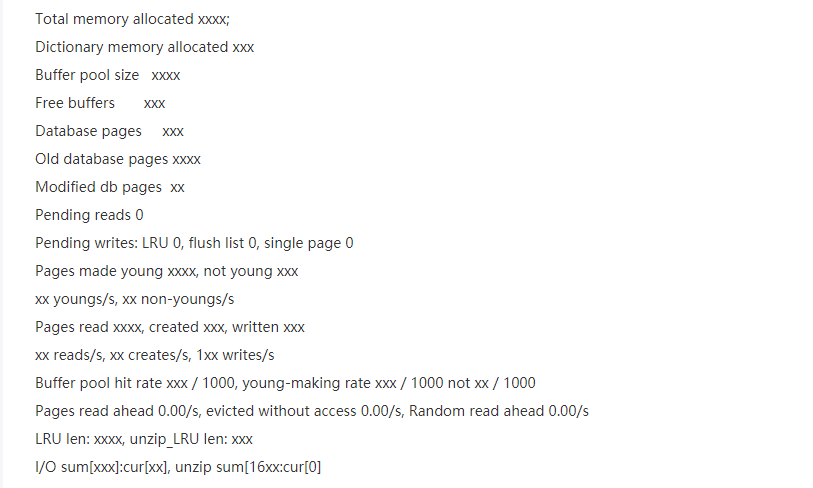

# MySql架构

## 连接MySql大概过程

> `JDBC`流程如下
>
> ~~~java
> public static void main(String[] args) throws SQLException, ClassNotFoundException {
>      Class.forName("com.mysql.cj.jdbc.Driver");
>      Connection conn = DriverManager.getConnection("jdbc:mysql://127.0.0.1:3306/imooc", "root", "root");
>      Statement statement = conn.createStatement();
>      statement = statement;
>      String sql = "insert into user(loginName,userName,password,sex)values('tom123','tom','123456',1)";
>      int result = statement.executeUpdate(sql);
> }
> ~~~

网络连接由线程处理：当数据库服务器连接池接受到网络请求时，会分配一个工作线程去进行处理

## MySql处理流程

### SQL接口：负责处理接收到的SQL语句

​	MySql工作线程从网络连接中读取出SQL语句后，会将其交给SQL接口去执行。

​	**SQL接口**：`是一套执行SQL语句的接口，专门用于执行我们发送给MySql的增删改查语句`

### 查询解析器：让MySql看懂sql语句

​	**Parser(查询解析器)**：`按照既定的sql语法规则，对sql语句进行解析，理解sql语句要做什么事情`

### 查询优化器：选择最优查询路径

​	**Optimizer(查询优化器)**：`针对编写的sql，生成所谓查询路径树，从中选择一条最优路径出来`

​	相当于告诉你，你应该按照什么样的步骤和顺序，去执行那些操作，然后一步一步的把sql语句给完成

### 执行器：根据执行计划调用存储引擎接口

​	`执行器会根据优化器生成的一套执行计划，然后不停的调用存储引擎的各种接口去完成sql语句的执行计划`

### 存储引擎接口：真正执行sql语句

​	MySql的架构设计中，SQL接口，解析器，优化器都是通用的，仅是一套组件而已。但存储引擎是由各种各样的，如InnoDB，MyISAM等，我们是可以选择使用那种存储引擎来负责具体sql执行的。

​	`存储引擎就是执行sql语句的，他会按照一定步骤去查询内存缓存数据，更新磁盘数据，查询磁盘数据等等`

# InnoDB

​	以一条update语句为例，初步了解InnoDB存储引擎的架构设计

​	update user set name = 'xxx' where id = 10	这条sql首先会通过数据库连接发送到MySql上，然后经过SQL接口，解析器，优化器，执行器几个环节，解析SQL语句，生成执行计划，接着由执行器负责计划的执行，调用InnoDB存储引擎的接口去执行

## 更新语句大致流程

---

### 	缓存池（Buffer Pool）

​		引擎执行更新语句时，会先判断id=10的数据是否存在于缓冲池中。如果不存在，则会从磁盘中加载数据，并且会对这行记录加独占锁

> Buffer Pool是一个放在内存中的组件，非常重要。其中放有缓存的数据，便于以后查询时，可以考虑直接从缓冲中获取。

### 	undo日志

​		如果id为10的数据name为zhangsan，先将其更新为xxx。那需要把这条记录原来的值（zhangsan，id为10）这些信息，写入到undo日志文件中去

> 考虑到未来可能要回滚数据，需要将更新前的值写入到undo日志文件中

### 更新buffer pool中数据

​		在将磁盘文件中加载到缓冲池后，同时加锁之后，并将修改前的数据写入到undo日志文件中之后。就可以正式更新这行记录了。更新时，先更新buffer pool中的数据。此时缓存数据和磁盘数据不一致

### Redo Log Buffer

​		为了避免MySql宕机，导致内存中数据丢失，需要把对内存所作修改写入到Redo Log Buffer中去，这也是内存中的一个缓冲区，使用了存放redo日志的。``redo日志就是记录对数据做了什么修改``

​		如果此时MySql宕机，此时内存中的数据全部丢失，但是由于事务并没有更新，所以磁盘上的数据依旧是旧数据

### Redo落盘

​		提交事务时，需要根据一定策略将redo日志从redo log buffer中刷入磁盘。这个策略是通过 **innodb_flush_log_at_trx_commit** 来进行配置的。其刷盘策略有三种

> 参数为0：提交事务时，不会将redo log buffer中数据刷入磁盘。如果此时MySql宕机了，那么内存中数据会丢失
>
> 参数为1：提交事务时，必须把redo log从内存中刷到磁盘文件中去，只要提交事务成功，那么redo log就必然在磁盘里了。此时MySql若宕机，那么内存中的数据虽然丢失，但是redo log 文件得到保存，MySql可以根据redo日志去进行恢复
>
> 参数为2：提交事务时，把redo日志写入到磁盘os cache缓存中，等待刷入到磁盘中去。如此时MySql宕机，并且redo文件还停留带os cacha中，那么数据会丢失

​		因此，redo日志刷盘策略一般都选为1，保证事务提交之后，数据不会丢失

因为数据库的每一次更新SQL语句，都必然涉及到多个磁盘随机读取数据页的操作，也会涉及到一条redo log日志文件顺序写的操作。所以磁盘读写的IOPS指标，就是每秒可以执行多少个随机读写操作，以及每秒可以读写磁盘的数据量的吞吐量指标，就是每秒可以写入多少redo log日志，整体决定了数据库的并发能力和性能。

### Binlog日志

> ​	redo log是一种**偏向物理性质的重做日志**，他里面记录的是类似这样的东西：对那个数据页中的什么记录，进行了什么修改。并且redo log是InnoDB存储引擎特有的
>
> ​	而binlog叫归档日志，**记录的是偏逻辑性的日志**，类似于：对user表中的id=10的行数据进行了更新，更新后的值是什么，binlog是mysql server自己的日志文件，不是InnoDB所特有的

​	在提交事务的同时，也会把这次更新对应的binlog文件写入到磁盘中去。对于binlog也有不同的刷盘策略，由参数 **sync_binlog** 控制。

> 参数为0：提交事务时，将binlog日志写入磁盘os cache中，等待刷入磁盘。此时若宕机，数据会丢失。0为默认值
>
> 参数为1：提交事务时，强制将binlog日志写入到磁盘中去。

### 基于binlog和relo log完成事务提交

​		当binlog写入到磁盘文件中后，接着就完成最终的事务提交，此时会将更新对应的binlog文件名称和此次更新的binlog日志在文件中的位置都写入到redo log日志文件中去，同时在redo log日志文件里写入一个commit标记。此时，才算完成了事务的提交

​		在redo log中写入commit标记的意义在于：`保持redo log和binlog的一致。`因为只有redo log和binlog一致，才能确认本次事务提交成功。

### 后台IO线程将内存中数据刷入磁盘

​		MySql后台有一个IO线程，会在之后某时间，随机的将内存buffer pool中的修改后的脏数据给刷回到磁盘中的数据文件中去。哪怕宕机也不影响，因为redo log和binlog中留有记录，可自行恢复

**执行器是非常核心的一个组件，负责跟存储引擎配合完成一个SQL语句在磁盘和内存层面的全部数据更新操作**

在执行更新时，每条SQL语句，都会对应修改buffer pool中的缓存数据，写undo日志，写redo log buffer 等步骤；在提交事务时，一定会将redo log刷入磁盘，binlog刷入磁盘，完成redo log中的commit标记；最后，再由后台IO线程随机的将buffer pool中的脏数据刷入到磁盘中

# 生产层面

8核16G，一般每秒扛一两千请求是没有问题的

16核32G，每秒三四千一般也没问题

数据库的磁盘最后使用SSD固态硬盘（数据库需要执行IO操作）

QPS(QUERY PER SECOND)：每秒处理多少请求。对数据库而言，可理解为每秒处理多少SQL语句

TPS(TRANSCATION PER SECOND)：每秒可处理的事务量。可理解为每秒处理多少事务提交或回滚

## 压测指标

### IO相关

- **IOPS**：这个指的是机器的随机IO并发处理的能力，比如机器可以达到200 IOPS，意思就是说每秒可以执行200个随机IO读写请求。

  这个指标是很关键的，因为之前我们在数据库架构原理中讲解过，你在内存中更新的脏数据库，最后都会由后台IO线程在不确定的时间，刷回到磁盘里去，这就是随机IO的过程。如果说IOPS指标太低了，那么会导致你内存里的脏数据刷回磁盘的效率就会不高。

- **吞吐量**：指机器的磁盘存储每秒可以读写多少字节的数据量

  这个指标也是很关键的，因为大家通过之前的学习都知道，我们平时在执行各种SQL语句的时候，提交事务的时候，其实都是大量的会写redo log之类的日志的，这些日志都会直接写磁盘文件。所以一台机器他的存储每秒可以读写多少字节的数据量，就决定了他每秒可以把多少redo log之类的日志写入到磁盘里去。一般来说我们写redo log之类的日志，都是对磁盘文件进行顺序写入的，也就是一行接着一行的写，不会说进行随机的读写，那么一般普通磁盘的顺序写入的吞吐量每秒都可以达到200MB左右。

- **latency**：指向磁盘中写入一条数据的延迟

  这个指标同样很重要，因为我们执行SQL语句和提交事务的时候，都需要顺序写redo log磁盘文件，所以此时你写一条日志到磁盘文件里去，到底是延迟1ms，还是延迟100us，这就对你的数据库的SQL语句执行性能是有影响的。一般来说，当然是你的磁盘读写延迟越低，那么你的数据库性能就越高，你执行每个SQL语句和事务的时候速度就会越快。

### 其他指标

- **CPU负载**：CPU负载是一个很重要的性能指标，因为假设你数据库压测到了每秒处理3000请求了，可能其他的性能指标都还正常，但是此时CPU负载特别高，那么也说明你的数据库不能继续往下压测更高的QPS了，否则CPU是吃不消的。
- **网络负载**：这个主要是要看看你的机器带宽情况下，在压测到一定的QPS和TPS的时候，每秒钟机器的网卡会输入多少MB数据，会输出多少MB数据，因为有可能你的网络带宽最多每秒传输100MB的数据，那么可能你的QPS到1000的时候，网卡就打满了，已经每秒传输100MB的数据了，此时即使其他指标都还算正常，但是你也不能继续压测下去了。
- **内存负载**：这个就是看看在压测到一定情况下的时候，你的机器内存耗费了多少，如果说机器内存耗费过高了，说明也不能继续压测下去了。

### 压测工具和监控

​	[压测工具sysbench](https://apppukyptrl1086.pc.xiaoe-tech.com/detail/i_5e383c5357307_MjhluwMb/1?from=p_5e0c2a35dbbc9_MNDGDYba&type=6)

​	[监控工具Prometheus和Grafana](https://apppukyptrl1086.pc.xiaoe-tech.com/detail/i_5e398efe3b8f9_XZOAxAmQ/1?from=p_5e0c2a35dbbc9_MNDGDYba&type=6)

​	

# Buffer Pool

buffer pool是数据库中必须要搞懂的一个核心组件，因为增删改查操作首先就是针对这个内存中的Buffer Pool里的数据执行的，同时配合了后续的redo log，刷磁盘等机制和操作

## Buffer Pool的数据结构

Buffer Pool默认大小为128MB，可以通过配置修改。本质就是数据库中的一个内存组件，由一大堆缓存页和描述数据块组成，然后加上各种链表(free,flush,lru)辅助其运行

~~~shell
[server]
innodb_buffer_pool_size=2147483648
~~~

### 数据页和缓存页

MySql对数据抽象出了一个**数据页**的概念，他将很多**行数据**放在了一个数据页中，每一页数据中放了很多行数据。所以buffer pool中的存放的是一个个的数据页

默认情况下，磁盘中存放的数据页的大小是16KB，也就是说一页数据包含了16KB的内容。Buffer Pool中存放的页数据又称之为缓存页，一个缓存页的大小和一个数据页的大小是一一对应的。

### 缓存页中的描述信息

对于每个**缓存页**，都会有一个**描述信息**，这个描述信息可以大体确认是用来描述这个缓存页的，一般包含：这个数据页的表空间，数据页的编号，这个缓存页在Buffer Pool中的内存地址以及一些别的信息。这些描述信息本身也是一块数据，在Buffer Pool中，每个缓存页的描述数据放在最前面，然后各个缓存页放在后面。如下图

Buffer Pool中的描述数据大概相当于缓存页的大小的5%左右。假设设置的buffer pool大小是128MB，那么实际上真正的大小可能有130MB，因为他里面还含有每个缓存页中的数据

### Buffer Pool的初始化

数据库启动时，便会按照配置的buffer pool大小，再稍微加大一点，去向操作系统申请一块内存空间，作为buffer pool的内存区域。内存区域申请完毕后，数据库就会按照默认的缓存页的16KB大小和对应的800字节左右的描述数据的大小，在Buffer Pool中划分出一个一个的缓存页和对于的描述数据。但此时缓存页都是空的，什么都没有

## Free链表

### 链表结构

Buffer Pool中有一个**Free链表**设计，他是一个**双向链表结构**，每个节点就是一个**空闲缓存页的描述数据块的地址**，即只要有一个缓存页是空闲的，那么他的描述数据块就会被放入到这个free链表中

free链表中还有一个基础节点，指向链表的头尾节点，里面还存储了链表中有多少个描述数据块的节点，即空闲缓存页

### 占用空间

free链表本身，就是由Buffer Pool中的描述数据块组成，每个描述数据块中都有两块指针，free_pre和free_netx。分别指向自己的上一个free链表的节点，以及下一个free链表的节点。

对于free链表而言，只有一个基础节点是不属于Buffer Pool的，他是40字节大小的一个节点，里面存放了free链表的头节点的地址，尾节点的地址，还有free链表中当前有多少节点

### 将数据读入到Buffer Pool

1. 首先从free链表中获取一个描述数据块，并根据数据库找到缓存页
2. 将磁盘上的数据读取到对应的缓存页中去，同时将相关描述信息写入到缓存页的描述数据块中。比如数据页所属表空间等信息。
3. 最后把描述数据库从free链表中去除

### 判断数据页是否缓存

`数据库中还会有一个哈希表数据结构，他会用表空间+数据页号，作为一个key，然后缓存页地址作为value`

当要使用数据页的时候，通过“表空间+数据页号”作为key去哈希表中查询一下，如果没有就读取数据页，如果有了，就说明已经缓存了

## Flush链表

结构和free链表类似，也是通过缓存页的描述数据块中的两块指针，让被修改过的缓存页的描述数据块，组成一个双向链表。凡是修改过的缓存页，都会将其数据块加入到flush链表中。flush的意思就是脏页，后续都是要将其flush刷新到磁盘上去的。

设计flush链表就是为了能够快速的将脏数据页中的数据刷回到磁盘中去。在更新缓存页的时候，通过变换缓存页中的描述数据块flush链表的尾指针，就可以把脏页的描述数据块组成一个双向链表，即flush链表，而且flush链表的基础节点会指向起始节点和尾巴节点。

## 缓存页的淘汰

如果所有的缓存页都被塞了数据，此时无法从磁盘上加载新的数据页到缓存页中去。那么就要淘汰一些缓存页——`即把一个缓存中修改过的数据，刷入到磁盘中去，然后将缓存页清空，再把新的数据页加载到空闲的缓存页中去`

### 缓存命中率以及LRU链表

淘汰缓存页时应尽可能选择使用率较少的缓存页，因此需要知道那些缓存页经常被访问，那些缓存页很少被访问。此时需要引入**LRU链表(Least Recently Used，最少使用)。**其数据结构和之前的Free链表，Flush链表类似，都是一个双向链表，节点均指向缓存页的描述数据块的地址

### 原始的LRU淘汰机制

> 大致工作原理：当我们从磁盘中**加载一个数据页到缓存页**时，就将这个缓存页的描述数据放入到LRU链表头部去，那么只有有数据的缓存页，都会在LRU链表中，而且最近被加载数据的缓存页，都会放到LRU链表的头部去。假设某个缓存页的描述数据在LRU链表的尾部，后续只要查询了或修改了这个缓存页，也会把这个缓存页挪动到LRU链表的头部，也就是**最近被访问过的缓存页，一定在LRU链表头部**
>
> 因此需要淘汰缓存页时，可以优先从LRU链表尾部进行淘汰

但这样的方式因为MySql的预读机制存在巨大隐患。

预读机制：当从磁盘上加载数据页的时候，MySql会连带着把这个数据页的相邻的其他数据页，都加载到缓存中去。

如果没有空闲缓存页了，此时加载新的数据页，就会将LRU链表尾部的数据淘汰。但这样是不合理的，毕竟其数据是有人访问的，而预读机制带入的数据页可能无人访问

> 一般而言，有两种情况可能触发MySql的预读机制
>
> - 有一个参数是innodb_read_ahead_threshold，他的默认值是56，意思就是如果顺序的访问了一个区里的多个数据页，访问的数据页的数量超过了这个阈值，此时就会触发预读机制，把下一个相邻区中的所有数据页都加载到缓存里去
> - 如果Buffer Pool里缓存了一个区里的13个连续的数据页，而且这些数据页都是比较频繁会被访问的，此时就会直接触发预读机制，把这个区里的其他的数据页都加载到缓存里去。这个机制是通过参数innodb_random_read_ahead来控制的，他默认是OFF，也就是这个规则是关闭的
>
> 预读机制可以一定程度上优化性能。如果你顺序读取很多数据页，MySql会判断可能会接着顺序读取后面的数据页。那么其提前读取到Buffer Pool中，后续读取就会方便很多

还有一种可能导致频繁被访问的缓存页被淘汰的情景：**全表扫描**（select *）

此时如果没where条件，那么会将表里全部数据页都从磁盘加载到Buffer Pool中去。此时LRU链表尾部，可能全部都是之前经常被访问的缓存页。此时进行淘汰时，就会将频繁访问的数据页给淘汰掉。

### 基于冷热数据分离思想设计LRU

真正的MySql在设计LRU链表时，采取的实际是**冷热数据分离**的思想。之前的问题，都是由于所有缓存页全部混在一个LRU链表中导致的

真正的LRU链表，会被拆分为两个部分，一部分是热数据，一部分是冷数据。冷热数据比例由**innodb_old_blocks_pct**参数控制的，默认是37，即冷数据占比37%

**当数据页第一次加载到缓存时**：数据页第一次被加载到缓存时，缓存页会被放在**冷数据区域的链表头部**

**冷数据区域缓存何时被放入热数据区域**：**innodb_old_blocks_time 参数**，默认值是1000，即1000ms。也就是说必须是一个数据页被加载到缓存页之后，在1s之后，访问这个缓存页，才会被挪动到热数据区域的链表头部去

这样设计的话，预读机制以及全表扫描加载进来的一大批缓存页，都会放在LRU链表的冷数据区域的前面位置。而那些频繁访问的缓存页都被放在热数据区域。淘汰缓存时，直接淘汰冷数据区域尾部的缓存页，刷入磁盘即可。

在这样的设计机制下，原始的LRU淘汰机制的问题基本都被解决掉了。

`因为那种预读机制以及全表扫描机制加载进来的数据页，大部分都会在1s之内访问一下，之后可能就再也不访问了，所以这种缓存页基本上都会留在冷数据区域里。然后频繁访问的缓存页还是会留在热数据区域里。当你要淘汰缓存的时候，优先就是会选择冷数据区域的尾部的缓存页，这就是非常合理的了！他不会让刚加载进来的缓存页占据LRU链表的头部，频繁访问的缓存页在LRU链表的尾部，淘汰的时候淘汰尾部的频繁访问的缓存页了！`

**热数据区域的优化**：LRU链表中的热数据区域的访问规则进行了优化，即只有在热数据区域的后3/4区域的缓存页被访问了，才会移动到链表头部去，如果是前面1/4的区域被访问，是不会移动到链表头部的。这样减少了链表的移动。

### 定时将LRU尾部缓存页刷入磁盘

并不是在缓存页满时，才会将LRU冷数据区域尾部的缓存页刷入磁盘。而是有一个后台线程，会运行一个定时任务，每隔一段时间就会把LRU链表的冷数据尾部的缓存页刷入到磁盘中，清空缓存页，并将其加入Free链表中

### 把Flush链表的缓存页刷入磁盘

仅将LRU冷数据区域缓存页刷入磁盘是不够的，后台线程也会在**MySql不繁忙的时候，将flush链表中的缓存页刷入磁盘中**，这样修改过的数据，迟早也会刷入磁盘。只要flush链表的缓存页被刷入磁盘，那么缓存页也会从flush链表和lru链表中移除，然后加入到free链表中

### 总结

总之，MySQL在执行CRUD的时候，首先就是大量的操作缓存页以及对应的几个链表。然后在缓存页都满的时候，必然要想办法把一些缓存页给刷入磁盘，然后清空这几个缓存页，接着把需要的数据页加载到缓存页里去！

你的MySQL的内核参数，应该如何优化，优化哪些地方的行为，才能够尽可能的避免在执行CRUD的时候，经常要先刷一个缓存页到磁盘上去，才能读取一个磁盘上的数据页到空闲缓存页里来？

> 如果要避免上述问题，就要避免缓存页频繁的使用完毕。这里的关键点就在于buffer pool的大小（程序对于缓存页是使用，以及定时线程释放缓存页的过程很难去控制）
>
> buffer pool的大小以及buffer pool的数量，这些参数需要用心的设置和优化，因为他对MySql的性能和并发能力，由较大的影响。

## Buffer Pool的优化

### 多个Buffer Pool

多线程并发访问Buffer Pool时，如果访问的是一些共享数据，那么必然会进行锁操作。因此如果并发请求高的话，性能会受到影响

因此可以设置多个Buffer Pool来优化并发能力。MySql默认规则是，如果给Buffer Pool分配的内存小于1GB，那么就会分配一个Buffer Pool。如果分配的内存大，那么就可以设置多个Buffer Pool

~~~shell
# buffer pool总大小为8GB，4个buffer pool实例
[server]
innodb_buffer_pool_size = 8589934592
innodb_buffer_pool_instances = 4
~~~

这样多线程并发性能就会得到很大的提高

### 基于chunk机制动态调整Buffer Pool大小（不常用）

Buffer Pool是由很多**chunk**组成的，每个大小是由 **innodb_buffer_pool_chunk_size** 参数控制的，默认值是128MB。每个Buffer Pool里的每个chunk里就是一系列的描述数据块和缓存页，多个chunk共享一套free,flush,lru链表

基于chunk机制，就可以动态的调整buffer pool的大小了。如果需要增加Buffer Pool的大小，那么可以申请一系列的128MB大小的chunk就可以了，只要每个chunk是连续到128MB内存就可以，然后将申请到的chunk内存分配给Buffer Pool即可

## Buffer Pool的参数设置

一般buffer pool大小为机器内存的50%-60%之间即可

Buffer Pool总大小=（chunk大小 * buffer pool数量）的2的倍数

## SHOW ENGINE INNODB STATUS

## 总结

数据库在生产环境运行时，需要根据机器的内存设置合理的buffer pool大小，然后设置buffer pool的数量。这样的话，可以尽可能的保证数据库的高性能和高并发能力。

在线上运行的时候，buffer pool是由多个的，每个buffer pool中多个chunk共用一套链表数据结构。执行crud的时候，会不停的加载磁盘上的数据页到缓存页中，然后查询和更新缓存中的数据，同时维护一系列的链表结构。

然后后台线程定时根据lru链表和flush链表，去将一批缓存页刷入磁盘释放掉这些缓存页，同时更新free链表

如果执行curd时发现缓存页都满了，无法加载自己需要的数据页进行缓存，此时就将lru链表冷数据区域的缓存页刷入磁盘，然后加载自己需要的数据页进来。

大致原理就是如此。

# 物理数据结构

> 为何不直接更新磁盘上的数据——磁盘随机读写性能太差，如果直接更新磁盘文件，必然会导致数据无法承受高并发
>
> 为何进入数据页概念—— 一条一条加载数据到内存更新，效率太低。不如将数据组织成一页一页的概念，每次加载数据时，至少加载一页甚至多页数据。可以说**页**就是数据库的最小数据单位，默认为16KB大小。磁盘和内存直接的交换通过数据页来执行

## MySql物理存储格式

### 行格式

对一个表指定他的行存储格式是什么样的。eg：CREATE TABLE table_name (columns) ROW_FORMAT=COMPACT/ALTER TABLE table_name ROW_FORAMT=COMPACT

对于每一行数据，存储的时候都会有一些头字段对这行数据进行一定的描述，然后再放上他这一行数据的每一列的具体的值，这就是所谓的行格式。大致形式如下

> 变长字段的长度列表，null值列表，数据头，column01的值，column02的值，column0n的值......

其他几种行格式都大同小异。

### 变长字段在磁盘的存储

在存储每一行数据时，都保存其变长字段的长度列表，这样才能解决读取问题。如果有多个变长字段，则长度排放是逆序的。如果hello是VARCHAR(10)类型的变长字段的值，那么其在磁盘存储时，结构可能是这样的 0x05 null值列表 数据头 hello ...

> create table custom（name VARCHAR(10) NOT NULL  ,  address VARCHAR(20)  ,  gender CHAR(1)  ,  job VARCHAR(30)  ,  school VARCHAR(50)）ROW_FORMAT=COMPACT;
>
> 假设数据为 jack NULL m NULL xx_school。
>
> 如果变长字段为null值，就不用在变长字段列表里存放值长度了，上述数据中，只有name和school两个字段有值。将其长度按照逆序放在变长字段长度列表中即可      
>
> 0x09 0x04 NULL值列表 头信息...
>
> 

### NULL字段值在磁盘的存储

NULL值列表即一行数据中可能有的字段值为NULL，比如name字段，如果允许为NULL值，并且在实际存储时也没有赋值，那其字段值就为NULL。

但是NULL值在实际存储时，是不会按照字符串形式存放在磁盘上浪费空间的，null实际是以二进制bit位来存储的。

Null值列表是允许值为Null，只要是允许为null的字段，在NULL值列表中都会有一个bit位，bit值为1说明是NULL，为0说明不是NULL

 jack NULL m NULL xx_school数据中有4个字段允许为NULL，其中有两个为null，两个不为null。则4个bit位：1010。但其实逆序存放，实际上是0101。并且NULL值列表存放时，不会仅仅是4个bit位，他一般起码是8个bit位的倍数，不足8位就补0。所以实际存储时类似下面这种形式

**0x09 0x04 00000101 数据头信息 column01=value1，column02=value2，column0n=voluen......**

### 数据头的存储

40个bit为中，第一位和第二位都是预留位，没任何含义

第三个bit位是：**delete_mask**，其标识本行数据是否被删除

第四个bit位是：min_rec_mask，是否是B+Tree每一层的非叶子节点的最小值

接下来的4个bit位是：n_owned，记录数

接下来的13个bit位是：heap_no，代表当前这行数据在记录堆里的位置

接下来3个bit位的record_type，即这行数据的类型：0代表的是普通类型，1代表的是B+树非叶子节点，2代表的是最小值数据，3代表的是最大值数据

最后是16bit位的next_record，指向下一条数据的指针

0x09 0x04 00000101 0000000000000000000010000000000000011001 jack m xx_school

### 实际数据的存储

实际上字符串是根据数据库指定的字符集编码，进行编码后再存储的，所以一行数据可能如下

0x09 0x04 00000101 0000000000000000000010000000000000011001 616161 636320 6262626262

在实际存储时，会在其真实数据部分加入一些隐藏字段：

- DB_ROW_ID：行唯一标识，数据库内部设置的一个标识，不是主键ID字段。如果没有指定主键和unique key唯一索引，他就会在内部自动加ROW_ID作为主键
- DB_TRX_ID：事务id，和事务有关
- DB_ROLL_PTR：回滚指针，用来进行事务回滚。

如果加上隐藏字段，实际一行数据可能如下

0x09 0x04 00000101 0000000000000000000010000000000000011001 00000000094C（DB_ROW_ID）00000000032D（DB_TRX_ID） EA000010078E（DB_ROL_PTR）  616161 636320 6262626262

### 行溢出

数据页的默认大小为16KB，如果一行的数据存储内容太多(blob，text这种类型字段都有可能出现溢出)，一个数据页都放不下了，此时只能溢出这个数据页，把数据溢出存放到其他数据页中，那些数据页就叫做溢出页

## 数据页的结构

一个数据页拆分成了很多个部分，大体上来说包含了文件头、数据页头、最小记录和最大记录、多个数据行、空闲空间、数据页目录、文件尾部。

其中文件头占据了38个字节，数据页头占据了56个字节，最大记录和最小记录占据了26个字节，数据行区域的大小是不固定的，空闲区域的大小也是不固定的，数据页目录的大小也是不固定的，然后文件尾部占据8个字节。

行数据会插入到缓存页的空闲区域（数据页和缓存页是一一对应的）中，并最终被刷入到磁盘中

## 表空间和数据区

平时创建的表，都有一个表空间的概念，在磁盘上都会对应着“表名.ibd”这样的磁盘数据空间。在物理层面，表空间就是对应一些磁盘上的数据文件。有的表空间，比如系统表空间可能对应的是多个磁盘文件，有的我们自己创建的表对应的表空间可能就是对应了一个“表名.ibd”数据文件。

一个表空间里的数据页太多了，不便于管理，于是引入**数据区（extent）**的概念，一个数据区对应着连续的64个数据页，每个数据页是16KB，所以一个数据区是1mb，然后256个数据区被划分为一组。

**对应表空间而言，他的第一组数据区的前三个数据页都是固定的，存放了一些描述性的数据。表空间的其他组数据区的第一个数据区的前两个数据页，也是存放特殊信息的**

**我们平时创建的那些表都是有对应的表空间的，每个表空间就是对应了磁盘上的数据文件，在表空间里有很多组数据区，一组数据区是256个数据区，每个数据区包含了64个数据页，是1mb**

当我们需要执行crud操作的时候，说白了，就是从磁盘上的表空间的数据文件里，去加载一些数据页出来到Buffer Pool的缓存页里去使用。

# IO调度

## LINUX层面读写

简单来说，Linux的存储系统分为VFS层、文件系统层、Page Cache缓存层、通用Block层、IO调度层、Block设备驱动层、Block设备层，如下图：

当MySQL发起一次数据页的随机读写，或者是一次redo log日志文件的顺序读写的时候，实际上会把磁盘IO请求交给Linux操作系统的VFS层。这一层的作用，就是根据你是对哪个目录中的文件执行的磁盘IO操作，把IO请求交给具体的文件系统。

举个例子，在linux中，有的目录比如/xx1/xx2里的文件其实是由NFS文件系统管理的，有的目录比如/xx3/xx4里的文件其实是由Ext3文件系统管理的，那么这个时候VFS层需要根据你是对哪个目录下的文件发起的读写IO请求，把请求转交给对应的文件系统，如下图所示。

接着文件系统会先在Page Cache这个基于内存的缓存里找你要的数据在不在里面，如果有就基于内存缓存来执行读写，如果没有就继续往下一层走，此时这个请求会交给通用Block层，在这一层会把你对文件的IO请求转换为Block IO请求。

接着IO请求转换为Block IO请求之后，会把这个Block IO请求交给IO调度层，在这一层里默认是用CFQ公平调度算法的，也就是说，可能假设此时你数据库发起了多个SQL语句同时在执行IO操作。有一个SQL语句可能非常简单，比如update xxx set xx1=xx2 where id=1，他其实可能就只要更新磁盘上的一个block里的数据就可以了。但是有的SQL语句，比如说select * from xx where xx1 like "%xx%"可能需要IO读取磁盘上的大量数据。那么此时如果基于公平调度算法，就会导致他先执行第二个SQL语句的读取大量数据的IO操作，耗时很久，然后第一个仅仅更新少量数据的SQL语句的IO操作，就一直在等待他，得不到执行的机会。

所以在这里，**其实一般建议MySQL的生产环境，需要调整为deadline IO调度算法，他的核心思想就是，任何一个IO操作都不能一直不停的等待，在指定时间范围内，都必须让他去执行。**

此时IO请求被转交给IO调度层

最后IO完成调度之后，就会决定哪个IO请求先执行，哪个IO请求后执行，此时可以执行的IO请求就会交给Block设备驱动层，然后最后经过驱动把IO请求发送给真正的存储硬件，也就是Block设备层，如下图所示。然后硬件设备完成了IO读写操作之后，要不然是写，要不然是读，最后就把响应经过上面的层级反向依次返回，最终MySQL可以得到本次IO读写操作的结果。

## RAID存储架构

RAID就是一个磁盘冗余阵列，可以大致理解为用来**管理机器里的多块磁盘的一种磁盘阵列技术**。有了它，在向磁盘中读写数据时，他会告诉你应该在那块磁盘上读写数据。并且其还实现了**数据冗余机制**，所以其实有的RAID磁盘冗余阵列技术里，是可以把你写入的同样一份数据，在两块磁盘上都写入的，这样可以让两块磁盘上的数据一样，作为冗余备份，然后当你一块磁盘坏掉的时候，可以从另外一块磁盘读取冗余数据出来，这一切都是RAID技术自动帮你管理的，不需要你操心。

服务器使用多块磁盘组成的RAID阵列的时候，一般会有一个RAID卡，这个RAID卡是带有一个缓存的，这个缓存不是直接用我们的服务器的主内存的那种模式，他是一种跟内存类似的SDRAM，当然，你大致就认为他也是基于内存来存储的吧！然后我们可以把RAID的缓存模式设置为write back，这样的话，所有写入到磁盘阵列的数据，先会缓存在RAID卡的缓存里，后续慢慢再写入到磁盘阵列里去，这种写缓冲机制，可以大幅度提升我们的数据库磁盘写的性能。

RAID卡一般都配置有自己独立的锂电池或者是电容，如果服务器突然掉电了，无法接通电源了，RAID卡自己是基于锂电池来供电运行的，然后他会赶紧把缓存里的数据写入到阵列中的磁盘上去。

# redo和undo

## redo log

redo log的本质是为了保证事务提交后，修改的数据绝对不会丢失（在提交事务的时候，保证把对缓存页做的修改以日志的形式写入到redo log日志文件中去）

**相比将修改后的缓存页刷入磁盘，写redo log性能更好更快（写入文件小，顺序写入磁盘文件），可以提供并发能力**

redo log中记录内容：**表空间号+数据页号+偏移量+修改几个字节的值+具体的值**

根据修改了数据页中几个字节的值，redo log被划分为了不同的类型，MLOG_1BYTE类型的日志代表修改了一个字节的值；MLOG_2BYTE类型的日志代表修改了两个个字节的值。如果一下子修改了一大串的值，类型就是MLOG_WRITE_STRING，代表一下子在那个数据页的某个偏移量的位置插入或者修改了一大串的值。redo log内容大致如下

日志类型（就是类似MLOG_1BYTE之类的），表空间ID，数据页号，数据页中的偏移量，具体修改的数据	

### redo log block

MySql内部数据结构  redo log block。一个redo log block是512字节，这个redo log block的512字节分为三个部分，一个是12字节的header块头，一个是496字节的body块体，一个是4字节的trailer块尾。

其中12字节的head头又可细分

1. 包括4个字节的block no，就是块唯一编号；
2. 2个字节的data length，就是block里写入了多少字节数据；
3. 2个字节的first record group。这个是说每个事务都会有多个redo log，是一个redo log group，即一组redo log。那么在这个block里的第一组redo log的偏移量，就是这2个字节存储的；
4. 4个字节的checkpoint on

对于redo log而言，他确实是不停的追加写入到redo log磁盘文件中去，但每一个redo log都是写入到文件中的一个redo log block中去的，一个block最多存放496自己的redo log日志。

### redo log buffer

redo log buffer是MySql启动时申请的一片连续内存，然后里面划分出了N多个空的redo log block。通过MySql的innodb_log_buffer_size可以指定其大小，默认值是16MB。

一个事务涉及的多个redo log 会组成一个redo log group，一起写入redo log block中

### 刷入磁盘的时机

redo log在写的时候，都是一个事务组里的一组redo log，先暂存在一个地方，完事后把一组redo log写入redo log buffer。写入redo log buffer时，是写入里面提前规划好的一个一个的redo log block中，选择有空闲空间的redo log block去写入，然后redo log block写满之后，会在某个时机刷入磁盘中

- 如果写入redo log buffer的日志已经占据了redo log buffer总容量的一半了，也就是超过了8MB的redo log在缓冲里了，此时就会把他们刷入到磁盘文件里去
- 一个事务提交的时候，必须把他的那些redo log所在的redo log block都刷入到磁盘文件里去，只有这样，当事务提交之后，他修改的数据绝对不会丢失，因为redo log里有重做日志，随时可以恢复事务做的修改（PS：之前最早最早的时候，讲过，这个redo log哪怕事务提交的时候写入磁盘文件，也是先进入os cache的，进入os的文件缓冲区里，所以是否提交事务就强行把redo log刷入物理磁盘文件中，这个需要设置对应的参数)
- 后台线程定时刷新，有一个后台线程每隔1秒就会把redo log buffer里的redo log block刷到磁盘文件里去
- MySQL关闭的时候，redo log block都会刷入到磁盘里去

为保证数据不丢失，还需要配置参数，提交事务把redo log刷入磁盘文件的os cache后，还得强行从os cache刷入物理磁盘

还可以**通过innodb_log_group_home_dir参数设置redo log写入文件目录，innodb_log_flie_size可以指定redo log文件大小，默认是48MB，通过innodb_log_files_in_group可以指定日志文件数量，默认就两个**

因此默认情况下，目录中就两个日志文件，每个48MB，先写第一个，再写第二个。如果第二个写满了，重新覆写第一个即可。96MB得日志文件够存储上百万条redo log了

## undo log回滚日志

执行事务的时候，里面很多INSERT、UPDATE和DELETE语句都在更新缓存页里的数据，但是万一事务回滚，你必须有每条SQL语句对应的undo log回滚日志，根据回滚日志去恢复缓存页里被更新的数据。

执行了INSERT语句，那么undo log必须有插入数据的主键ID，可以在回滚的时候从缓存页里把这条数据给删除了；

执行了DELETE语句，那么undo log必须记录下来被删除的数据，回滚的时候就得重新插入一条数据；

执行了UPDATE语句，那么undo log必须记录下来修改之前的数据，回滚的时候就得把数据给更新回去；

### undo log内容

以insert为例。insert语句的undo log类型是TRX_UNDO_INSERT_SEC，其中包含了以下一些东西

- 日志的开始位置
  - 主键的各列长度和值（如果自己指定主键，那么主键可能是多个列。主键各列长度和值，意思是插入这条数据的主键的每个列，长度是多少，具体值是多少。即使没有设置主键，MySql也会自己设置row_id作为隐藏字段，作为主键）
- 表id
- undo log日志编号
- undo log日志类型
- 这条日志的结束位置

如果事务回滚了，就就找出语句对于的undo log，根据undo log就可以定位数据，执行回滚

# 事务

## 脏写，脏读，不可重复读，幻读

### 脏写

即两个事务同时执行，A事务更新一条数据后，B事务由更新了同一条数据。此时A事务回滚，将更新数据改回最初值。对于事务B来说，其更新值丢失。这即为脏写

### 脏读

即两个事务同时执行，A事务更新一条数据后，B事务查询该数据。此时A事务回滚，将更新数据改回最初值。对于事务B来说，再次查询发现值变了。这即为脏读

**无论是脏写还是脏读，都是因为一个事务去更新或者查询了另外一个还没提交的事务更新过的数据。因为另外一个事务还没提交，所以他随时可能会反悔会回滚，那么必然导致你更新的数据就没了，或者你之前查询到的数据就没了，这就是脏写和脏读两种坑爹场景。**

### 不可重复读

在事务执行期间，事务A在事务执行期间，读到了事务B和事务C提交事务修改的值。对事务A来言，在事务未提交时，多次重复读取，所读的值不同，这就是不可重复读

不可重复读取决于你想要数据库是什么样子的，如果你希望看到的场景就是不可重复读，也就是事务A在执行期间多次查询一条数据，每次都可以查到其他已经提交的事务修改过的值，那么就是不可重复读的，如果你希望这样子，那也没问题。

### 幻读

事务A需要查询一批数据出来如：select * from table where id > 10 。查询出了10条数据，此时事务B向表中插入两条数据，并提交事务。此时事务A再次按照同样进行查询，会导致查询出12条数据

幻读特指查询到了之前查询没看到的数据

## 隔离级别

**read uncommitted（读未提交），read committed（读已提交），repeatable read（可重复读），serializable（串行化）**

### read uncommitted（读未提交）

不允许发生脏写。不可能有两个事务在没提交的情况下去更新同一行数据的值。但此隔离级别会发生 脏读，不可重复读，以及幻读

### read committed（读已提交）RC

不会发生脏读和脏写。即事务未提交情况下修改的值，不会被另一事务读到。但可能发生不可重复读和幻读

### repeatable read（可重复读）RR

这个级别下，不会发生脏写、脏读和不可重复读的问题，因为你一个事务多次查询一个数据的值，哪怕别的事务修改了这个值还提交了。你事务一旦开始，多次查询一个值，会一直读到同一个值！

RR隔离级别，保证了对同一行数据的多次查询，但还是有幻读问题

### serializable（串行化）

不允许事务并发执行，只能串行执行

# MVCC多版本并发控制机制

## undo log版本链

> 每条数据都有两个隐藏字段：**trx_id和roll_pointer**。trx_id是最近一次更新这条数据事务的id，roll_pointer指向了**更新这个事务之前**生成的undo log

如上图，事务A插入一条数据，此条数据的隐藏字段以及指向undo log如图所示。roll_pointer指向为空，因为之前是没有的

假设事务B修改了数据的值为B，则数据的隐藏字段也相应进行改别

事务C又对数据进行修改，则隐藏字段变动关系如图

**多个事务串行执行的时候，每个事务修改了数据后，都会更新隐藏字段trx_id和roll_pointer，同时之前的多个数据快照对应的undo log，会通过roll_pointer指针串联起来，形成重要的版本链**

## ReadView机制（基于undo log版本链）

ReadView，简单的说，就是在执行一个事务的时候，就会生成一个ReadView。其中里面比较关键的东西有4个

- m_ids，此时有那些事务在MySql里执行还没提交的；
- min_trx_id，就是m_ids中最小的值；
- max_trx_id，就是MySql下一个要生成的事务id，即最大事务id；
- creator_trx_id，当前事务id；

**其可以保证当前事务可以读取到事务开启前，别的事务提交的更新的值，以及自己事务更新的值（此即实现了RR隔离级别）**

当前有两个事务A和B，B去更新数据，A去读取数据。

事务A开启ReadView后，当前ReadView包含事务A和事务B的id（45，59）。min_trx_id就是45，max_trx_id是60，creator_trx_id是事务Aid：45	

事务A第一次查询时，会进行判断，判断当前这行数据的trx_id是否小于当前ReadView的min_trx_id。如果小于，说明事务开启之前，修改这行数据的事务就已经提交，此时可以查到这行数据。

此时事务B，更新了这条数据，此时这行数据的trx_id变为59。然后事务B就提交了

此时A再次查询，会发现此时数据行里的trx_id为59，大于当前ReadView中的min_trx_id，同时小于max_trx_id。这说明更新这条数据的事务，可能和自己是同时开启的，因此便会查看m_ids，查看trx_id=59是否存在其中。发现存在便不能对其进行查询。

于是，便通过roll_pointer顺着undo log版本链查找，查找符合要求的undo log。这就是undo log版本链的作用，其可以保存一个快照链条，让事务读取到之前的快照值

接着，事务A更新了这行数据的值，trx_id修改为了45，同时保存之前事务B修改的值的快照。此时事务A再次查询

在事务A执行的同时，事务C更新了这行数据的值，还提交了。此时事务A再去查询，发现当前数据的trx_id为78，大于了自己ReadView中的max_trx_id(60)。说明事务A开启之后，又有一个事务提交了数据，自己是看不到的。只能通过undo log链条去寻找可读到的版本

## RC(read committed)隔离级别和ReadView

RC隔离级别指事务运行期间，只要别的事务修改数据提交了，就可以读到其他事务修改的数据，所以会发生不可重复读，幻读问题

**当一个事务设置处于RC隔离级别时，他每次发起查询，都会重新生成一个ReadView**

假设当前有两个事务A,B。事务B发起update操作，更新了一条数据，将其修改为B。此时数据对应的事务id为70，同时生成一个undo log

此时，事务A要发起查询操作，会生成一个ReadView，此时ReadView里的min_trx_id=60，max_trx_id=71，creator_trx_id=60，此时如下图所示。

此时只能查到undo log版本链中的数据。如果此时事务B提交，那么事务B就不属于活跃事务了。此时A再进行查询，就会重新生成一个ReadView

此时事务A就可以查询到事务B了

## RR(read repatable)隔离级别和ReadView

在MySql中，RR隔离级别是可以同时避免不可重复读和幻读问题的。在RR级别下，事务读一条数据，无论是读取多少次，都是一个值，别的事务修改数据之后哪怕提交了，也是看不到其他事务的修改数据的。同时如果其他事务插入了一些数据，也是感知不到的

假设有如下事务A，B和数据

此时事务A基于这个ReadView去查这条数据，会发现这条数据的trx_id为50，是小于ReadView里的min_trx_id的，说明他发起查询之前，早就有事务插入这条数据还提交了，所以此时可以查到这条原始值的，如下图。

此时事务B更新此条数据的值为B，同时修改trx_id为70，并生成undo log。并提交了事务

此时，事务A中的ReadView中的m_ids还是[60，70]。因为ReadView一旦生成就不会轻易改变。虽然事务B结束了，但在A的ReadView中还是会有两个事务id

此时事务A再次去查询数据的值，此时数据的trx_id为70，70一方面是在ReadView的min_trx_id和max_trx_id的范围区间的，同时还在m_ids列表中

事务A多次读同一个数据，每次读到的值都是一样的，除非其自己修改了值。因为事务A的ReadView始终是不变的，它基于这个ReadView查到的值是一样的

这样就解决了不可重复读的问题

事务C此时插入了一条数据，并进行事务的提交。接着，事务A进行查询，此时会发现符合条件的有两条数据，一条是原始值数据，一条是事务C插入的那条数据。但是事务C插入的那条数据的trx_id是80，这个80是大于自己的ReadView的max_trx_id的，说明这条数据是不能进行查询的

因此，事务A进行查询还是只能查询到一条数据。所以事务A不会发生幻读，他根据条件范围查询的时候，每次读到的数据都是一样的，不会读到其他事务插入的数据，这都是基于ReadView机制实现的

## 总结

> 多个事务并发运行的时候，同时读写一个数据，可能会出现脏写、脏读、不可重复读、幻读几个问题
>
> 所谓的脏写，就是两个事务都更新一个数据，结果有一个人回滚了把另外一个人更新的数据也回滚没了。
>
> 脏读，就是一个事务读到了另外一个事务没提交的时候修改的数据，结果另外一个事务回滚了，下次读就读不到了。
>
> 不可重复读，就是多次读一条数据，别的事务老是修改数据值还提交了，多次读到的值不同。
>
> 幻读，就是范围查询，每次查到的数据不同，有时候别的事务插入了新的值，就会读到更多的数据。
>
> 针对这些问题，才会有RU,RC,RR和串行四个隔离级别
>
> RU隔离级别，就是可以读到人家没提交的事务修改的数据，只能避免脏写问题；
>
> RC隔离级别，可以读到人家提交的事务修改过的数据，可以避免脏写和脏读问题。
>
> RR是不会读到别的已经提交事务修改的数据，可以避免脏读、脏写和不可重复读的问题；
>
> 串行是让事务都串行执行，可以避免所有问题。
>
> 然后MySQL实现MVCC机制的时候，是基于**undo log多版本链条+ReadView机制**来做的，默认的RR隔离级别，就是基于这套机制来实现的，依托这套机制实现了RR级别，除了避免脏写、脏读、不可重复读，还能避免幻读问题。

# 锁机制

> 不是太建议在数据库粒度去通过行锁实现复杂的业务锁机制，而更加建议通过redis、zookeeper来用分布式锁实现复杂业务下的锁机制，其实更为合适一些。

## 锁机制入门

依靠锁机制可以让多个事务更新一行数据的时候串行化，避免同时更新一行数据

一个事务要对一个数据进行更新时，事务会判断当前数据是否有锁，如果没有锁，该事务就会创建一个锁，里面包含了事务的trx_id和等待状态，然后锁便和这行数据关联到了一起

更新一行数据必须把其所在的数据页从磁盘文件里读取到缓存页里才能更新。所以，此时和**这行数据相关的锁数据结构都是在内存中的**

如上图，事务A对数据加速的情况下，事务B也来更新数据，便也会生成锁，并进入排队状态。如果事务A修改完毕，便会将锁释放掉，并去判断是否有其他事务也对数据进行锁操作。如果有，便会修改下个等待锁的状态，并将其唤醒

## 共享锁和独占锁(行锁)

多个事务同时更新数据的时候，加的是X锁——Exclude独占锁，当有一个事务加了独占锁之后，此时其他数据再要更新这行数据，都要加独占锁，但要生成独占锁在后面等待。

当有事务在更新数据，其他事务读取该数据，是不需要加锁的。在默认情况下，有人更新数据时，其他事务读取数据，默认是开启MVCC机制的。其他事务读取数据，可以根据ReadView，去undo log版本链中找到一个你能读取的版本，不需要考虑别人在不断更新

MVCC机制就是避免频繁加锁互斥而设计的

查询时加锁（S锁，共享锁），可以通过：select * from table lock in share mode。在一个查询语句后加**lock in the share mode**，意思是查询的时候对一行数据加**共享锁**。

并且共享锁和独占锁是互斥的

| 锁类型 | 独占锁 | 共享锁 |
| :----: | :----: | :----: |
| 独占锁 |  互斥  |  互斥  |
| 共享锁 |  互斥  | 不互斥 |

查询操作也可以加互斥锁，select * from table for update

`所以这里可以先看出一个规律，就是更新数据的时候必然加独占锁，独占锁和独占锁是互斥的，此时别人不能更新；但是此时你要查询，默认是不加锁的，走mvcc机制读快照版本，但是你查询是可以手动加共享锁的，共享锁和独占锁是互斥的，但是共享锁和共享锁是不互斥的，如下规律。`

## 表级锁（了解即可）

表锁比较鸡肋，很少使用。表锁分为两种，一种为表锁，一种为表级的意向锁。并且执行DDL语句时，会阻塞所有增删改操作；执行增删改操作时，会阻塞DDL操作

LOCK TABLES xxx READ：这是加表级共享锁

LOCK TABLES xxx WRITE：这是加表级独占锁

还有另两种情况会加表级锁。如果有事务在表里执行增删改操作，那在行级会加独占锁，此时也会在表级加意向独占锁；如果有事务在表里执行查询操作，那么会在表级加意向独占锁

手动加表级共享锁和独占锁，以及更新和查询的时候自动在表级加的意向共享锁和意向独占锁，他们之间反而是有一定的互斥关系，关系如下表所示。

|   锁类型   | 独占锁 | 意向独占锁 | 共享锁 | 意向共享锁 |
| :--------: | :----: | :--------: | :----: | :--------: |
|   独占锁   |  互斥  |    互斥    |  互斥  |    互斥    |
| 意向独占锁 |  互斥  |   不互斥   |  互斥  |   不互斥   |
|   共享锁   |  互斥  |    互斥    | 不互斥 |   不互斥   |
| 意向共享锁 |  互斥  |   不互斥   | 不互斥 |   不互斥   |

其实更新数据自动加的表级意向独占锁，会跟你用 LOCK TABLES xxx WRITE 手动加的表级独占锁是互斥的，所以说，假设你手动加了表级独占锁，此时任何人都不能执行更新操作了！

或者你用LOCK TABLES xxx READ手动加了表级共享锁，此时任何人也不能执行更新操作了，因为更新就要加意向独占锁，此时是跟你手动加的表级共享锁，是互斥的！

**一般来讲，都是对同一行数据的更新操作加的行级独占锁是互斥，跟读操作都是不互斥的，读操作默认都是走mvcc机制读快照版本的！**

# 索引

## 索引原理

### 数据页的存放

数据页在磁盘上的存放如下图所示，大量的数据页是按照一页一页顺序存放的，然后**两两相邻的数据页间采用双向链表相互引用**。

一个数据页内部存储这一行行的的数据，**数据页里的每一行都会按照主键大小进行排序存储**，同时每一行数据都有指针指向下一行数据的位置，组成单向链表。

每个数据页都会有一个页目录，里面根据数据行的主键存放了一个目录，同时数据行是被分散到不同槽位中的。因此每个数据页的目录里，就是这个页里每个主键跟所在槽位的映射关系

### 没有索引的情况进行查询

**假设要根据主键id进行数据查询，首先会到数据页的页目录中根据主键进行二分查找。然后通过二分查找确定主键所在数据是在那个槽位里，然后到指定槽位中，遍历槽位的每一行数据，就能快速找到主键对应的数据了。**

但如果根据非主键对数据进行查询，那就只能对所有数据页进行遍历，直到找到对应数据为止。上述操作，就是**全表扫描**。

在你没有任何索引数据结构的时候，无论如何查找数据，说白了都是一个全表扫描的过程，就是根据双向链表依次把磁盘上的数据页加载到缓存页里去，然后在一个缓存页内部来查找那条数据。	

### 数据页页分裂

**页分裂的过程核心目标就是保证下一个数据页里的主键值都比上一个数据页里的主键值要大**，索引运作的核心基础就是要求后一个数据页的主键值都大于前一个数据页的主键值

如上图，有两条数据的主键值明显小于上一个数据页的主键值。此时就会出现**页分裂**，就是万一你的主键值都是你自己设置的，那么在增加一个新的数据页的时候，实际上会把前一个数据页里主键值较大的，挪动到新的数据页里来，然后把你新插入的主键值较小的数据挪动到上一个数据页里去，保证新数据页里的主键值一定都比上一个数据页里的主键值大。

### 主键索引

为了避免查询慢的问题，就针对主键设计索引。针对主键的索引实际上就是主键目录

> 主键目录：**将每个数据页的页号，还有数据页里最小的主键值放在一起，组成一个索引的目录**

有了主键目录后，就可以直接到主键目录中进行查询。比如id=3的数据，此时就会和每个数据页的最小主键值进行对比。对比后发现3>数据页2的最小主键值1，又小于数据页8的最小主键值4。因此，便可以定位到id为3的数据是在数据页2中。

假设有很多的数据页，在主键目录里就会有很多的数据页和最小主键值，此时可以根据二分查找来快速定位id在那个数据页中，效率非常之高

### B+Tree

如果表中的数据量很多很多，此时可能有大量的数据页，然后主键目录就要存储大量的数据页和最小主键值。所以索引数据也是存储在数据页（索引页）中的。有很多很多的数据页，相应的就会有很多很多的索引页。如下图

这样又引出新的问题，现在有很多很多的索引页，但此时需要知道应该到那个索引页里去找你的主键数据？接下来又可以将索引页再多加一个层级出来，在更高的索引层级中，保存了每个索引页和索引页里的最小主键值。

假设去寻找id为46的数据，直接去顶层索引页35进行二分查找，发现46大于1并小于58。下一步去往索引20中查找，再通过二分查找定位到数据。

如果最顶层索引页中存放的下层索引页的页号页太多了，那么便可以再次分离，再加一层索引页

这就是一颗**B+Tree**。以最简单的主键索引为例，当你为一个表的主键建立起来索引之后，其实这个主键的索引就是一颗B+树，然后当你要根据主键来查数据的时候，直接就是从B+树的顶层开始二分查找，一层一层往下定位，最终一直定位到一个数据页里，在数据页内部的目录里二分查找，找到那条数据。

### 聚簇索引

**`如果一颗大的B+树索引数据结构里，叶子节点就是数据页自己本身，那么此时我们就可以称这款B+树索引为聚簇索引`**

**对于MySql的B+Tree结构，最下层的索引页，都是有指针引用数据页的，所以实际上索引页之间和数据页之间是有指针连接起来的。而在索引页内部，对于一个层级的索引页，互相之间都是基于指针组成双向链表的。**

上图中，所有的索引页+数据页组成的B+Tree就是聚簇索引

> 在InnoDB引擎中，对数据增删改的时候，就是直接把数据页放在聚簇索引里的，数据就在聚簇索引里，聚簇索引就包含了数据！比如你插入数据，那么就是在数据页里插入数据。
>
> 如果你的数据页开始进行页分裂了，他此时会调整各个数据页内部的行数据，保证数据页内的主键值都是有顺序的，下一个数据页的所有主键值大于上一个数据页的所有主键值。
>
> 同时在页分裂的时候，会维护你的上层索引数据结构，在上层索引页里维护你的索引条目，不同的数据页和最小主键值。
>
> 然后如果你的数据页越来越多，一个索引页放不下了，此时就会再拉出新的索引页，同时再搞一个上层的索引页，上层索引页里存放的索引条目就是下层索引页页号和最下主键值。
>
> 按照这个顺序，以此类推，如果你的数据量越大，此时可能就会多出更多的索引页层级来，不过说实话，一般索引页里可以放很多索引条目，所以通常而言，即使你是亿级的大表，基本上大表里建的索引的层级也就三四层而已。
>
> 这个聚簇索引默认是按照主键来组织的，所以你在增删改数据的时候，一方面会更新数据页，一方面其实会给你自动维护B+树结构的聚簇索引，给新增和更新索引页，这个聚簇索引是默认就会给你建立的。

### 二级索引

如果针对其他字段(如name)建立索引，也会建立一颗B+树，B+树的叶子节点也是数据页，但是这个数据页中仅仅放主键字段和指定的字段

这是一颗独立于聚簇索引之外的另一颗索引B+树了，严格来说是name字段的索引B+树。在这个B+树中，叶子节点的数据页仅存放主键和name字段的值，至于排序规则，和之前一样（数据页中的name值都是按大小排序的，同时下一个数据页里的name字段值都大于上一个数据页里的name字段值）。这颗B+树也会构建多层级的索引页，这个索引里存放的是下一层的页号和最小name字段值，整体规则都是一样的

查询时，也是从name字段的索引B+树的根节点开始查找，一层一层向下，一直找到叶子节点的数据页中，定位到name字段值对应的**主键值**.

此时还需要进行**回表查询**，即根据主键值，再从聚簇索引的根节点开始，一路找到叶子节点的数据页，定位到主键对应的完整数据行，此时才能将全部字段获取到。

联合索引的原理也是类似的

### 索引的维护

一张新表，只有一个数据页，这个数据页就是属于聚簇索引的一部分。此时插入数据，直接在数据页中插入即可，无需设置索引页。

这个初始的数据页就是一个根页，每个数据页内部都有一个基于主键的页目录，此时进行查询直接在唯一的数据页根据页目录查找即可。

当表中数据越来越多，此时数据页满了，就会搞一个新的数据页，然后把根页里的数据拷贝过去，同时再搞一个新的数据页，根据主键值得大小挪动，让两个新的数据页根据主键值进行排序，第二个数据页的主键值都大于第一个数据页的主键值。

此时**根页就升级为索引页**了，这个根页里面放的是两个数据页的页号和他们里面最小的主键值。根页就成了索引页，引用了两个数据页，如图所示

此时表中不停的插入数据，那么根页存放的数据页索引条目也越来越多，连索引页都满了。那就让一个索引页分裂为两个索引页，然后根页继续向上走引用两个索引页

以此类推，数据页越来越多，那么根页指向的索引页也会不停分裂，分裂出更多的索引页，当下层的索引页数量太多的时候，会导致根页指向的索引页太多了，此时根页继续分裂成多个索引页，根页再次往上提上去去一个层级。

这其实就是增删改的时候，整个聚簇索引维护的一个过程，其实其他的二级索引也是类似的一个原理。

### 索引优缺点

默认情况下MySQL给我们建立的聚簇索引都是基于主键的值来组织索引的，聚簇索引的叶子节点都是数据页，里面放的就是我们插入的一行一行的完整的数据了！

在一个索引B+树中，他有一些特性，那就是数据页/索引页里面的记录都是组成一个单向链表的，而且是按照数据大小有序排列的；然后数据页/索引页互相之间都是组成双向链表的，而且也都是按照数据大小有序排列的，所以其实B+树索引是一个完全有序的数据结构，无论是页内还是页之间。

正是因为这个有序的B+树索引结构，才能让我们查找数据的时候，直接从根节点开始按照数据值大小一层一层往下找，这个效率是非常高的。

优点：查询快

主要是两个缺点，一个是空间上的，一个是时间上的。

- 空间上而言，要是给很多字段创建很多的索引，那必须会有很多棵索引B+树，每一棵B+树都要占用很多的磁盘空间啊！所以要是搞的索引太多了，是很耗费磁盘空间的。
- 时间上而言，在进行增删改查的时候，每次都需要维护各个索引的数据有序性。如果频繁的增删改查，在维护索引结构上会耗费较多的时机。不停的插入数据，也会导致页分离耗费时间。

一个表里如果索引太多，就会影响增删改的速度。

## 索引使用

### 联合索引查询原理

假设有一学生成绩表，包含学生班级，姓名，科目名称，成绩四个字段。针对班级+姓名+科目建立联合索引。

有两个数据页，第一个数据页里有三条数据，每条数据都包含了联合索引的三个字段的值和主键值，数据页内部是按照顺序排序的。首先按照班级字段的值来排序，如果一样则按照学生姓名字段来排序，如果一样，则按照科目名称来排序，所以数据页内部都是按照三个字段的值来排序的，而且还组成了单向链表。然后数据页之间也是有顺序的，第二个数据页里的三个字段的值一定都大于上一个数据页里三个字段的值，比较方法也是按照班级名称、学生姓名、科目名称依次来比较的，数据页之间组成双向链表。

假设要搜索1班+张小强+数学的成绩，有如下sql：select * from student_score where class_name='1班' and student_name='张小强' and subject_name='数学'

等值匹配规则：SQL语句里，where条件里的几个字段都是基于等值来查询，都是用的等于号！而且where条件里的几个字段的名称和顺序也跟你的联合索引一模一样！此时就是等值匹配规则，上面的SQL语句是百分百可以用联合索引来查询的。

对于联合索引而言，就是依次按照各个字段来进行二分查找，先定位到第一个字段对应的值在哪个页里，然后如果第一个字段有多条数据值都一样，就根据第二个字段来找，以此类推，一定可以定位到某条或者某几条数据！

### 常见索引使用原则

**等值匹配规则**：`where语句中的几个字段名称和联合索引的字段完全一样，而且都是基于等号的等值匹配，那百分百会用上索引，即使where语句里写的字段的顺序和联合索引里的字段顺序不一致，也没关系，MySQL会自动优化为按联合索引的字段顺序去找。`

**最左侧列匹配**：`这个意思就是假设我们联合索引是KEY(class_name, student_name, subject_name)，那么不一定必须要在where语句里根据三个字段来查，其实只要根据最左侧的部分字段来查，也是可以的。如select * from student_score where class_name='' and student_name=''，就查某个学生所有科目的成绩。但是假设select * from student_score where class_name='' and subject_name=''，那么只有class_name的值可以在索引里搜索，剩下的subject_name是没法在索引里找的，道理同上。`

**最左前缀匹配原则**：`即如果要用like语法来查，比如select * from student_score where class_name like '1%'，查找所有1打头的班级的分数，那么也是可以用到索引的。`

**范围查找规则**：`即如果要用like语法来查，比如select * from student_score where class_name like '1%'，查找所有1打头的班级的分数，那么也是可以用到索引的。如果where语句中有范围查询，那只有对联合索引里最左侧的列进行范围查询才能用到索引`

**等值匹配+范围匹配规则**：`如果用select * from student_score where class_name='1班' and student_name>'' and subject_name<''，那么此时你首先可以用class_name在索引里精准定位到一波数据，接着这波数据里的student_name都是按照顺序排列的，所以student_name>''也会基于索引来查找，但是接下来的subject_name<''是不能用索引的。`

### order by和group by

SQL语句里，应该尽量最好是按照联合索引的字段顺序去进行order by排序，这样就可以直接利用联合索引树里的数据有序性，到索引树里直接按照字段值的顺序去获取你需要的数据了。

但是这里有一些限定规则，因为联合索引里的字段值在索引树里都是从小到大依次排列的 ，所以你在order by里要不然就是每个字段后面什么都不加，直接就是order by xx1,xx2,xx3，要不然就都加DESC降序排列，就是order by xx1 DESC,xx2 DESC,xx3 DESC。不能order by语句里有的升序，有的降序，这是不能用索引的

另外，要是order by语句里有的字段不在联合索引里，或者是对order by语句里的字段用了复杂的函数，这些也不能使用索引去进行排序了。

而group by和order by的使用类似。对于group by后面的字段，最后也是按照联合索引里的最左侧字段开始，按照顺序排列开来。

### 回表查询和覆盖索引

索引不论是单列索引还是联合索引，其中一个索引就对应着一颗独立的索引B+树，索引B+树的节点仅仅包含了索引里的几个子段的值和主键值。即使根据索引树查到了需要的数据，那也仅仅是索引里的几个子段的值和主键值，如果需要其他子段，那么还需要去主键的聚簇索引里寻找，聚簇索引的叶子节点是数据页，找到数据页的行数据才能把数据的所有字段提取出来。这个过程就是**回表查询**

**覆盖索引不是一种索引，而是一种基于索引的查询方式，需要的字段直接在索引树里就能提取出来，不需要回表到聚簇索引，这种查询方式就是覆盖索引。**、

### 索引的设计

- 针对SQL语句中的where条件，order by和group by条件去设计索引（优先考虑where条件）。尽可能使用联合索引；
- 建立索引，**选择基数较大的字段，即区分度较大的字段**，这样才能发挥B+树快速二分查找的优势。其次**尽量选择字段类型较小的列设计索引；**
- 较长的字段，可以考虑设计前缀索引，仅仅包含部分字符到索引树中去，但这样order by和group by就无法使用索引；
- **一张表的索引不用建立太多，建议两三个联合索引基本就可覆盖查询；**
- 主键id使用自增id；

### 实际中的问题

- 在实际环境中，where筛选条件和order by排序大部分情况下都无法用到索引。这种情况下，优先考虑where条件
- 如果实际查询中，一定会使用某些字段，哪怕这个字段的区分度很低，也最好将其放入索引中
- 范围查询的字段如果作为联合索引，就要将其放在最后一位，否则其他字段可能无法使用索引
- **尽量利用一两个复杂的多字段联合索引，抗下你80%以上的 查询，然后用一两个辅助索引抗下剩余20%的非典型查询，保证你99%以上的查询都能充分利用索引，就能保证你的查询速度和性能！**

# 执行计划

SQL语句（不管是简单还是复杂），在实际的MySQL底层，针对磁盘上的大量数据表、聚簇索引和二级索引，如何检索查询，如何筛选过滤，如何使用函数，如何进行排序，如何进行分组，到底怎么能把你想要的东西查出来，这个过程就是一个很重要的东西：**执行计划**

也就是说，提交一个SQL给MySQL，内核里的查询优化器，都会针对这个SQL语句的语义去生成一个执行计划，这个执行计划就代表了，他会怎么查各个表，用哪些索引，如何做排序和分组，看懂这个执行计划，就学会了真正的SQL优化的一半了！

| id   | select_type | table | partitions | type             | possible_keys  | key            | key_len  | ref  | rows | filtered | extra |
| ---- | :---------: | ----- | ---------- | :--------------- | -------------- | :------------- | -------- | ---- | ---- | -------- | ----- |
|      |  查询类型   | 表名  | 表分区     | 当前表的访问方法 | 可供选择的索引 | 实际选择的索引 | 索引长度 |      |      |          |       |

select_type：这一条执行计划对应的查询是什么类型

type：针对当前表的访问方法

possible_keys：和type结合起来看，当type访问方式确定了，那么那些索引是可供选择的

ref：使用某个字段的索引进行等值匹配搜索时，跟索引列进行等值匹配的那个目标值的信息

rows：是预估通过索引或别的访问方式访问这个表时，大概可能会读取多少条数据

filterer：经过搜索条件过滤之后的剩余数据的百分比

extra：额外信息，不是很重要

> SQL调优的核心就是分析执行计划那些地方出现了全表扫描，或者扫描数据过大，尽可能的通过合理优化索引保证执行计划每个步骤都可以基于索引执行，避免扫描过多的数据

## type

**const**：`可直接通过聚簇索引或者二级索引（unique key唯一索引）+聚簇索引回源，直接查到数据。select * from table where id = 1。`

**ref**：`使用普通的二级索引进行查询，或者对聚簇索引/唯一索引使用了 IS NULL/IS NOT NULL`

**range**：`sql利用索引进行范围查询`

以上三种方式本质都是利用索引树的二分查找和多层跳转来进行查询

**index**：`只需要遍历二级索引就可以获取想要的数据，而不需要回源到聚簇索引的访问方式。`

index是利用遍历二级索引树的叶子节点方式来执行，是比基于索引树的二分查找要慢

**all**：`全表查询，扫描聚簇索引的全部叶子节点`

## 可能性

在索引的设计中，尽量让可用索引的条件在索引树种查询出的数据比较少，这样后续用不上索引的条件的查询性能才会高。

一般一个SQL语句只能用到一个二级索引，但有一些特殊的情况下，可能会对一个SQL语句用到多个二级索引（同时取多个索引树取交集，再回表到聚簇索引）

## 多表关联

select * from t1,t2 where t1.x1=xxx and t1.x2=t2.x2 and t2.x3=xxx

这个SQL执行的过程可能是这样的，首先根据t1.x1=xxx这个筛选条件，去t1表里查出来一批数据，此时可能是const、ref，也可能是index或者all，都有可能，具体看你的索引如何建的，他会挑一种执行计划访问方式。

然后假设从t1表里按照t1.x1=xxx条件筛选出2条数据，接着对这两条数据，根据每条数据的x2字段的值，以及t2.x3=xxx这个条件，去t2表里找x2字段值和x3字段值都匹配的数据，比如说t1表第一条数据的x2字段的值是265，此时就根据t2.x2=265和t2.x3=xxx这俩条件，找出来一波数据，比如找出来2条吧。

此时就把t1表里x2字段为265的那个数据跟t2表里t2.x2=265和t2.x3=xxx的两条数据，关联起来，就可以了，t1表里另外一条数据也是如法炮制而已，这就是多表关联最最基本的原理。

记住，他可能是先从一个表里查一波数据，这个表叫做“**驱动表**”，再根据这波数据去另外一个表里查一波数据进行关联，另外一个表叫做“**被驱动表**”

**inner join**：要求两个表里的数据必须能够完全能关联上。内连接的连接条件是可以放在where语句中的。

**outer join**：分为左连接和右连接，左外连接的意思就是，在左侧的表里的某条数据，如果在右侧的表里关联不到任何数据，也得把左侧表这个数据给返回出来，右外连接反之，在右侧的表里如果关联不到左侧表里的任何数据，得把右侧表的数据返回出来。外连接一般将语句放在ON子句里的。

**嵌套循环关联(nested-loop join)**

其就是关联执行原理，伪代码如下。所以针对多表查询的语句，要尽量给两个表都加上索引，索引要确保从驱动表里查询也是通过索引取查找，接着对被驱动表查询也通过索引去查找

~~~java
t1Rows = queryFromt1()  // 根据
for t1Row in t1Rows{
    t2Rows = queryFromt2(t1Row)
    for t2Row in t2Rows{
    	t3Rows = queryFromt3(t2Row){
                
        }
    }    
}
~~~

## 查询成本（了解）

show table status like “表名”  可以获取到表的统计信息，如可以看到rows和data_length等信息，但对于InnoDB来说，这个rows是估计值。

rows就是表里的记录数，data_length就是表的聚簇索引的字节数大小，此时用data_length除以1024就是kb为单位的大小，然后再除以16kb（默认一页的大小），就是有多少页，此时知道数据页的数量和rows记录数，就可以计算全表扫描的成本了。

**全表查询IO成本**：数据页数量 * 1.0 + 微调值

**全表查询CPU成本**：行记录数 * 0.2 + 微调值 

索引成本计算跟👆不同

1. 二级索引根据条件查一波数据的IO成本，一般是看查询条件涉及到几个范围（如name值在25-100，250-350两个区间，这就是两个范围，name=xxx就是一个范围），一般一个范围区就可以大致的认为等同于一个数据页，所以此时根据二级索引查询时IO成本预估都会很小
2. 此时仅是通过IO读取了二级索引的数据，仅是索引读取的IO成本，但是二级索引数据页到内存里以后，还需要根据搜索条件去获取数据。即CPU成本
3. 拿到数据后，需要回表到聚簇索引查询完整数据，还需要估算回表的IO成本，可粗暴的认为一条数据需要回表一个数据页
4. 拿到100数据后，判断查询条件，耗费CPU成本

上述估算方法不精确，只是一个大致的比较

## MySql的优化

MySQL在执行一些相对较为复杂的SQL语句的时候是如何对查询进行重写来优化具体的执行计划的，因为他有时候可能会觉得你写的SQL一点都不好，直接按你的SQL生成的执行计划效率还是不够高，需要自动帮你改改。（如 x=y and y=k and k=3 优化为 x=3 and y=3 and k=3等）

Sql的自动优化本质都是优化sql语句的清晰语义，方便后续在索引和数据页中进行查找。

### 子查询的优化

select * from t1 where x1=(select x1 from t2 where id = xxx)

上面的SQL语句在执行的时候，其实会被拆分为两个步骤：第一个步骤先执行子查询，也就是：select x1 from t2 where id=xxx，直接根据主键定位出一条数据的x1字段的值。接着再执行select * from t1 where x1=子查询的结果值，这个SQL语句。

这个第二个SQL执行，其实也无非就是跟之前讲的单表查询的方式是一样的，其实大家看到最后会发现，这个SQL语句最核心的就是单表查询的几种执行方式，其他的多表关联，子查询，这些都是差不多这个意思。

select * from t1 where x1 = (select x1 from t2 where t1.x2=t2.x2)

这种时候，你会发现子查询里的where条件依赖于t1表的字段值，所以这种查询就会效率很低下，他需要遍历t1表里每一条数据，对每一条数据取出x2字段的值，放到子查询里去执行，找出t2表的某条数据的x1字段的值，再放到外层去判断，是否符合跟t1表的x1字段匹配。

select * from t1 where x1 in (select x2 from t2 where x3=xxx)

对于上述的子查询，执行计划会被优化为，先执行子查询，也就是select x2 from t2 where x3=xxx这条SQL语句，把查出来的数据都写入一个临时表里，也可以叫做**物化表，意思就是说，把这个中间结果集进行物化**。这个物化表可能会基于memory存储引擎来通过内存存放，如果结果集太大，则可能采用普通的b+树聚簇索引的方式放在磁盘里。但是无论如何，这个物化表都会建立索引，所以大家要清楚，**这波中间结果数据写入物化表是有索引的**。

接着大家可能会想，此时是不是全表扫描t1表，对每条数据的x1值都去物化表里根据索引快速查找一下是否在这个物化表里？如果是的话，那么就符合条件了。但是这里还有一个优化的点，那就是他可以反过来思考。也就是说，假设t1表的数据量是10万条，而物化表的数据量只有500条，那么此时完全可以改成全表扫描物化表，对每个数据值都到t1表里根据x1这个字段的索引进行查找，查找物化表的这个值是否在t1表的x1索引树里，如果在的话，那么就符合条件了。

#### 半连接

select * from t1 where x1 in (select x2 from t2 where x3=xxx)，可能会在底层把他转化为一个半连接，有点类似于下面的样子：

select t1.* from t1 semi join t2 on t1.x1=t2.x2 and t2.x3=xxx

当然，其实并没有提供semi join这种语法，这是MySQL内核里面使用的一种方式，上面就是给大家说那么个意思，其实上面的semi join的语义，是和IN语句+子查询的语义完全一样的，他的意思就是说，对于t1表而言，只要在t2表里有符合t1.x1=t2.x2和t2.x3=xxx两个条件的数据就可以了，就可以把t1表的数据筛选出来了。

# 实战

## SQL优化

### 近期登录会员场景（semi join优化）

~~~sql
SELECT id, name FROM users WHERE id IN (SELECT user_id FROM users_extent_info WHERE latest_login_time < xxxxx)
~~~

users是主表，users_extent_info是从表

通过explain 可得如下结果

| id   | select_type  | table             | type  | key            | rows  | filtered | Extra                                             |
| ---- | ------------ | ----------------- | ----- | -------------- | ----- | -------- | ------------------------------------------------- |
| 1    | SIMPLE       | <subquery2>       | ALL   | NULL           | NULL  | 100.00   | NULL                                              |
| 1    | SIMPLE       | users             | ALL   | NULL           | 49651 | 10.00    | Using where; Using join buffer(Block Nested Loop) |
| 2    | MATERIALIZED | users_extent_info | range | idx_login_time | 4561  | 100.00   | NULL                                              |

其执行过程如下

- 针对子查询，是执行计划的第三行，他表明，针对users_extent_info表，使用了 idx_login_time 索引，range类型，扫描出4561条数据，无其他额外筛选，所以filterer是100%。MATERIALIZED 意味着把子查询的4561条数据代表的结果集进行了物化，物化为了一个临时表。这个临时表的物化，会将这些数据临时落到磁盘文件中去，过程会比较慢
- 第二天执行计划表明，针对user表进行了全表扫描，查出49561条数据，并从extra字段发现，执行了join操作
- 执行计划第一条说明，这是针对子查询产出的一个物化临时表，即<subquery2>进行全表查询，将里面数据都扫描了一遍。

之所以对临时表进行全表扫描，是因为user表的每一条数据都要去和物化临时表的数据进行join操作，所以针对users表中的每一条数据，只能是去全表扫描一遍物化临时表，去寻找物化临时表中那条数据是匹配的，才能筛选出结果

第二条执行计划的全表扫描的结果表明是一共扫到了49651条数据，但是全表扫描的过程中，因为去跟物化临时表执行了一个join操作，而物化临时表里就4561条数据，所以最终第二条执行计划的filtered显示的是10%，也就是说，最终从users表里筛选出了也是4000多条数据。

这条sql之所以这么慢，是因为他对子查询结果做了物化临时表，落地磁盘了。还全表扫描了users表的所有数据，每条数据还到物化临时表中进行全表查询。这个过程非常的慢，几乎用不到索引

#### show warnings

在执行完上述SQL的EXPLAIN命令，看到执行计划之后，可以执行一下 **show warnings** 命令。执行后大致结果如下

由此可见，MySql在生成执行计划的同时，自动把in查询优化为了semi join进行in+子查询的操作。简单来说，对users表不是全表扫描了么？对users表里每一条数据，去对物化临时表全表扫描做semi join，不需要把users表里的数据真的跟物化临时表里的数据join上。只要users表里的一条数据，在物化临时表里可以找到匹配的数据，那么users表里的数据就会返回，这就叫做semi join，他是用来筛选的。

因此到此为止，这个SQL的性能问题，真相大白，其实反而是他自动执行的semi join半连接优化，给咱们导致了问题，一旦禁止掉semi join自动优化（SET optimizer_switch='semijoin=off'），用正常的方式让他基于索引去执行，性能那是嗖嗖的。

但是生产环境不应随便更改设置，最后尝试修改sql的写法，在不影响语义的情况下，尽可能的去改别SQL语句的结构和格式

~~~sql
SELECT  COUNT(id) 
FROM users
WHERE ( id IN (SELECT user_id FROM users_extent_info WHERE latest_login_time < xxxxx) OR 
       id IN (SELECT user_id FROM users_extent_info WHERE latest_login_time < -1))
~~~

在上述写法下，where语句的or的第二个条件是不可能成立的，是不影响sql语义的。sql执行计划也改变了，没有semi join优化，而是正常子查询。速度达到几百毫秒

### 亿级商品sql调优

~~~sql
select * from products where category='xx' and sub_category='xx' order by id desc limit xx,xx
~~~

此sql执行时间突然来到十几秒，说明未走索引 Key index_category(category，sub_category)。

使用explain后发现并未使用索引（using where），而是直接在主键的聚簇索引上扫描，一边扫描，一边使用了where条件后的两个字段进行筛选。

若想强制sql使用指定索引，可以使用**force index**语法

~~~sql
select * from products force index(index_category) where category='xx' and sub_category='xx' order by id desc limit xx,xx
~~~

问题：

- 为何使用聚簇索引进行扫描
- 为何没使用二级索引
- 即使用了聚簇索引，为何之前没问题，现在有了问题

解决：对于大数据的表而言，即使是二级索引，数据量依然很大。并且根据二级索引查出数据后，还需要到聚簇索引进行回表查询。MySql这种执行方式从二级索引查出的数据太多，并且还要在临时磁盘里排序，性能可能会比较差。所以直接采用聚簇索引查询，按照id值倒序查找，并根据limit条件拿到指定数据即可。

并且之前，where category='xx' and sub_category='xx'这个条件通常都是有返回值的，根据条件里的取值，扫描聚簇索引的时候，通常都是很快就能找到符合条件的值以及返回的，所以之前其实性能也没什么问题。但当时表中新增了几种产品分类和子类，并且这些子类集合没有任何数据，所以底层在扫描聚簇索引的时候，扫来扫去都扫不到符合where条件的结果，一下子就把聚簇索引全部扫了一遍，等于是上亿数据全表扫描了一遍，都没找到符合where category='新分类' and sub_category='新子类'这个条件的数据。因此非常的慢