## 事务与隔离级别

### 脏写，脏读，不可重复读，幻读

#### 脏写

即两个事务同时执行，A事务更新一条数据后，B事务由更新了同一条数据。此时A事务回滚，将更新数据改回最初值。对于事务B来说，其更新值丢失。这即为脏写

#### 脏读

即两个事务同时执行，A事务更新一条数据后，B事务查询该数据。此时A事务回滚，将更新数据改回最初值。对于事务B来说，再次查询发现值变了。这即为脏读

**无论是脏写还是脏读，都是因为一个事务去更新或者查询了另外一个还没提交的事务更新过的数据。因为另外一个事务还没提交，所以他随时可能会反悔会回滚，那么必然导致你更新的数据就没了，或者你之前查询到的数据就没了，这就是脏写和脏读两种坑爹场景。**

#### 不可重复读

在事务执行期间，事务A在事务执行期间，读到了事务B和事务C提交事务修改的值。对事务A来言，在事务未提交时，多次重复读取，所读的值不同，这就是不可重复读

不可重复读取决于你想要数据库是什么样子的，如果你希望看到的场景就是不可重复读，也就是事务A在执行期间多次查询一条数据，每次都可以查到其他已经提交的事务修改过的值，那么就是不可重复读的，如果你希望这样子，那也没问题。

#### 幻读

事务A需要查询一批数据出来如：select * from table where id > 10 。查询出了10条数据，此时事务B向表中插入两条数据，并提交事务。此时事务A再次按照同样进行查询，会导致查询出12条数据

幻读特指查询到了之前查询没看到的数据

### 隔离级别

#### read uncommitted（读未提交）

不允许发生脏写。不可能有两个事务在没提交的情况下去更新同一行数据的值。但此隔离级别会发生 脏读，不可重复读，以及幻读

#### read committed（读已提交）RC

不会发生脏读和脏写。即事务未提交情况下修改的值，不会被另一事务读到。但可能发生不可重复读和幻读

#### repeatable read（可重复读）RR

这个级别下，不会发生脏写、脏读和不可重复读的问题，因为你一个事务多次查询一个数据的值，哪怕别的事务修改了这个值还提交了。你事务一旦开始，多次查询一个值，会一直读到同一个值！

RR隔离级别，保证了对同一行数据的多次查询，但还是有幻读问题

#### serializable（串行化）

不允许事务并发执行，只能串行执行

## MVCC机制

对于MySQL来说，每条数据都有两个隐藏字段：**trx_id和roll_pointer**。trx_id是最近一次更新这条数据事务的id，roll_pointer指向了**更新这个事务之前**生成的undo log。

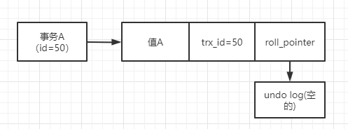

如上图，事务A插入一条数据，此条数据的隐藏字段以及指向undo log如图所示。roll_pointer指向为空，因为之前是没有的

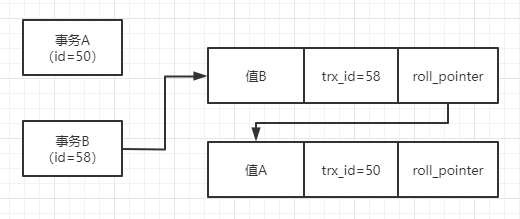

假设事务B修改了数据的值为B，则数据的隐藏字段也相应进行改别

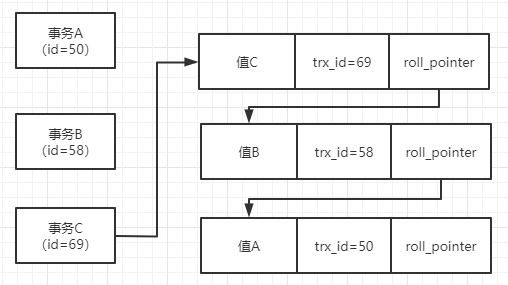

事务C又对数据进行修改，则隐藏字段变动关系如图

**多个事务串行执行的时候，每个事务修改了数据后，都会更新隐藏字段trx_id和roll_pointer，同时之前的多个数据快照对应的undo log，会通过roll_pointer指针串联起来，形成重要的版本链**

### ReadView机制（基于undo log版本链）

ReadView，简单的说，就是在执行一个事务的时候，就会生成一个ReadView。其中里面比较关键的东西有4个

- **m_ids，此时有那些事务在MySql里执行还没提交的；**
- **min_trx_id，就是m_ids中最小的值；**
- **max_trx_id，就是MySql下一个要生成的事务id，即最大事务id；**
- **creator_trx_id，当前事务id；**

**其可以保证当前事务可以读取到事务开启前，别的事务提交的更新的值，以及自己事务更新的值（此即实现了RR隔离级别）**

举例说明

当前有两个事务A和B，B去更新数据，A去读取数据。

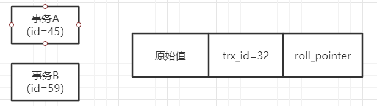

事务A开启ReadView后，当前ReadView包含事务A和事务B的id（45，59）。min_trx_id就是45，max_trx_id是60，creator_trx_id是事务Aid：45	

事务A第一次查询时，会进行判断，判断当前这行数据的trx_id是否小于当前ReadView的min_trx_id。如果小于，说明事务开启之前，修改这行数据的事务就已经提交，此时可以查到这行数据。

此时事务B，更新了这条数据，此时这行数据的trx_id变为59。然后事务B就提交了

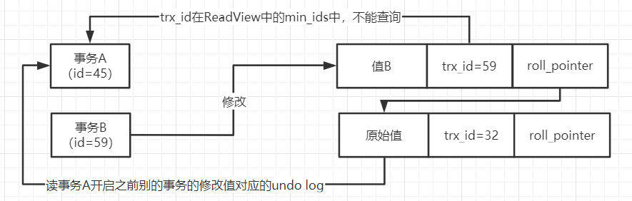

此时A再次查询，会发现此时数据行里的trx_id为59，大于当前ReadView中的min_trx_id，同时小于max_trx_id。这说明更新这条数据的事务，可能和自己是同时开启的，因此便会查看m_ids，查看trx_id=59是否存在其中。发现存在便不能对其进行查询。

于是，便通过roll_pointer顺着undo log版本链查找，查找符合要求的undo log。这就是undo log版本链的作用，其可以保存一个快照链条，让事务读取到之前的快照值。

接着，事务A更新了这行数据的值，trx_id修改为了45，同时保存之前事务B修改的值的快照。此时事务A再次查询

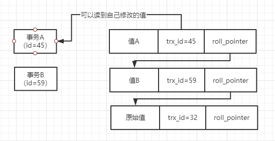

在事务A执行的同时，事务C更新了这行数据的值，还提交了。此时事务A再去查询，发现当前数据的trx_id为78，大于了自己ReadView中的max_trx_id(60)。说明事务A开启之后，又有一个事务提交了数据，自己是看不到的。只能通过undo log链条去寻找可读到的版本

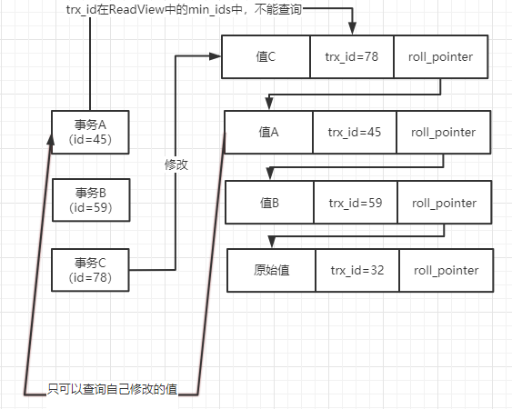

## RC(read committed)隔离级别和ReadView

RC隔离级别指事务运行期间，只要别的事务修改数据提交了，就可以读到其他事务修改的数据，所以会发生不可重复读，幻读问题

**当一个事务设置处于RC隔离级别时，他每次发起查询，都会重新生成一个ReadView**

假设当前有两个事务A,B。事务B发起update操作，更新了一条数据，将其修改为B。此时数据对应的事务id为70，同时生成一个undo log

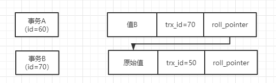

此时，事务A要发起查询操作，会生成一个ReadView，此时ReadView里的min_trx_id=60，max_trx_id=71，creator_trx_id=60，此时如下图所示。

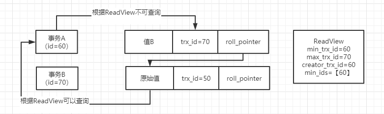

此时只能查到undo log版本链中的数据。如果此时事务B提交，那么事务B就不属于活跃事务了。此时A再进行查询，就会重新生成一个ReadView

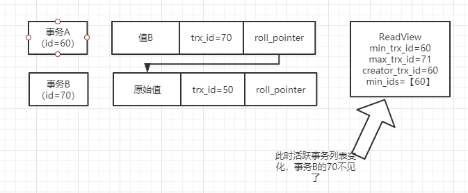

此时事务A就可以查询到事务B了

## RR(read repatable)隔离级别和ReadView

在MySql中，RR隔离级别是可以同时避免不可重复读和幻读问题的。在RR级别下，事务读一条数据，无论是读取多少次，都是一个值，别的事务修改数据之后哪怕提交了，也是看不到其他事务的修改数据的。同时如果其他事务插入了一些数据，也是感知不到的

假设有如下事务A，B和数据，此时事务A基于这个ReadView去查这条数据，会发现这条数据的trx_id为50，是小于ReadView里的min_trx_id的，说明他发起查询之前，早就有事务插入这条数据还提交了，所以此时可以查到这条原始值的，如下图。

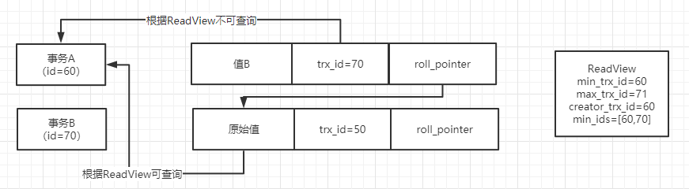

事务A多次读同一个数据，每次读到的值都是一样的，除非其自己修改了值。因为事务A的ReadView始终是不变的，它基于这个ReadView查到的值是一样的

这样就解决了不可重复读的问题

事务C此时插入了一条数据，并进行事务的提交。接着，事务A进行查询，此时会发现符合条件的有两条数据，一条是原始值数据，一条是事务C插入的那条数据。但是事务C插入的那条数据的trx_id是80，这个80是大于自己的ReadView的max_trx_id的，说明这条数据是不能进行查询的

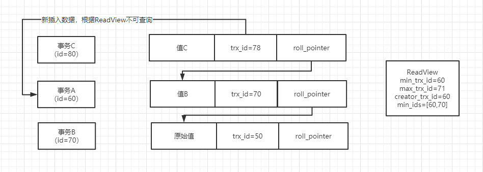

因此，事务A进行查询还是只能查询到一条数据。所以事务A不会发生幻读，他根据条件范围查询的时候，每次读到的数据都是一样的，不会读到其他事务插入的数据，这都是基于ReadView机制实现的

## 总结

> 多个事务并发运行的时候，同时读写一个数据，可能会出现脏写、脏读、不可重复读、幻读几个问题
>
> 所谓的脏写，就是两个事务都更新一个数据，结果有一个人回滚了把另外一个人更新的数据也回滚没了。
>
> 脏读，就是一个事务读到了另外一个事务没提交的时候修改的数据，结果另外一个事务回滚了，下次读就读不到了。
>
> 不可重复读，就是多次读一条数据，别的事务老是修改数据值还提交了，多次读到的值不同。
>
> 幻读，就是范围查询，每次查到的数据不同，有时候别的事务插入了新的值，就会读到更多的数据。
>
> 针对这些问题，才会有RU,RC,RR和串行四个隔离级别
>
> RU隔离级别，就是可以读到人家没提交的事务修改的数据，只能避免脏写问题；
>
> RC隔离级别，可以读到人家提交的事务修改过的数据，可以避免脏写和脏读问题。
>
> RR是不会读到别的已经提交事务修改的数据，可以避免脏读、脏写和不可重复读的问题；
>
> 串行是让事务都串行执行，可以避免所有问题。
>
> 然后MySQL实现MVCC机制的时候，是基于**undo log多版本链条+ReadView机制**来做的，默认的RR隔离级别，就是基于这套机制来实现的，依托这套机制实现了RR级别，除了避免脏写、脏读、不可重复读，还能避免幻读问题。